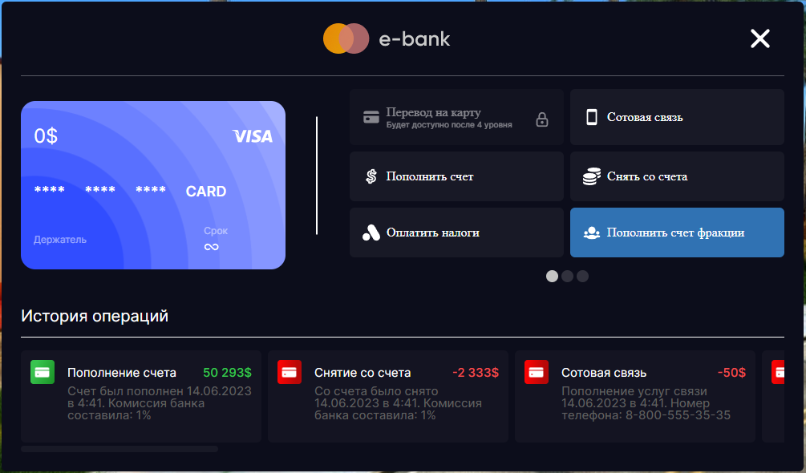
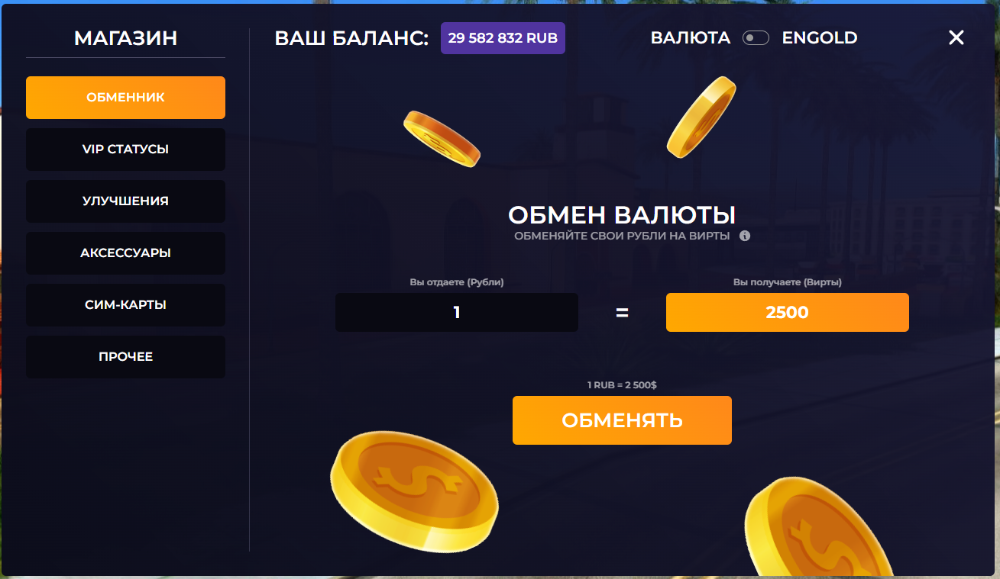
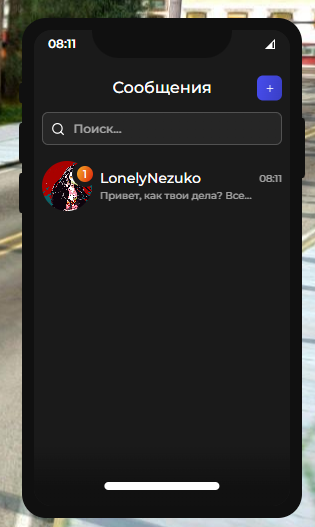
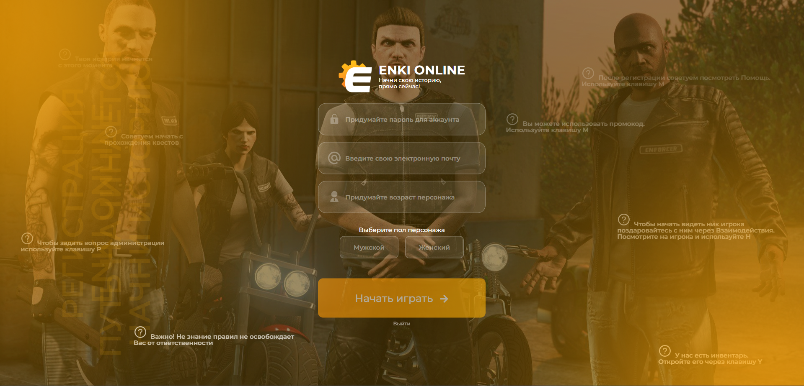
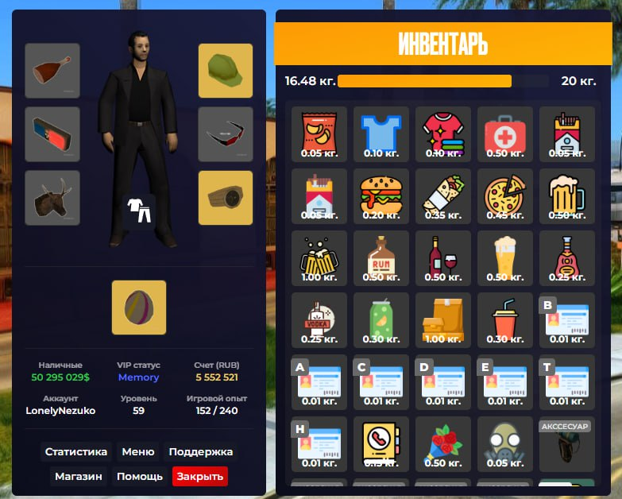
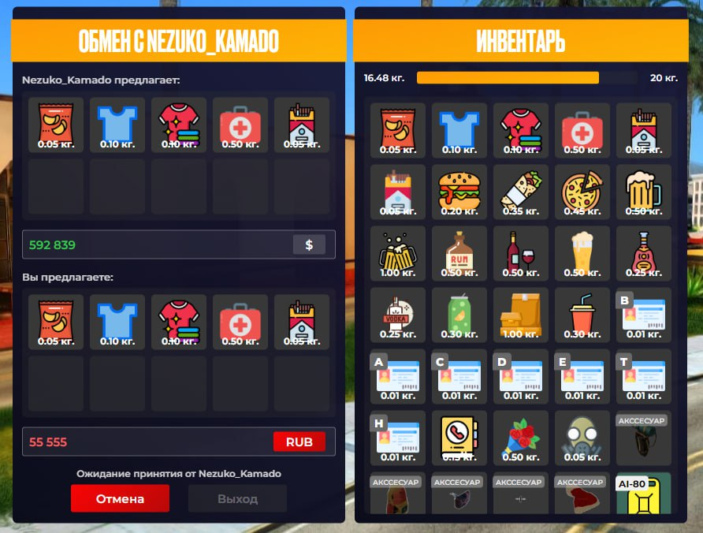
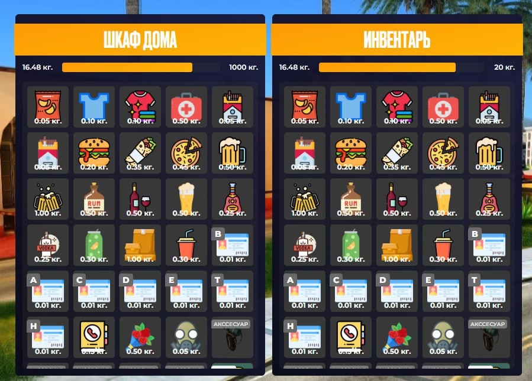

# Интерфейсы для SA:MP проекта ENKI ONLINE


<details>
<summary>Изображения</summary>
    








</details>

<details>
<summary>Пример кода</summary>
    
```javascript
import React from 'react'
import $ from 'jquery'

import _cef from '../../modules/cef'

import './inventory.scss'
import { inventoryGetItem,
    inventoryIsQuantityItem,
    INV_ITEM_TYPE_ACS,
    INV_ITEM_TYPE_SHOTBIZ } from './inventoryItems'

import { BiBlock } from 'react-icons/bi'
import { TbDragDrop2 } from 'react-icons/tb'

import { GiClothes } from 'react-icons/gi'

export default function Inventory() {
    const [ toggle, setToggle ] = React.useState(false)
    const [ invtype, setInvtype ] = React.useState('warehouse')

    function getAllWeight(items) {
        let weight = 0.0
        items.map(item => {
            const itemData = inventoryGetItem(item.model)
            weight += parseFloat(item.quantity * itemData.weight)
        })

        return weight
    }

    // main
    const [ items, setItems ] = React.useState([
        { model: 1, quantity: 1, custom: -1, tradeChecked: false, simCost: 0 },
        { model: 2, quantity: 1, custom: -1, tradeChecked: false, simCost: 0 },
        { model: 3, quantity: 1, custom: -1, tradeChecked: false, simCost: 0 },
        { model: 4, quantity: 1, custom: -1, tradeChecked: false, simCost: 0 },
        { model: 5, quantity: 1, custom: -1, tradeChecked: false, simCost: 0 },
        { model: 6, quantity: 1, custom: -1, tradeChecked: false, simCost: 0 },
        { model: 7, quantity: 1, custom: -1, tradeChecked: false, simCost: 0 },
        { model: 8, quantity: 1, custom: -1, tradeChecked: false, simCost: 0 },
        { model: 9, quantity: 1, custom: -1, tradeChecked: false, simCost: 0 },
        { model: 10, quantity: 1, custom: -1, tradeChecked: false, simCost: 0 },
        { model: 11, quantity: 1, custom: -1, tradeChecked: false, simCost: 0 },
        { model: 12, quantity: 1, custom: -1, tradeChecked: false, simCost: 0 },
        { model: 13, quantity: 1, custom: -1, tradeChecked: false, simCost: 0 },
        { model: 14, quantity: 1, custom: -1, tradeChecked: false, simCost: 0 },
        { model: 15, quantity: 1, custom: -1, tradeChecked: false, simCost: 0 },
        { model: 16, quantity: 1, custom: -1, tradeChecked: false, simCost: 0 },
        { model: 17, quantity: 1, custom: -1, tradeChecked: false, simCost: 0 },
        { model: 18, quantity: 1, custom: -1, tradeChecked: false, simCost: 0 },
        { model: 19, quantity: 1, custom: -1, tradeChecked: false, simCost: 0 },
        { model: 20, quantity: 1, custom: -1, tradeChecked: false, simCost: 0 },
        { model: 21, quantity: 1, custom: -1, tradeChecked: false, simCost: 0 },
        { model: 22, quantity: 1, custom: -1, tradeChecked: false, simCost: 0 },
        { model: 23, quantity: 1, custom: -1, tradeChecked: false, simCost: 0 },
        { model: 24, quantity: 1, custom: -1, tradeChecked: false, simCost: 0 },
        { model: 25, quantity: 1, custom: -1, tradeChecked: false, simCost: 0 },
        { model: 26, quantity: 1, custom: -1, tradeChecked: false, simCost: 0 },
        { model: 27, quantity: 1, custom: -1, tradeChecked: false, simCost: 0 },
        { model: 28, quantity: 1, custom: -1, tradeChecked: false, simCost: 0 },
        { model: 29, quantity: 1, custom: -1, tradeChecked: false, simCost: 0 },
        { model: 30, quantity: 1, custom: -1, tradeChecked: false, simCost: 0 },
        { model: 31, quantity: 1, custom: -1, tradeChecked: false, simCost: 0 },
        { model: 32, quantity: 1, custom: -1, tradeChecked: false, simCost: 0 },
        { model: 33, quantity: 1, custom: -1, tradeChecked: false, simCost: 0 },
        { model: 34, quantity: 1, custom: -1, tradeChecked: false, simCost: 0 },
        { model: 103, quantity: 1, custom: 80, tradeChecked: false, simCost: 0 },
        { model: 0, quantity: 1, custom: -1, tradeChecked: false, simCost: 0 },
        { model: 0, quantity: 1, custom: -1, tradeChecked: false, simCost: 0 },
        { model: 0, quantity: 1, custom: -1, tradeChecked: false, simCost: 0 },
        { model: 0, quantity: 1, custom: -1, tradeChecked: false, simCost: 0 },
        { model: 0, quantity: 1, custom: -1, tradeChecked: false, simCost: 0 },
        { model: 0, quantity: 1, custom: -1, tradeChecked: false, simCost: 0 },
        { model: 0, quantity: 1, custom: -1, tradeChecked: false, simCost: 0 },
        { model: 0, quantity: 1, custom: -1, tradeChecked: false, simCost: 0 },
        { model: 0, quantity: 1, custom: -1, tradeChecked: false, simCost: 0 },
        { model: 0, quantity: 1, custom: -1, tradeChecked: false, simCost: 0 },
        { model: 0, quantity: 1, custom: -1, tradeChecked: false, simCost: 0 },
        { model: 0, quantity: 1, custom: -1, tradeChecked: false, simCost: 0 },
        { model: 0, quantity: 1, custom: -1, tradeChecked: false, simCost: 0 },
        { model: 0, quantity: 1, custom: -1, tradeChecked: false, simCost: 0 },
        { model: 0, quantity: 1, custom: -1, tradeChecked: false, simCost: 0 },
        { model: 0, quantity: 1, custom: -1, tradeChecked: false, simCost: 0 },
        { model: 0, quantity: 1, custom: -1, tradeChecked: false, simCost: 0 },
        { model: 0, quantity: 1, custom: -1, tradeChecked: false, simCost: 0 },
        { model: 0, quantity: 1, custom: -1, tradeChecked: false, simCost: 0 },
        { model: 0, quantity: 1, custom: -1, tradeChecked: false, simCost: 0 },
        { model: 0, quantity: 1, custom: -1, tradeChecked: false, simCost: 0 },
        { model: 0, quantity: 1, custom: -1, tradeChecked: false, simCost: 0 },
        { model: 0, quantity: 1, custom: -1, tradeChecked: false, simCost: 0 },
        { model: 0, quantity: 1, custom: -1, tradeChecked: false, simCost: 0 },
        { model: 0, quantity: 1, custom: -1, tradeChecked: false, simCost: 0 },
        { model: 0, quantity: 1, custom: -1, tradeChecked: false, simCost: 0 },
        { model: 0, quantity: 1, custom: -1, tradeChecked: false, simCost: 0 },
        { model: 0, quantity: 1, custom: -1, tradeChecked: false, simCost: 0 },
        { model: 0, quantity: 1, custom: -1, tradeChecked: false, simCost: 0 },
        { model: 0, quantity: 1, custom: -1, tradeChecked: false, simCost: 0 }
    ])
    const [ maxWeight, setMaxWeight ] = React.useState(20.0)

    // character
    const [ accessories, setAccessories ] = React.useState([ 131, 127, 126, 138, 134, 44 ])
    const [ _accessoriesPos, _setAccessoriesPos ] = React.useState([
        [ 0, 0 ],
        [ 218, 0 ],
        [ 0, 80 ],
        [ 218, 80 ],
        [ 0, 160 ],
        [ 218, 160 ]
    ])

    const [ skin, setSkin ] = React.useState(120)
    const [ defaultSkin, setDefaultSkin ] = React.useState(99)

    const [ backpack, setBackpack ] = React.useState(133)

    const [ statsCash, setStatsCash ] = React.useState(50295029)
    const [ statsVip, setStatsVip ] = React.useState(1)
    const [ statsDonate, setStatsDonate ] = React.useState(5552521)
    const [ statsUsername, setStatsUsername ] = React.useState('LonelyNezuko')
    const [ statsLevel, setStatsLevel ] = React.useState(59)
    const [ statsExp, setStatsExp ] = React.useState(152)


    // warehouse
    const [ warehouseName, setWarehouseName ] = React.useState('Шкаф дома')
    const [ warehouseItems, setWarehouseItems ] = React.useState([
        { model: 1, quantity: 1, custom: -1, tradeChecked: false, simCost: 0 },
        { model: 2, quantity: 1, custom: -1, tradeChecked: false, simCost: 0 },
        { model: 3, quantity: 1, custom: -1, tradeChecked: false, simCost: 0 },
        { model: 4, quantity: 1, custom: -1, tradeChecked: false, simCost: 0 },
        { model: 5, quantity: 1, custom: -1, tradeChecked: false, simCost: 0 },
        { model: 6, quantity: 1, custom: -1, tradeChecked: false, simCost: 0 },
        { model: 7, quantity: 1, custom: -1, tradeChecked: false, simCost: 0 },
        { model: 8, quantity: 1, custom: -1, tradeChecked: false, simCost: 0 },
        { model: 9, quantity: 1, custom: -1, tradeChecked: false, simCost: 0 },
        { model: 10, quantity: 1, custom: -1, tradeChecked: false, simCost: 0 },
        { model: 11, quantity: 1, custom: -1, tradeChecked: false, simCost: 0 },
        { model: 12, quantity: 1, custom: -1, tradeChecked: false, simCost: 0 },
        { model: 13, quantity: 1, custom: -1, tradeChecked: false, simCost: 0 },
        { model: 14, quantity: 1, custom: -1, tradeChecked: false, simCost: 0 },
        { model: 15, quantity: 1, custom: -1, tradeChecked: false, simCost: 0 },
        { model: 16, quantity: 1, custom: -1, tradeChecked: false, simCost: 0 },
        { model: 17, quantity: 1, custom: -1, tradeChecked: false, simCost: 0 },
        { model: 18, quantity: 1, custom: -1, tradeChecked: false, simCost: 0 },
        { model: 19, quantity: 1, custom: -1, tradeChecked: false, simCost: 0 },
        { model: 20, quantity: 1, custom: -1, tradeChecked: false, simCost: 0 },
        { model: 21, quantity: 1, custom: -1, tradeChecked: false, simCost: 0 },
        { model: 22, quantity: 1, custom: -1, tradeChecked: false, simCost: 0 },
        { model: 23, quantity: 1, custom: -1, tradeChecked: false, simCost: 0 },
        { model: 24, quantity: 1, custom: -1, tradeChecked: false, simCost: 0 },
        { model: 25, quantity: 1, custom: -1, tradeChecked: false, simCost: 0 },
        { model: 26, quantity: 1, custom: -1, tradeChecked: false, simCost: 0 },
        { model: 27, quantity: 1, custom: -1, tradeChecked: false, simCost: 0 },
        { model: 28, quantity: 1, custom: -1, tradeChecked: false, simCost: 0 },
        { model: 29, quantity: 1, custom: -1, tradeChecked: false, simCost: 0 },
        { model: 30, quantity: 1, custom: -1, tradeChecked: false, simCost: 0 },
        { model: 31, quantity: 1, custom: -1, tradeChecked: false, simCost: 0 },
        { model: 32, quantity: 1, custom: -1, tradeChecked: false, simCost: 0 },
        { model: 33, quantity: 1, custom: -1, tradeChecked: false, simCost: 0 },
        { model: 34, quantity: 1, custom: -1, tradeChecked: false, simCost: 0 },
        { model: 103, quantity: 1, custom: 80, tradeChecked: false, simCost: 0 },
        { model: 0, quantity: 1, custom: -1, tradeChecked: false, simCost: 0 },
        { model: 0, quantity: 1, custom: -1, tradeChecked: false, simCost: 0 },
        { model: 0, quantity: 1, custom: -1, tradeChecked: false, simCost: 0 },
        { model: 0, quantity: 1, custom: -1, tradeChecked: false, simCost: 0 },
        { model: 0, quantity: 1, custom: -1, tradeChecked: false, simCost: 0 },
        { model: 0, quantity: 1, custom: -1, tradeChecked: false, simCost: 0 },
        { model: 0, quantity: 1, custom: -1, tradeChecked: false, simCost: 0 },
        { model: 0, quantity: 1, custom: -1, tradeChecked: false, simCost: 0 },
        { model: 0, quantity: 1, custom: -1, tradeChecked: false, simCost: 0 },
        { model: 0, quantity: 1, custom: -1, tradeChecked: false, simCost: 0 },
        { model: 0, quantity: 1, custom: -1, tradeChecked: false, simCost: 0 },
        { model: 0, quantity: 1, custom: -1, tradeChecked: false, simCost: 0 },
        { model: 0, quantity: 1, custom: -1, tradeChecked: false, simCost: 0 },
        { model: 0, quantity: 1, custom: -1, tradeChecked: false, simCost: 0 },
        { model: 0, quantity: 1, custom: -1, tradeChecked: false, simCost: 0 },
        { model: 0, quantity: 1, custom: -1, tradeChecked: false, simCost: 0 },
        { model: 0, quantity: 1, custom: -1, tradeChecked: false, simCost: 0 },
        { model: 0, quantity: 1, custom: -1, tradeChecked: false, simCost: 0 },
        { model: 0, quantity: 1, custom: -1, tradeChecked: false, simCost: 0 },
        { model: 0, quantity: 1, custom: -1, tradeChecked: false, simCost: 0 },
        { model: 0, quantity: 1, custom: -1, tradeChecked: false, simCost: 0 },
        { model: 0, quantity: 1, custom: -1, tradeChecked: false, simCost: 0 },
        { model: 0, quantity: 1, custom: -1, tradeChecked: false, simCost: 0 },
        { model: 0, quantity: 1, custom: -1, tradeChecked: false, simCost: 0 },
        { model: 0, quantity: 1, custom: -1, tradeChecked: false, simCost: 0 },
        { model: 0, quantity: 1, custom: -1, tradeChecked: false, simCost: 0 },
        { model: 0, quantity: 1, custom: -1, tradeChecked: false, simCost: 0 },
        { model: 0, quantity: 1, custom: -1, tradeChecked: false, simCost: 0 },
        { model: 0, quantity: 1, custom: -1, tradeChecked: false, simCost: 0 },
        { model: 0, quantity: 1, custom: -1, tradeChecked: false, simCost: 0 }
    ])
    const [ warehouseMaxWeight, setWarehouseMaxWeight ] = React.useState(1000.0)


    // trade
    const [ tradePlayer, setTradePlayer ] = React.useState('Nezuko_Kamado')
    const [ tradePlayerItems, setTradePlayerItems ] = React.useState([
        { model: 1, quantity: 1, custom: -1, tradeChecked: false, simCost: 0 },
        { model: 2, quantity: 1, custom: -1, tradeChecked: false, simCost: 0 },
        { model: 3, quantity: 1, custom: -1, tradeChecked: false, simCost: 0 },
        { model: 4, quantity: 1, custom: -1, tradeChecked: false, simCost: 0 },
        { model: 5, quantity: 1, custom: -1, tradeChecked: false, simCost: 0 },
        { model: 0, quantity: 1, custom: -1, tradeChecked: false, simCost: 0 },
        { model: 0, quantity: 1, custom: -1, tradeChecked: false, simCost: 0 },
        { model: 0, quantity: 1, custom: -1, tradeChecked: false, simCost: 0 },
        { model: 0, quantity: 1, custom: -1, tradeChecked: false, simCost: 0 },
        { model: 0, quantity: 1, custom: -1, tradeChecked: false, simCost: 0 }
    ])
    const [ tradePlayerCash, setTradePlayerCash ] = React.useState([ 592839, 0 ])

    const [ tradeUser, setTradeUser ] = React.useState('Nezuko_Kamado')
    const [ tradeUserItems, setTradeUserItems ] = React.useState([
        { model: 1, quantity: 1, custom: -1, tradeChecked: false, simCost: 0 },
        { model: 2, quantity: 1, custom: -1, tradeChecked: false, simCost: 0 },
        { model: 3, quantity: 1, custom: -1, tradeChecked: false, simCost: 0 },
        { model: 4, quantity: 1, custom: -1, tradeChecked: false, simCost: 0 },
        { model: 5, quantity: 1, custom: -1, tradeChecked: false, simCost: 0 },
        { model: 0, quantity: 1, custom: -1, tradeChecked: false, simCost: 0 },
        { model: 0, quantity: 1, custom: -1, tradeChecked: false, simCost: 0 },
        { model: 0, quantity: 1, custom: -1, tradeChecked: false, simCost: 0 },
        { model: 0, quantity: 1, custom: -1, tradeChecked: false, simCost: 0 },
        { model: 0, quantity: 1, custom: -1, tradeChecked: false, simCost: 0 }
    ])
    const [ tradeUserCash, setTradeUserCash ] = React.useState([ 55555, 2 ])

    const [ tradeAccept, setTradeAccept ] = React.useState(2)
    const [ tradeTime, setTradeTime ] = React.useState(-2)

    return (
        <div className={`inventory ${invtype === 'trade' && 'thistrade'}`} style={{display: !toggle ? 'none' : 'flex'}}>
            <div className="contextmenu" style={{display: 'none'}}>
                <button className="use">Использовать</button>
                <button className="info">Информация</button>
                <button className="drop">Выбросить</button>
            </div>

            <div className="account" style={{display: invtype !== 'none' ? 'none' : 'block'}}>
                <div className="character">
                    <div className="dragdrop">
                        <section>
                            <TbDragDrop2 />
                            <h1>Надеть аксессуар</h1>
                        </section>
                    </div>
                    <div className="skin">
                        
                        {skin !== defaultSkin ? (
                            <button id="inventoryTakeSkin" data-attr="Снять одежду">
                                <GiClothes />
                            </button>
                        ) : ''}
                    </div>
                    <div className="accessories" style={{transform: "translateY(26px)"}}>
                        {_accessoriesPos.map((item, i) => {
                            const itemData = inventoryGetItem(accessories[i])
                            return (
                                <div className={`invitem acs ${accessories[i] && "selected"}`} style={{transform: `translate(${item[0]}px, ${item[1]}px)`}} data-attr={accessories[i] ? itemData.name.replace('Аксессуар: ', '') : "Пусто"}>
                                    <div className="wrap" style={{backgroundColor: accessories[i] ? itemData.color : ""}}>
                                        {accessories[i] ? () : ""}
                                    </div>
                                </div>
                            )
                        })}
                    </div>
                </div>
                <div className="improvements">
                    <div className="dragdrop">
                        <section>
                            <TbDragDrop2 />
                            <h1>Надеть аксессуар</h1>
                        </section>
                    </div>
                    {backpack === -1 ? (
                        <div className="invitem impr-backpack blocked" data-attr="Приобретите улучшение 'Без рюкзака'">
                            <BiBlock />
                        </div>
                    ) : (function() {
                        const itemData = inventoryGetItem(backpack)
                        return (
                            <div className={`invitem impr-backpack ${backpack && 'selected'}`} data-attr={backpack ? itemData.name.replace('Аксессуар: ', '') : 'Пусто'}>
                                <div className="wrap" style={{backgroundColor: backpack ? itemData.color : ""}}>
                                    {backpack ? () : ''}
                                </div>
                            </div>
                        )
                    }())}
                </div>
                <div className="stats">
                    <div className="elem cash">
                        <span>Наличные</span>
                        <h1>{statsCash.toLocaleString()}$</h1>
                    </div>
                    <div className={`elem vipstatus vipstatus${statsVip}`}>
                        <span>VIP статус</span>
                        <h1>{!statsVip ? "Не имеется" : statsVip === 1 ? "Memory" : statsVip === 2 ? "Atomic" : "Неизвестно"}</h1>
                    </div>
                    <div className="elem donatescore">
                        <span>Счет (RUB)</span>
                        <h1>{statsDonate.toLocaleString()}</h1>
                    </div>
                    <div className="elem username">
                        <span>Аккаунт</span>
                        <h1>{statsUsername}</h1>
                    </div>
                    <div className="elem level">
                        <span>Уровень</span>
                        <h1>{statsLevel}</h1>
                    </div>
                    <div className="elem exp">
                        <span>Игровой опыт</span>
                        <h1>{statsExp} / {(statsLevel + 1) * 4}</h1>
                    </div>
                </div>
                <div className="nav">
                    <li>Статистика</li>
                    <li>Меню</li>
                    <li>Поддержка</li>
                    <li>Магазин</li>
                    <li>Помощь</li>
                    <li className="close">Закрыть</li>
                </div>
            </div>
            <div className="main trade" style={{display: invtype !== 'trade' ? 'none' : 'block'}}>
                <div className="header">
                    <div className="title">
                        <h1>Обмен с <span>{tradePlayer}</span></h1>
                    </div>
                </div>
                <div className="body">
                    <div className="title">{tradePlayer} предлагает:</div>
                    <div className="invitems">
                        {tradePlayerItems.map((item, i) => {
                            return ( <InventoryRenderItem item={item} i={i} /> )
                        })}
                    </div>
                    <div className={`cash ${!tradePlayerCash[1] ? "" : tradePlayerCash[1] === 1 ? "engold" : "rub"}`}>
                        <input type="text" disabled value={tradePlayerCash[0].toLocaleString()} />
                        <button>
                            <h1>{!tradePlayerCash[1] ? "$" : tradePlayerCash[1] === 1 ? "EnGold" : "RUB"}</h1>
                        </button>
                    </div>
                </div>
                <div className="body">
                    <div className="title">Вы предлагаете:</div>
                    <div className="invitems">
                        {tradeUserItems.map((item, i) => {
                            return ( <InventoryRenderItem item={item} i={i} /> )
                        })}
                    </div>
                    <div className={`cash ${!tradeUserCash[1] ? "" : tradeUserCash[1] === 1 ? "engold" : "rub"}`}>
                        <input type="text" value={tradeUserCash[0].toLocaleString()} />
                        <button>
                            <h1>{!tradeUserCash[1] ? "$" : tradeUserCash[1] === 1 ? "EnGold" : "RUB"}</h1>
                            <div className="choice">
                                <button>$</button>
                                <button>EnGold</button>
                                <button>RUB</button>
                            </div>
                        </button>
                    </div>
                </div>
                <div className="buttons">
                    <h1>{tradeTime === -1 ? (<>&nbsp;</>) : tradeTime === -2 ? `Ожидание принятия от ${tradePlayer}` : `Обмен будет произведен через ${tradeTime} секунд`}</h1>
                    <section>
                        <button className={!tradeAccept ? "" : tradeAccept === 1 ? "access" : "cancel"}>{!tradeAccept ? "Обмен" : tradeAccept === 1 ? "Обмен" : "Отмена"}</button>
                        <button className="exit">Выход</button>
                    </section>
                </div>
            </div>
            <div className="main warehouse" style={{display: invtype !== 'warehouse' ? 'none' : 'block'}}>
                <div className="header">
                    <div className="title">
                        <h1>{warehouseName}</h1>
                    </div>
                    <div className="weight">
                        <span>{getAllWeight(warehouseItems).toFixed(2)} кг.</span>
                        <div>
                            <div style={{width: getAllWeight(warehouseItems).toFixed(2) / maxWeight * 100 + "%"}}></div>
                        </div>
                        <span>{warehouseMaxWeight} кг.</span>
                    </div>
                </div>
                <div className="invitems">
                    {warehouseItems.map((item, i) => {
                        return ( <InventoryRenderItem item={item} i={i} /> )
                    })}
                </div>
            </div>
            <div className="main">
                <div className="header">
                    <div className="title">
                        <h1>Инвентарь</h1>
                    </div>
                    <div className="weight">
                        <span>{getAllWeight(items).toFixed(2)} кг.</span>
                        <div>
                            <div style={{width: getAllWeight(items).toFixed(2) / maxWeight * 100 + "%"}}></div>
                        </div>
                        <span>{maxWeight} кг.</span>
                    </div>
                </div>
                <div className="invitems">
                    {items.map((item, i) => {
                        return ( <InventoryRenderItem item={item} i={i} /> )
                    })}
                </div>
            </div>
        </div>
    )
}

function InventoryRenderItem({ item, selected, i }) {
    const itemData = inventoryGetItem(item.model)
    if(!item || !item.model || !itemData.model)return (<div className="invitem"></div>)

    return (
        <div key={i} className={`invitem ${itemData.model && 'selected'}`}>
            <div className="wrap" style={{backgroundColor: itemData.color === '#555555' ? "" : itemData.color}}>
                
                <h1 className="text" style={{display: (!inventoryIsQuantityItem(itemData.id) && parseFloat((item.quantity * itemData.weight)) < 0.01) ? "none" : 'block'}}>
                    {inventoryIsQuantityItem(itemData.id) ? item.quantity : parseFloat((item.quantity * itemData.weight)).toFixed(2) + ' кг.'}
                </h1>

                {itemData.type === INV_ITEM_TYPE_ACS ? (<button className="acs">Акссесуар</button>) : ''}
                {itemData.type === INV_ITEM_TYPE_SHOTBIZ ? (<button className="shotbiz">Трениров.</button>) : ''}

                {itemData.id === 122 ? (<button className="bandplate">Нелегал.</button>) : ''}

                {itemData.id === 156 ? (<button className="vip">1 день</button>) : ''}
                {itemData.id === 157 ? (<button className="vip">7 дней</button>) : ''}
                {itemData.id === 158 ? (<button className="vip">30 дней</button>) : ''}

                {itemData.id === 124 ? (<button className="certificate">Транспорт</button>) : ''}
                {itemData.id === 125 ? (<button className="certificate">Дом</button>) : ''}

                {itemData.id === 20 ? (<button className="lic">B</button>) : ''}
                {itemData.id === 21 ? (<button className="lic">A</button>) : ''}
                {itemData.id === 22 ? (<button className="lic">C</button>) : ''}
                {itemData.id === 23 ? (<button className="lic">D</button>) : ''}
                {itemData.id === 24 ? (<button className="lic">E</button>) : ''}
                {itemData.id === 25 ? (<button className="lic">T</button>) : ''}
                {itemData.id === 26 ? (<button className="lic">H</button>) : ''}

                {(itemData.id === 97 || itemData.id === 103 || itemData.id === 104) ? (<button className="canistre">{
                    item.custom === 80 ? "AI-80" :
                    item.custom === 92 ? "AI-92" :
                    item.custom === 95 ? "AI-95" :
                    item.custom === 1 ? "DIESEL" :
                    item.custom === 2 ? "AIR" :
                    item.custom === 3 ? "WATER" : "UNKW"}</button>) : ''}
            </div>
        </div>
    )
}
```
</details>