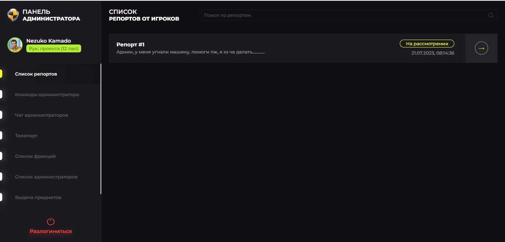
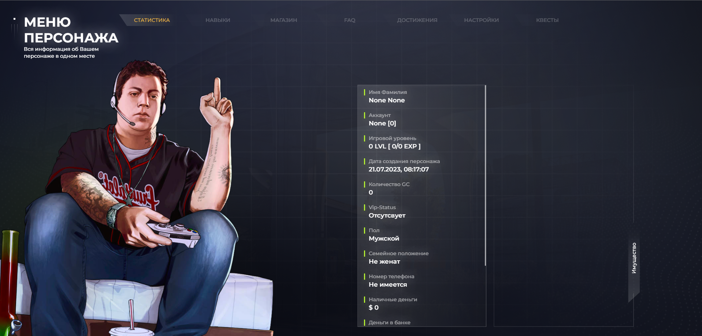
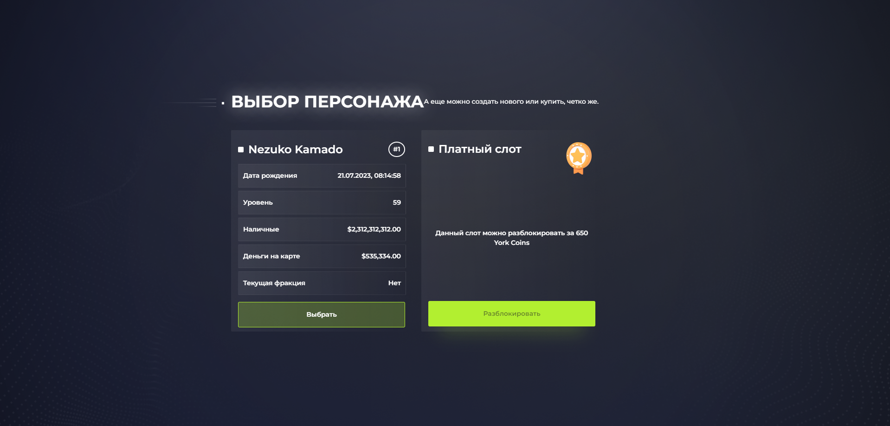
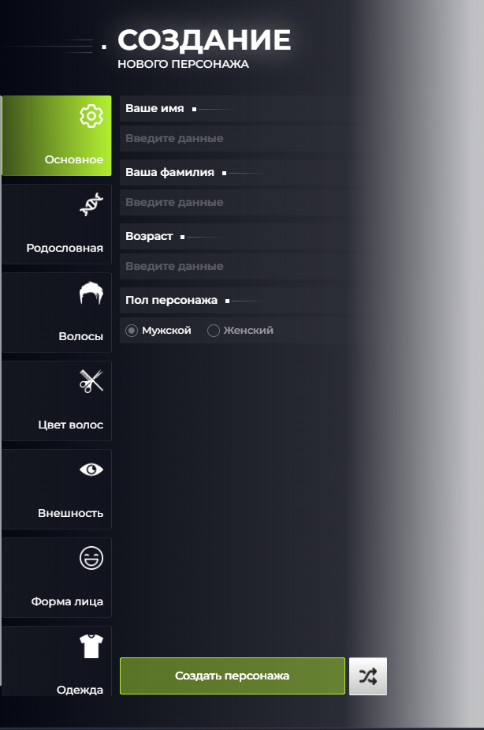
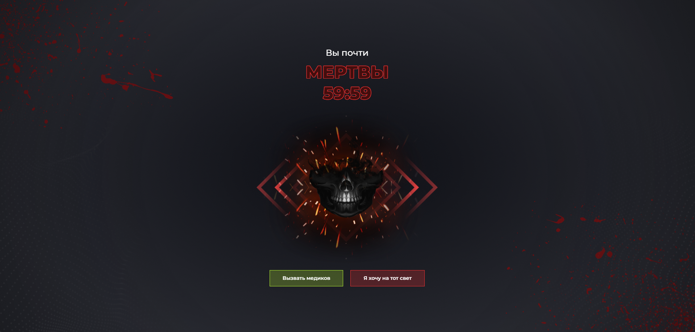
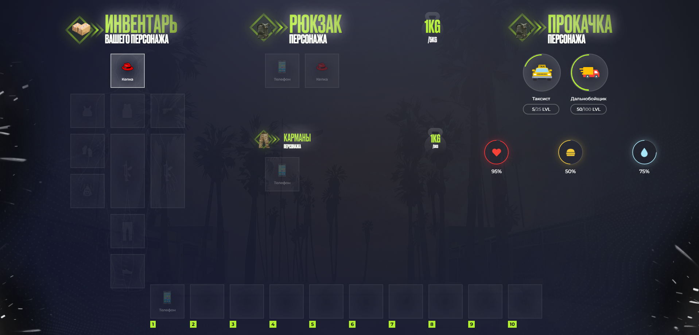
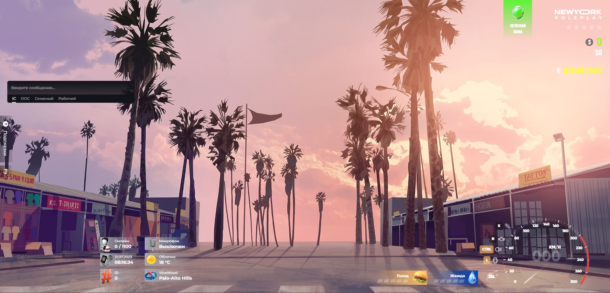
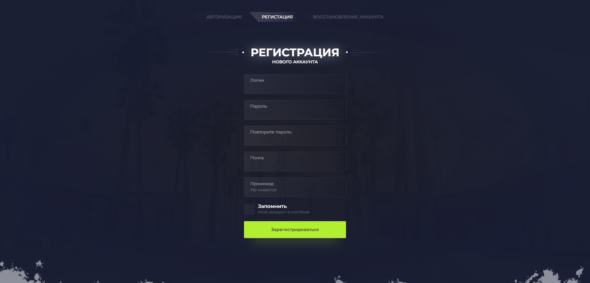
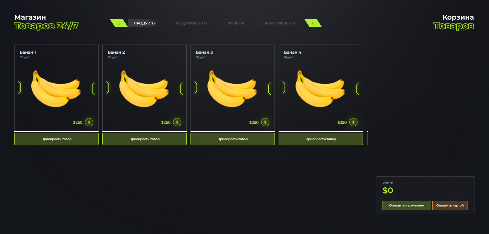

# Интерфейсы для SA:MP проекта ENKI ONLINE


<details>
<summary>Изображения</summary>
    










</details>

<details>
<summary>Пример кода</summary>
    
```javascript
import React from 'react'
import {ReactSVG} from 'react-svg'
import $ from 'jquery'

import './css.css'
import ragemp from '../../_modules/ragemp'

import IMG_ITEM_USER_HEADER from './images/user_header.png'
import IMG_ITEM_USER_BODY from './images/user_body.png'
import IMG_ITEM_USER_ARMOUR from './images/user_armour.png'
import IMG_ITEM_USER_DEAGLE from './images/user_deagle.png'
import IMG_ITEM_USER_WEAPON from './images/user_weapon.png'
import IMG_ITEM_USER_PANTS from './images/user_pants.png'
import IMG_ITEM_USER_BOTTOM from './images/user_bottom.png'
import IMG_ITEM_USER_HANDS from './images/user_hands.png'
import IMG_ITEM_USER_BACKPACK from './images/user_backpack.png'

export default function Inventory()
{
    const [ toggle, setToggle ] = React.useState(false)

    const [ data, setData ] = React.useState({
        inventory: [
            { id: 1, name: 'Телефон', desc: 'Для звонков', weight: 0.3, img: 'phone.png', status: 4, info: [
                { name: 'Сим карта', value: '8 800 555 35 35' }
            ] }
        ],
        backpack: [
            { id: 1, name: 'Телефон', desc: 'Для звонков', weight: 0.3, img: 'phone.png', status: 4, info: [] },
            { id: 2, name: 'Кепка', desc: 'Для головы', weight: 0.1, img: 'cap.png', status: 2, info: [] }
        ],
        armour: [],
        user: {
            cap: { id: 2, name: 'Кепка', desc: 'Для головы', weight: 0.1, img: 'cap.png' },
            body: 0,
            armour: 0,
            deagle: 0,
            weapon1: 0,
            weapon2: 0,
            pants: 0,
            bottom: 0,
            hands: 0
        },
        keys: [
            { id: 1, name: 'Телефон', desc: 'Для звонков', weight: 0.3, img: 'phone.png', status: 4, info: [
                { name: 'Сим карта', value: '8 800 555 35 35' }
            ] }
        ],

        invData: {
            lvl: 1,
            weight: 1,
            maxWeight: 5
        },
        backpackData: {
            lvl: 1,
            weight: 1,
            maxWeight: 5
        },
        armourData: null
    })

    const [ healthData, setHealthData ] = React.useState({
        health: 95,
        satiety: 50,
        thirst: 75
    })
    const [ skillsData, setSkillsData ] = React.useState([
        { name: "Таксист", img: 'taxi.png', count: [ 5, 25 ] },
        { name: "Дальнобойщик", img: 'truck.png', count: [ 50, 100 ] }
    ])

    const [ elemSelected, setElemSelected ]  = React.useState({
        status: false,
        id: 0,
        type: 'backpack',

        menuX: 0,
        menuY: 0,

        item: { id: -1, name: '', desc: '', weight: 0, img: '', status: 0, info: [] }
    })

    function elemClick(type, id, _elem)
    {
        if(!elemSelected.status
            && (type === 'user' || type === 'keys'))
        {
            ragemp.send('ui::inventory:takeoff', {
                type,
                id
            })
        }
        else
        {
            if(!elemSelected.status)
            {
                setElemSelected({
                    status: true,
                    id,
                    type,

                    menuX: getElemSelectedPos(_elem.currentTarget).x,
                    menuY: getElemSelectedPos(_elem.currentTarget).y,

                    item: data[type][id]
                })
            }
            else
            {
                if(type !== elemSelected.type
                    || id !== elemSelected.id)
                {
                    if(!data[type][id])
                    {
                        ragemp.send('ui::inventory:set', {
                            insertType: type,
                            insertID: id,

                            type: elemSelected.type,
                            id: elemSelected.id
                        })
                    }
                    else
                    {
                        ragemp.send('ui::inventory:trade', {
                            tradeType: type,
                            tradeID: id,

                            insertType: elemSelected.type,
                            insertID: elemSelected.id
                        })
                    }
                }
                elemClear()
            }
        }
    }
    function elemClear()
    {
        setElemSelected({
            status: false,
            id: 0,
            type: 'backpack',

            menuX: 0,
            menuY: 0,

            item: { id: -1, name: '', desc: '', weight: 0, img: '', status: 0, info: [] }
        })
    }
    function getElemSelectedPos(_elem)
    {
        const data = {
            x: $(_elem).position().left,
            y: $(_elem).position().top + $('.inv-inventory-menu').height() / 2 - 20
        }

        if(data.x - ($('.inv-inventory-menu').width() / 2 - 30) > 0) data.x = data.x - ($('.inv-inventory-menu').width() / 2 - 30)
        return data
    }

    function use(type, id)
    {
        ragemp.send('ui::inventory:useItem', {
            type,
            id
        })
        elemClear()
    }
    function drop(type, id)
    {
        ragemp.send('ui::inventory:dropItem', {
            type,
            id
        })
        elemClear()
    }


    const [ trade_toggle, trade_setToggle ] = React.useState(false)
    const [ trade_data, trade_setData ] = React.useState({
        me: {
            items: [ null, null,
                { id: 1, name: 'Телефон', desc: 'Для звонков', weight: 0.3, img: 'phone.png', status: 4, info: [
                    { name: 'Сим карта', value: '8 800 555 35 35' }
                ], _slot: 0, _type: "inventory" }
            ],
            cash: 0,
            yes: false
        },
        user: {
            items: [
                { id: 1, name: 'Телефон', desc: 'Для звонков', weight: 0.3, img: 'phone.png', status: 4, info: [
                    { name: 'Сим карта', value: '8 800 555 35 35' }
                ] }
            ],
            cash: 0,
            yes: false,

            username: 'Nezuko Kamado ( 567 )'
        },
        items: [
            { id: 1, name: 'Телефон', desc: 'Для звонков', weight: 0.3, img: 'phone.png', status: 4, info: [
                { name: 'Сим карта', value: '8 800 555 35 35' }
            ], _type: "inventory", _slot: 0 }
        ]
    })
    const [ trade_addItem, trade_setAddItem ] = React.useState(false)
    const [ trade_timer, trade_setTimer ] = React.useState(0)

    function tradeAddItem(id, type)
    {
        ragemp.send('ui::inventory:trade:addItem', {
            id: id,
            type: type
        })
    }
    function tradeDeleteItem(id)
    {
        ragemp.send('ui::inventory:trade:deleteItem', {
            id: id
        })
    }
    function tradeSelectItemData(id, _elem, type = 'me')
    {
        if(!elemSelected.status)
        {
            setElemSelected({
                status: true,
                id,
                type: `trade-${type}`,

                menuX: getElemSelectedPos(_elem.currentTarget).x,
                menuY: getElemSelectedPos(_elem.currentTarget).y,

                item: trade_data[type].items[id]
            })
        }
        else elemClear()
    }
    function tradeFindMeItems(item)
    {
        let status = true
        trade_data.me.items.map((item, i) =>
        {
            if(item
                && item._type === item._type
                && item._slot === item._slot) status = true
        })
        return status
    }

    React.useMemo(() =>
    {
        ragemp.eventCreate('client::inventory', (cmd, data) =>
        {
            switch(cmd)
            {
                case 'toggle':
                {
                    setToggle(data.status)
                    break
                }
                case 'update':
                {
                    setData(data)
                    break
                }
                case 'health':
                {
                    setHealthData(data)
                    break
                }
                case 'skills':
                {
                    setSkillsData(data)
                    break
                }
                case 'tradeToggle':
                {
                    trade_setToggle(data.status)
                    break
                }
                case 'tradeUpdate':
                {
                    trade_setData(data)
                    break
                }
                case 'tradeUpdateTimer':
                {
                    trade_setTimer(data.timer)
                    break
                }
            }
        })
    }, [])

    return (
        <>
            <div className="trade" style={!trade_toggle ? {display: 'none'} : {}}>
                <div className="trade-section" style={trade_addItem ? {display: 'none'} : {}}>
                    <header className="header-deg">
                        <h1>
                            Обмен
                            <span>Предметами</span>
                        </h1>
                    </header>
                    <div className="trade-elem">
                        <h2>Вы отдаете</h2>
                        <section>
                            {Array.from(Array(8).keys()).map((item, i) =>
                            {
                                if(trade_data.me.items[i])return (<div onClick={e => tradeSelectItemData(i, e)} key={i} className={`inv-elem inv-elem-select ${elemSelected.status && elemSelected.type === 'trade-me' && elemSelected.id === i ? 'inv-elem-selected' : ''}`}>
                                        
                                        <span>{trade_data.me.items[i].name}</span>
                                    </div>)
                                return (<div onClick={() => trade_setAddItem(true)} key={i} className="inv-elem"></div>)
                            })}
                        </section>
                        <div className="trade-cash">
                            <div>
                                <h2>Сумма денег к обмену</h2>
                                <span>$ <input type="number" onChange={e => ragemp.send('ui::inventory:trade:cash', { cash: e.target.value })} /></span>
                            </div>
                            <div>
                                <h2>Готовность к обмену</h2>
                                <input checked={trade_data.me.yes} className="input-checkbox" type="checkbox" onChange={e => ragemp.send('ui::inventory:trade:go', { status: e.target.value === 'on' ? true : false })} />
                            </div>
                        </div>
                    </div>
                    <div className={`trade-user trade-elem ${!trade_data.user.yes && 'trade-elem-no'}`}>
                        <h2>Вы получаете от {trade_data.user.username}</h2>
                        <section>
                            {Array.from(Array(8).keys()).map((item, i) =>
                            {
                                if(trade_data.user.items[i])return (<div onClick={e => tradeSelectItemData(i, e, 'user')} key={i} className={`inv-elem inv-elem-select ${elemSelected.status && elemSelected.type === 'trade-user' && elemSelected.id === i ? 'inv-elem-selected' : ''}`}>
                                        
                                        <span>{trade_data.user.items[i].name}</span>
                                    </div>)
                                return (<div key={i} className="inv-elem"></div>)
                            })}
                        </section>
                        <div className="trade-cash">
                            <div>
                                <h2>Сумма денег к обмену</h2>
                                <h3>${trade_data.user.cash.toLocaleString()}</h3>
                            </div>
                            <div>
                                <h2>Готовность к обмену</h2>
                                <input className="input-checkbox" type="checkbox" disabled checked />
                            </div>
                        </div>
                    </div>
                    <div className="trade-elem">
                        <button style={trade_timer === 0 ? {display: 'none'} : {}} className="btn btn-select">Обмен произойдет через {trade_timer} секунд</button>
                        <button onClick={() => ragemp.send('ui::inventory:trade:cancel')} className="btn">Отменить обмен</button>
                    </div>
                </div>
                <div className="trade-section trade-section-myitems" style={!trade_addItem ? {display: 'none'} : {}}>
                    <header className="header-deg">
                        <h1>
                            Обмен
                            <span>Предметами</span>
                        </h1>
                    </header>
                    <div className="trade-elem">
                        <h2>Ваши предметы</h2>
                        <section>
                            {Array.from(Array(104).keys()).map((item, i) =>
                            {
                                if(trade_data.items[i])return (<div onClick={() => tradeAddItem(i, trade_data.items[i]._type)} key={i} className={`inv-elem inv-elem-select ${tradeFindMeItems(trade_data.items[i]) && 'inv-elem-selected'}`}>
                                        
                                        <span>{trade_data.items[i].name}</span>
                                    </div>)
                                return (<div key={i} className="inv-elem"></div>)
                            })}
                        </section>
                    </div>
                    <div className="trade-elem">
                        <button onClick={() => trade_setAddItem(false)} className="btn btn-select">Вернуться назад</button>
                    </div>
                </div>
            </div>


            <div className="inv" style={!toggle ? {display: 'none'} : {}}>
                
                
                


                <div className="inv-wrap">
                    <div className="inv-body">
                        <div className="inv-header">
                            <section>
                                <div>
                                    
                                    
                                </div>
                                <h1>
                                    Инвентарь
                                    <h2>Вашего персонажа</h2>
                                </h1>
                            </section>
                        </div>
                        <div className="inv-body-wrap inv-user">
                            
                            <section onClick={e => elemClick('user', 'cap', e)} className={`inv-elem ${data.user.cap && 'inv-elem-select'}`} id="inv-user-header">
                                
                                <span style={!data.user.cap ? {display: 'none'} : {}}>{data.user.cap ? data.user.cap.name : ''}</span>
                            </section>
                            <section onClick={e => elemClick('user', 'body', e)} className={`inv-elem ${data.user.body && 'inv-elem-select'}`} id="inv-user-body">
                                
                                <span style={!data.user.body ? {display: 'none'} : {}}>{data.user.body ? data.user.body.name : ''}</span>
                            </section>
                            <section onClick={e => elemClick('user', 'armour', e)} className={`inv-elem ${data.user.armour && 'inv-elem-select'}`} id="inv-user-armour">
                                
                                <span style={!data.user.armour ? {display: 'none'} : {}}>{data.user.armour ? data.user.armour.name : ''}</span>
                            </section>
                            <section onClick={e => elemClick('user', 'deagle', e)} className={`inv-elem ${data.user.deagle && 'inv-elem-select'}`} id="inv-user-deagle">
                                
                                <span style={!data.user.deagle ? {display: 'none'} : {}}>{data.user.deagle ? data.user.deagle.name : ''}</span>
                            </section>
                            <section onClick={e => elemClick('user', 'hands', e)} className={`inv-elem ${data.user.hands && 'inv-elem-select'}`} id="inv-user-hands">
                                
                                <span style={!data.user.hands ? {display: 'none'} : {}}>{data.user.hands ? data.user.hands.name : ''}</span>
                            </section>
                            <section onClick={e => elemClick('user', 'backpack', e)} className={`inv-elem ${data.user.backpack && 'inv-elem-select'}`} id="inv-user-backpack">
                                
                                <span style={!data.user.backpack ? {display: 'none'} : {}}>{data.user.backpack ? data.user.backpack.name : ''}</span>
                            </section>
                            <section onClick={e => elemClick('user', 'weapon1', e)} className={`inv-elem ${data.user.weapon1 && 'inv-elem-select'}`} id="inv-user-weapon1">
                                
                                <span style={!data.user.weapon1 ? {display: 'none'} : {}}>{data.user.weapon1 ? data.user.weapon1.name : ''}</span>
                            </section>
                            <section onClick={e => elemClick('user', 'weapon2', e)} className={`inv-elem ${data.user.weapon2 && 'inv-elem-select'}`} id="inv-user-weapon2">
                                
                                <span style={!data.user.weapon2 ? {display: 'none'} : {}}>{data.user.weapon2 ? data.user.weapon2.name : ''}</span>
                            </section>
                            <section onClick={e => elemClick('user', 'pants', e)} className={`inv-elem ${data.user.pants && 'inv-elem-select'}`} id="inv-user-pants">
                                
                                <span style={!data.user.pants ? {display: 'none'} : {}}>{data.user.pants ? data.user.pants.name : ''}</span>
                            </section>
                            <section onClick={e => elemClick('user', 'bottom', e)} className={`inv-elem ${data.user.bottom && 'inv-elem-select'}`} id="inv-user-bottom">
                                
                                <span style={!data.user.bottom ? {display: 'none'} : {}}>{data.user.bottom ? data.user.bottom.name : ''}</span>
                            </section>
                        </div>
                    </div>
                    <div className="inv-body">
                        <div className="inv-header inv-header-space" style={!data.backpackData ? {display: 'none'} : {}}>
                            <section>
                                <div>
                                    
                                    
                                </div>
                                <h1>
                                    Рюкзак
                                    <h2>Персонажа</h2>
                                </h1>
                                <h5>
                                    {data.backpackData ? data.backpackData.weight : 0}kg
                                    <span>/{data.backpackData ? data.backpackData.maxWeight : 0}kg</span>
                                </h5>
                            </section>
                        </div>
                        <div className="inv-body-wrap inv-items" style={{display: !data.backpackData ? 'none' : '', height: "28%"}}>
                            {data.backpack.map((item, i) =>
                            {
                                if(!item)return (<section onClick={e => elemClick('backpack', i, e)} id={`inv-inventory-elem-${i}`} key={i} className='inv-elem'></section>)
                                return (<section onClick={e => elemClick('backpack', i, e)} id={`inv-inventory-elem-${i}`} key={i} className={`inv-elem inv-elem-size ${elemSelected.status && elemSelected.type === 'backpack' && elemSelected.id === i ? 'inv-elem-selected' : ''}`}>
                                        
                                        <span>{item.name}</span>
                                    </section>)
                            })}
                        </div>
                        <div className={`inv-header ${data.backpackData ? 'inv-header-min' : ''} inv-header-space`} style={!data.armourData ? {display: 'none'} : {}}>
                            <section>
                                <div>
                                    
                                    
                                </div>
                                <h1>
                                    Разгрузка
                                    <h2>Персонажа</h2>
                                </h1>
                                <h5>
                                    {data.armourData ? data.armourData.weight : 0}kg
                                    <span>/{data.armourData ? data.armourData.maxWeight : 0}kg</span>
                                </h5>
                            </section>
                        </div>
                        <div className={`inv-body-wrap inv-items ${data.backpackData ? 'inv-items-min' : ''}`} style={!data.armourData ? {display: 'none'} : {}}>
                            {data.armour.map((item, i) =>
                            {
                                if(!item)return (<section onClick={e => elemClick('armour', i, e)} id={`inv-inventory-elem-${i}`} key={i} className='inv-elem'></section>)
                                return (<section onClick={e => elemClick('armour', i, e)} id={`inv-inventory-elem-${i}`} key={i} className={`inv-elem inv-elem-size ${elemSelected.status && elemSelected.type === 'armour' && elemSelected.id === i ? 'inv-elem-selected' : ''}`}>
                                        
                                        <span>{item.name}</span>
                                    </section>)
                            })}
                        </div>
                        <div className={`inv-header ${data.backpackData || data.armourData ? 'inv-header-min' : ''} inv-header-space`}>
                            <section>
                                <div>
                                    
                                    
                                </div>
                                <h1>
                                    Карманы
                                    <h2>Персонажа</h2>
                                </h1>
                                <h5>
                                    {data.invData.weight}kg
                                    <span>/{data.invData.maxWeight}kg</span>
                                </h5>
                            </section>
                        </div>
                        <div className={`inv-body-wrap inv-items ${data.backpackData || data.armourData ? 'inv-items-min' : ''}`}>
                            {data.inventory.map((item, i) =>
                            {
                                if(!item)return (<section onClick={e => elemClick('inventory', i, e)} id={`inv-inventory-elem-${i}`} key={i} className='inv-elem'></section>)
                                return (<section onClick={e => elemClick('inventory', i, e)} id={`inv-inventory-elem-${i}`} key={i} className={`inv-elem inv-elem-size ${elemSelected.status && elemSelected.type === 'inventory' && elemSelected.id === i ? 'inv-elem-selected' : ''}`}>
                                        
                                        <span>{item.name}</span>
                                    </section>)
                            })}
                        </div>
                    </div>
                    <div className="inv-body">
                        <div className="inv-header">
                            <section>
                                <div>
                                    
                                    
                                </div>
                                <h1>
                                    Прокачка
                                    <h2>Персонажа</h2>
                                </h1>
                            </section>
                        </div>
                        <div className="inv-body-wrap inv-skills">
                            <section style={!skillsData.length ? {display: "none"} : {}}>
                                {skillsData.map((item, i) =>
                                {
                                    return (<div className="inv-skill-item">
                                        <div className="inv-skill-item-img">
                                            
                                            <svg viewBox="0 0 50 50">
                                                <circle cx="25" cy="25" r="20" fill="none" stroke-width="2" style={{stroke: "#B2EF30", "stroke-dashoffset": -126 + (126 / 100) * item.count[0] / item.count[1] * 100}}>
                                                </circle>
                                            </svg>
                                        </div>
                                        <h1>{item.name}</h1>
                                        <h2>
                                            {item.count[0]}<span>/{item.count[1]}</span> LVL
                                        </h2>
                                    </div>)
                                })}
                            </section>
                            <section>
                                <div className="inv-user-health">
                                    
                                    <div>
                                        <svg viewBox="0 0 50 50">
                                            <circle cx="25" cy="25" r="20" fill="none" stroke-width="1" style={{"stroke-dashoffset": -126 + (126 / 100) * healthData.health}}>
                                            </circle>
                                        </svg>
                                    </div>
                                    <h1>{healthData.health}%</h1>
                                </div>
                                <div className="inv-user-health">
                                    
                                    <div style={{"box-shadow": "0px 0px 26px -10px #F4CA36"}}>
                                        <svg viewBox="0 0 50 50">
                                            <circle cx="25" cy="25" r="20" fill="none" stroke-width="1" style={{stroke: "#F4CA36", "stroke-dashoffset": -126 + (126 / 100) * healthData.satiety}}>
                                            </circle>
                                        </svg>
                                    </div>
                                    <h1>{healthData.satiety}%</h1>
                                </div>
                                <div className="inv-user-health">
                                    
                                    <div style={{"box-shadow": "0px 0px 26px -10px #A7E5F9"}}>
                                        <svg viewBox="0 0 50 50">
                                            <circle cx="25" cy="25" r="20" fill="none" stroke-width="1" style={{stroke: "#A7E5F9", "stroke-dashoffset": -126 + (126 / 100) * healthData.thirst}}>
                                            </circle>
                                        </svg>
                                    </div>
                                    <h1>{healthData.thirst}%</h1>
                                </div>
                            </section>
                        </div>
                    </div>
                </div>
                <div className="inv-wrap">
                    <div className="inv-body inv-keys">
                        {Array.from(Array(10).keys()).map((item, i) =>
                        {
                            if(!data.keys[i])return (<div className="inv-keys-item">
                                    <section onClick={e => elemClick('keys', i, e)} id={`inv-inventory-elem-${i}`} key={i} className='inv-elem'></section>
                                    <h5>{i + 1}</h5>
                                </div>)
                            return (
                                <div className="inv-keys-item">
                                    <section onClick={e => elemClick('keys', i, e)} id={`inv-inventory-elem-${i}`} key={i} className={`inv-elem inv-elem-size ${elemSelected.status && elemSelected.type === 'keys' && elemSelected.id === i ? 'inv-elem-selected' : ''}`}>
                                        
                                        <span>{data.keys[i].name}</span>
                                    </section>
                                    <h5>{i + 1}</h5>
                                </div>)
                        })}
                    </div>
                </div>
            </div>

            <div className="inv-inventory-menu" style={{display: elemSelected.status && toggle ? '' : 'none', top: elemSelected.menuY + 'px', left: elemSelected.menuX + 'px'}}>
                <header>
                    <section className='inv-elem inv-elem-size inv-elem-select inv-elem-selected'>
                        
                    </section>
                    <h1>
                        {elemSelected.item.name}
                        <h2>
                            Вес
                            <span>{elemSelected.item.weight} кг</span>
                        </h2>
                    </h1>
                </header>
                <div className="inv-inventory-menu-info">
                    <h1>Информация</h1>
                    <section>
                        <h2>Износ</h2>
                        <div className={`inv-inventory-menu-info-status inv-inventory-menu-info-status-${elemSelected.item.status}`}>
                            {[0,0,0,0].map((item, i) =>
                            {
                                if(elemSelected.item.status >= i + 1)return (<div className="inv-inventory-menu-info-status-yes"></div>)
                                return (<div></div>)
                            })}
                        </div>
                    </section>
                    {elemSelected.item.info.map((item, i) =>
                    {
                        return (<section>
                            <h2>{item.name}</h2>
                            <span>{item.value}</span>
                        </section>)
                    })}
                </div>
                <div className="inv-inventory-menu-info inv-inventory-menu-btn" style={elemSelected.type === 'trade-user' ? {display: 'none'} : {}}>
                    <h1>Взаимодействие</h1>
                    <button style={elemSelected.type !== 'inventory' && elemSelected.type !== 'backpack' ? {display: 'none'} : {}} onClick={() => use(elemSelected.type, elemSelected.id)} className="btn">Использовать</button>
                    <button style={elemSelected.type !== 'inventory' && elemSelected.type !== 'backpack' ? {display: 'none'} : {}} onClick={() => drop(elemSelected.type, elemSelected.id)} className="btn">Выкинуть</button>
                    <button style={elemSelected.type !== 'trade-me' ? {display: 'none'} : {}} onClick={() => tradeDeleteItem(elemSelected.id)} className="btn">Убрать из обмена</button>
                </div>
            </div>
        </>
    )
}
```
</details>