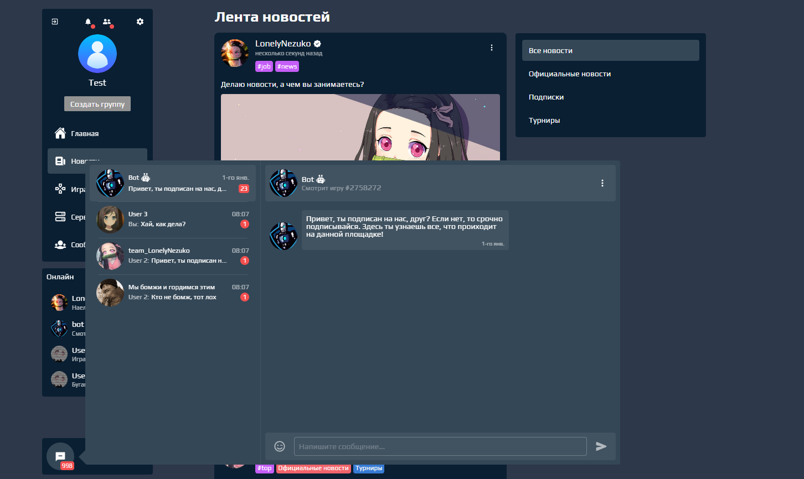

# FunDot
Не большой проект для себя


<details>
<summary>Изображения</summary>
    



</details>

<details>
<summary>Пример кода React JS</summary>

```javascript
import React from 'react'
import $ from 'jquery'
import {
    useParams,
    Link,
    useLocation,
    useNavigate
} from 'react-router-dom'
import Cookies from 'universal-cookie'
import countryParser from '@ejarnutowski/country-parser'

import moment from 'moment'
import 'moment/locale/ru'

import './account.scss'

import AccountLandingHeader from './landing_header'
import AccountLandingBodyStats from './landing_body_stats'

import Error404Page from '../404/404'

import News from '../../components/news/news'
import { Rank } from '../../components/rank/rank'

import Avatar from '../../components/avatar/avatar'
import Modal from '../../components/_modals/index/index'

import notify from '../../modules/notify'

import { FaGamepad } from 'react-icons/fa'
import { IoMdStats } from 'react-icons/io'
import { FaUserFriends } from 'react-icons/fa'
import { GiBestialFangs } from 'react-icons/gi'

import { BiDotsVerticalRounded } from 'react-icons/bi'
import { IoMdPersonAdd } from 'react-icons/io'
import { MdOutlineBlock } from 'react-icons/md'
import { MdReportProblem } from 'react-icons/md'
import { AiOutlineUserDelete } from 'react-icons/ai'

import { FiUpload } from 'react-icons/fi'


export default function AccountPage() {
    React.useMemo(() => { document.title = "FunDot - Аккаунт" })
    const cookies = new Cookies()

    const [ landingHeader, setLandingHeader ] = React.useState(true)
    const [ landingBody, setLandingBody ] = React.useState(true)

    const location = useLocation()
    const params = useParams()
    const navigate = useNavigate()

    const [ account, setAccount ] = React.useState({})
    const [ header, setHeader ] = React.useState({})

    const [ isBlocked, setIsBlocked ] = React.useState(0)

    const [ notfound, setNotfound ] = React.useState(false)

    React.useEffect(() => {
        setNotfound(false)

        setLandingBody(true)
        if(!header.id || !params['*'].length) setLandingHeader(true)

        let id = params.id
        if(!id)return navigate('/')

		const jwt = cookies.get('jsonwebtoken')
		if(!jwt)return window.location = '/signin'

		$.ajax({
			url: `/api/user/account/${params.id}`,
            type: "get",
			headers: { jwt }
		}).done(results => {
            if(results.type === 'error') {
                if(results.statusCode === 401)return window.location = '/signin'

                if(results.message === 'Account not found') setNotfound(true)
                else {
                    notify('Упс. Кажется где-то ошибка (подробнее в консоли)')
                    console.log(results)
                }
            }
            else {
			    setAccount(results.message)
                setHeader(results.message)

                setLandingBody(false)
                setLandingHeader(false)
            }
		}).fail(err => {
			notify('Упс. Кажется где-то ошибка (подробнее в консоли)')
		})
	}, [params])

    return (
        <div id="account">
            {notfound ? (<Error404Page />) : (
                <>
                    {landingHeader ? (<AccountLandingHeader />) : (
                        <AccountPageHeader account={header} isBlocked={isBlocked} />
                    )}

                    {isBlocked ? (
                        <div className="accountBlocked">
                            <div className="wrap">
                                <MdOutlineBlock />
                                {isBlocked === 1 ? (
                                    <>
                                        <h1>Вы заблокировали данного игрока и не можете просматривать его страницу</h1>
                                        <button className="btn">Разблокировать</button>
                                    </>
                                ) : (<h1>Данный игрок заблокировал Вас, поэтому Вы не можете просматривать его страницу</h1>)}
                            </div>
                        </div>
                    ) : ''}

                    {(!params['*'].length && !isBlocked) ? 
                        landingBody ? (<AccountLandingBodyStats />) : (<AccountPageHome account={account} />)
                    : ''}
                </>
            )}
        </div>
    )
}


function AccountPageHeader({ isBlocked, account }) {
    const params = useParams()

    return (
        <header className="header">
            <div className="accountBG" style={{backgroundImage: `url(${account.background.image})`, top: account.background.position.y + '%', left: account.background.position.x + '%'}}></div>
            <div className="wrapper">
                <div className="accountAvatar" style={{marginBottom: !isBlocked ? '' : '14px'}}>
                    <Avatar image={account.avatar.image} size={account.avatar.size} position={account.avatar.position} type="megabig" code={!isBlocked ? (
                            <Link to={`?image=${account.avatar.image}`} className="accountAvatarHover"></Link>
                        ) : ''
                    } />
                    <div className="wrap" style={{transform: isBlocked ? 'none' : 'translateX(16px)'}}>
                        <div className="title">
                            <h1>
                                {account.username}
                                
                                {account.isVerified ? (<span className="verified color"></span>) : ''}
                                {account.isBot ? (<span className="bot color"></span>) : ''}
                            </h1>
                            <h2>{account.signature}</h2>
                        </div>
                        {!isBlocked ? (
                            <button className="btn icon focus manage">
                                <BiDotsVerticalRounded />

                                <div className="menu">
                                    <button className="btn icontext left focus">
                                        <IoMdPersonAdd />
                                        Подписаться
                                    </button>
                                    {/* <button className="btn icon focus" data-alt="Отписаться">
                                        <AiOutlineUserDelete />
                                    </button> */}
                                    <button className="btn icontext left focus">
                                        <MdOutlineBlock />
                                        Заблокировать
                                    </button>
                                    <Link to={`?report=${params.id}`} className="btn icontext left focus">
                                        <MdReportProblem />
                                        Жалоба
                                    </Link>
                                </div>
                            </button>
                        ) : ''}
                    </div>
                </div>
                {!isBlocked ? (
                    <div className="nav">
                        <Link className={`item ${!params['*'].length && 'selected'}`} to={`/account/${params.id}`}>
                            <IoMdStats />
                            Статистика
                        </Link>
                        <Link className={`item ${params['*'].indexOf('games') !== -1 && 'selected'}`} to={`/account/${params.id}/games`}>
                            <FaGamepad />
                            Игры
                        </Link>
                        <Link className={`item ${params['*'].indexOf('subs') !== -1 && 'selected'}`} to={`/account/${params.id}/subs`}>
                               <FaUserFriends />
                            Друзья и сабы
                            <h4>23 592</h4>
                        </Link>
                        <Link className={`item ${params['*'].indexOf('highlights') !== -1 && 'selected'}`} to={`/account/${params.id}/highlights`}>
                            <GiBestialFangs />
                            Хайлайты
                        </Link>
                        <span className={`item ${params['*'].indexOf('stream') !== -1 && 'selected'} stream blocked`}>Стрим</span>
                    </div>
                ) : ''}
            </div>
            <div className="bg"></div>
        </header>
    )
}
function AccountPageHome({ account }) {
    const [ news, setNews ] = React.useState([
        { author: {
            id: 1,
            username: 'LonelyNezuko',
            avatar: { image: 'https://i.ibb.co/2cgHpWC/nezu5-2.jpg', size: 100, position: { x: 0, y: 0 } },
            verified: true
        }, date: new Date(), body: {
            text: 'Делаю новости, а чем вы занимаетесь?',
            attached: [
                { type: 'img', src: 'https://aniyuki.com/wp-content/uploads/2021/05/aniyuki-nezuko-91.jpg' }
            ]
        }, feedback: [ 128, 3, 0, 252 ], userInfo: {
            like: true,
            dislike: false,
            view: false,
            subscribed: false
        }, hidden: false, blocked: false, ageLimit: false, isPin: false, forSubs: false, forFriends: false,
        comments: [], tags: '#job #news' },
        { author: {
            id: 1,
            username: 'LonelyNezuko',
            avatar: { image: 'https://static.displate.com/857x1200/displate/2019-09-04/04e658831fcb7ec9958f496c029cccd2_93f63c496c402fa7ace55ddd3b26bdf8.jpg', size: 200 },
            verified: true
        }, date: new Date(), body: {
            text: 'Привет, это первая новость здесь. Поставь лайк :)',
            attached: [
                { type: 'img', src: 'https://i.pinimg.com/736x/5a/c0/76/5ac07656d8527a0a2fb2379081cea082.jpg' },
                { type: 'img', src: 'https://i.pinimg.com/originals/33/07/b5/3307b5f5c95d8062907ac945972fdadb.jpg' },
                { type: 'img', src: 'https://aniyuki.com/wp-content/uploads/2021/05/aniyuki-nezuko-50.jpg' },
            ]
        }, feedback: [ 128, 3, 0, 252 ], userInfo: {
            like: true,
            dislike: false,
            view: false,
            subscribed: false
        }, hidden: false, blocked: false, ageLimit: false, isPin: true, forSubs: true,
        comments: [
            { author: {
                id: 1,
                username: 'LonelyNezuko',
                avatar: { image: 'https://i.ibb.co/2cgHpWC/nezu5-2.jpg', size: 100, position: { x: 0, y: 0 } },
                verified: true
            }, body: { text: 'Привет, это я, твой единственный подпищек', attached: {} }, date: new Date(), feedback: [0, 0], userInfo: { like: false, dislike: false }, answers: [
                { author: {
                    id: 1,
                    username: 'LonelyNezuko',
                    avatar: { image: 'https://i.ibb.co/2cgHpWC/nezu5-2.jpg', size: 100, position: { x: 0, y: 0 } },
                    verified: true
                }, body: { text: 'Да, я знаю, спасибо', attached: {} }, date: new Date(), feedback: [0, 0], userInfo: { like: false, dislike: false } },
                { author: {
                    id: 1,
                    username: 'LonelyNezuko',
                    avatar: { image: 'https://i.ibb.co/2cgHpWC/nezu5-2.jpg', size: 100, position: { x: 0, y: 0 } },
                    verified: true
                }, body: { text: 'Да, я знаю, спасибо', attached: {} }, date: new Date(), feedback: [0, 0], userInfo: { like: false, dislike: false } }
            ] },
            { author: {
                id: 1,
                username: 'LonelyNezuko',
                avatar: { image: 'https://i.ibb.co/2cgHpWC/nezu5-2.jpg', size: 100, position: { x: 0, y: 0 } },
                verified: true
            }, body: { text: 'Привет, это я, твой единственный подпищек', attached: {} }, date: new Date(), feedback: [0, 0], userInfo: { like: false, dislike: false }, answers: [] }
        ], tags: '#top official tournaments' },
    ])
    const [ socials, setSocials ] = React.useState({
        vk: 'myangelnezuko',
        telegram: 'myangelnezuko',
        facebook: '',
        instagram: '',
        twitter: '',
        tiktok: '',
        youtube: '',
        twitch: ''
    })
    const [ steam, setSteam ] = React.useState('myangelnezuko')

    return (
        <div className="home">
            <section className="section">
                <Rank rpp={account.rpp} />
                <div className="stats">
                    <h1 className="title">
                        Основная статистика
                        <Link to="/settings/account">редактировать</Link>
                    </h1>
                    <div className="wrap">
                        <div className="about">
                            <h1>Обо мне</h1>
                            <div>
                                {account.about}
                            </div>
                        </div>
                        <div className="main">
                            <section className="country">
                                <h1>Страна</h1>
                                <span>
                                    
                                    {countryParser.getName(account.country)}
                                </span>
                            </section>
                            <section className="regdate">
                                <h1>Дата регистрации</h1>
                                <span>
                                    {moment(account.createDate).format('DD.MM.YYYY')}
                                </span>
                            </section>
                            <section className="steam">
                                <h1>Steam</h1>
                                <span>
                                    <Link target="_blank" to={`https://steamcommunity.com/id/${steam}`} className="link color">LonelyNezuko</Link>
                                </span>
                            </section>
                            <section className="social">
                                <h1>Соц. сети</h1>
                                <span>
                                    {socials.vk.length ? (
                                        <Link target="_blank" to={`https://vk.com/${socials.vk}`}>
                                            
                                        </Link>
                                    ) : (
                                        <div>
                                            
                                        </div>    
                                    )}
                                    {socials.telegram.length ? (
                                        <Link target="_blank" to={`https://t.me/${socials.telegram}`}>
                                            
                                        </Link>
                                    ) : (
                                        <div>
                                            
                                        </div>    
                                    )}
                                    {socials.facebook.length ? (
                                        <Link target="_blank" to={`https://facebook.com/${socials.facebook}`}>
                                            
                                        </Link>
                                    ) : (
                                        <div>
                                            
                                        </div>    
                                    )}
                                    {socials.instagram.length ? (
                                        <Link target="_blank" to={`https://instagram.com/${socials.instagram}`}>
                                            
                                        </Link>
                                    ) : (
                                        <div>
                                            
                                        </div>    
                                    )}
                                    {socials.twitter.length ? (
                                        <Link target="_blank" to={`https://twitter.com/${socials.twitter}`}>
                                            
                                        </Link>
                                    ) : (
                                        <div>
                                            
                                        </div>    
                                    )}
                                    {socials.tiktok.length ? (
                                        <Link target="_blank" to={`https://tiktok.com/@${socials.tiktok}`}>
                                            
                                        </Link>
                                    ) : (
                                        <div>
                                            
                                        </div>    
                                    )}
                                    {socials.youtube.length ? (
                                        <Link target="_blank" to={`https://youtube.com/@${socials.youtube}`}>
                                            
                                        </Link>
                                    ) : (
                                        <div>
                                            
                                        </div>    
                                    )}
                                    {socials.twitch.length ? (
                                        <Link target="_blank" to={`https://twitch.tv/${socials.twitch}`}>
                                            
                                        </Link>
                                    ) : (
                                        <div>
                                            
                                        </div>    
                                    )}
                                </span>
                            </section>
                        </div>
                    </div>
                </div>
            </section>
            <section className="section">
                <News addform={true} title='Новости' account={true} news={news} id="accountNews" />
            </section>
        </div>
    )
}
```
</details>


<details>
<summary>Пример кода NestJS</summary>

```typescript
import { Injectable, UnauthorizedException } from '@nestjs/common';
import { Response, Request } from 'express';
import { InjectRepository } from '@nestjs/typeorm';
import { Repository } from 'typeorm';

const bcryptjs = require('bcryptjs')
const jwt = require('jsonwebtoken')
const geoip = require('geoip-lite')

import templateResponse from '../../../common/templates/response.tp'

import isValidPassword from 'common/functions/isValidPassword';
import isValidEmail from 'common/functions/isValidEmail';
import isValidUsername from 'common/functions/isValidUsername';

import { User } from '../user.entity';

@Injectable()
export class UserSigninService {
    constructor(
        @InjectRepository(User)
        private readonly userRepository: Repository<User>
    ) {}

    async signup(
        username: string,
        password: string,
        email: string,
        promo: string,

        response: Response,
        request: Request
    ): Promise<void> {
        if(!username || !password || !email) {
            templateResponse(response, "error", "Fields should not be empty", 400)
            throw new UnauthorizedException
        }
        if(!isValidUsername(username)
            || !isValidPassword(password)
            || !isValidEmail(email)) {
            templateResponse(response, "error", "Incorrect data", 400)
            throw new UnauthorizedException
        }
        if(promo && (promo.length < 4 || promo.length > 32)) {
            templateResponse(response, "error", "Incorrect data", 400)
            throw new UnauthorizedException
        }

        let results = await this.userRepository.findOne({
            where: {
                username
            }
        })
        if(results) {
            templateResponse(response, "error", "Account witch this username already exists", 400)
            throw new UnauthorizedException
        }

        const ip = request.ip === '::1' ? '207.97.227.239' : request.ip
        const geo = geoip.lookup(ip)

        // здесь еще должна быть проверка на существуеммость промо

        const salt = bcryptjs.genSaltSync(15)
        const hash = bcryptjs.hashSync(password, salt)

        let insertId = await this.userRepository.insert({
            username,
            password: hash,
            email,
            promo,

            regIP: ip,
            country: geo.country
        })
        if(!insertId) {
            templateResponse(response, "error", "Failed to create an account", 400)
            throw new UnauthorizedException
        }

        insertId = insertId.raw.insertId
        templateResponse(response, "success", insertId, 200)
    }

    async signin(
        username: string,
        password: string,
        remember,
        
        response: Response,
        request: Request
    ): Promise<void> {
        remember = parseInt(remember)

        if(!username || !password || remember === undefined) {
            templateResponse(response, "error", "Fields should not be empty", 400)
            throw new UnauthorizedException
        }
        if(!isValidUsername(username)
            || !isValidPassword(password)
            || remember < 0 || remember > 1) {
            templateResponse(response, "error", "Incorrect data", 400)
            throw new UnauthorizedException
        }

        let results = await this.userRepository.findOne({
            where: {
                username
            },
            select: [ 'id', 'username', 'password' ]
        })
        if(!results) {
            templateResponse(response, "error", "Account not found", 400)
            throw new UnauthorizedException
        }

        if(!bcryptjs.compareSync(password, results.password)) {
            templateResponse(response, "error", "Invalid account password", 400)
            throw new UnauthorizedException
        }

        let expin = '1d'
        if(remember) expin = '7d'

        const token = jwt.sign({
            id: results.id,
            username: results.username
        }, process.env.jwt_privatekey, { algorithm: 'HS256', expiresIn: expin })


        templateResponse(response, "success", token, 200)
    }
}
```
</details>

<details>
<summary>Пример кода SASS (SCSS)</summary>
    
```scss
@import '../../rules/scss/variables.scss';

#accountLandingBodyStats {
    & .home {
        & .stats {
            & .title {
                & h2 {
                    width: 220px;
                    height: 25px;

                    background-color: $themeBlack_background;
                    border-radius: $borderRadius;
                }
                & span {
                    width: 100px;
                    height: 17px;

                    display: block;

                    background-color: $themeBlack_background;
                    border-radius: $borderRadius;
                }
            }
        }
    }
}
#accountLandingHeader {
    & header {
        & .accountAvatar {
            & .landingAvatar {
                width: 160px;
                height: 160px;
    
                background-color: $themeBlack_background;
                border-radius: 50%;
            }
            & .title {
                & h1 {
                    width: 140px;
                    height: 27px;

                    background-color: $themeBlack_background;
                    border-radius: $borderRadius;
                }
                & h2 {
                    width: 100px;
                    height: 15px;

                    background-color: $themeBlack_background;
                    border-radius: $borderRadius / 1.5;
                }
            }
        }
        & .nav {
            & .item {
                width: 130px;

                background-color: $themeBlack_background;
                border-radius: $borderRadius;
            }
        }
    }
}
#account {
    & .header {
        position: relative;
        height: 390px;

        border-radius: $borderRadius * 2;
        overflow: hidden;

        display: flex;
        align-items: flex-end;

        & .wrapper {
            position: relative;
            z-index: $zindex_wrapper;

            padding: $padding * 3 $padding * 7;

            display: flex;
            align-items: flex-end;
            justify-content: center;
            flex-wrap: wrap;

            width: 100%;
        }

        & .bg {
            position: absolute;
            z-index: $zindex_hover;

            bottom: 0;
            left: 0;

            width: 100%;
            height: 22%;

            background-color: $themeBlack_domBackgroundOther;
            box-shadow: 0 -80px 35px 34px $themeBlack_domBackgroundOther;
        }
        & .accountBG {
            width: 100%;
            height: 100%;

            position: absolute;

            top: -22%;
            left: 0;

            background-position: center;
            background-repeat: no-repeat;
            background-size: cover;
        }
        & .accountAvatar {
            display: flex;
            align-items: flex-end;
            justify-content: center;
            flex-wrap: wrap;

            width: 100%;
            .wrap {
                width: 100%;

                display: flex;
                justify-content: center;
                align-items: center;

                margin-top: $margin * 2;
                position: relative;

                // transform: translateX($margin * 4);

                & .title {
                    & h1 {
                        font-size: $fontsize + 12px;
                        font-weight: bold;
        
                        display: flex;
                        align-items: center;
        
                        & .verified {
                            margin-left: $margin * 2;
        
                            width: 24px;
                            height: 24px;
                        }
                    }
                    & h2 {
                        margin-top: $margin;
                        opacity: .8;
                    }
                }
                & .manage {
                    margin-left: $margin * 4;
                    position: relative;

                    &:before {
                        position: absolute;

                        display: block;
                        content: "";

                        width: 6px;
                        height: 100%;

                        left: 0;
                        top: 0;

                        background-color: transparent;
                        transform: translateX(-100%);
                    }
                    &:hover .menu {
                        z-index: $zindex_hover;
                        opacity: 1;
                        visibility: visible;
                    }

                    .menu {
                        position: absolute;

                        right: $margin * 9;
                        top: 0;

                        z-index: -1;
                        opacity: 0;
                        visibility: hidden;

                        background-color: $themeBlack_color;
                        border-radius: $borderRadius;

                        transition: $transition;
        
                        & .btn {
                            padding: $padding * 2;
                            width: 100%;

                            position: relative;
                            z-index: $zindex_hoverModal;

                            &:hover {
                                background-color: $themeBlack_colorHover;
                            }
                        }
                    }
                }
            }

            & .avatar {
                border: $padding * 1.2 solid $themeBlack_domBackgroundOther;   

                & .accountAvatarHover {
                    // &:hover {
                    //     opacity: 1;
                    // }
                    // opacity: 0;
                    
                    z-index: $zindex_hover;
                    position: absolute;

                    width: 100%;
                    height: 100%;

                    display: flex;
                    align-items: center;
                    justify-content: center;

                    // background-color: #0A1F3250;
                    // backdrop-filter: blur(2px);
                    // border-radius: 50%;

                    & svg {
                        font-size: $fontsize + 22px;
                        transition: $transition;
                    }

                    transition: $transition;
                }
            }
        }

        & .nav {
            margin-top: $margin * 6;

            display: flex;
            align-items: center;
            gap: $margin;

            & .item {
                text-transform: uppercase;
                transition: $transition;

                display: flex;
                align-items: center;

                padding: $padding * 2 $padding * 4;
                border-radius: $borderRadius - 2px;

                height: 40px;
                
                &.selected:not(.blocked):not(.landingAnimate),
                &:hover:not(.blocked):not(.landingAnimate) {
                    background-color: $themeBlack_color;
                    color: $themeBlack_textColor;

                    & h4 {
                        opacity: 1;
                    }
                }

                & svg {
                    margin-right: $margin * 2;
                    transition: $transition;
                }
                & h4 {
                    margin-left: $margin * 2;

                    background-color: $themeBlack_disable;
                    color: black;

                    padding: $padding $padding * 1.5;
                    transition: $transition;

                    border-radius: $borderRadius - 2px;
                    opacity: .4;
                }

                &.blocked {
                    opacity: .4;
                }

                &.stream {
                    &:before {
                        display: block;
                        content: "OFFLINE";

                        margin-right: $margin * 2;

                        background-color: $themeBlack_disable;
                        color: black;

                        padding: $padding $padding * 1.5;
                        transition: $transition;

                        border-radius: $borderRadius - 2px;
                    }

                    .live {
                        &:hover,
                        &.selected {
                            &:before {
                                color: $themeBlack_color;
                                background-color: white;
                            }
                        }
                        &:before {
                            content: "LIVE";

                            background-color: #ef4243;
                            color: white;

                            opacity: 1;
                        }
                    }
                }
            }
        }
        
    }

    & .accountBlocked {
        margin-top: $margin * 12;
        width: 100%;

        display: flex;
        align-items: center;
        justify-content: center;

        & .wrap {
            opacity: .8;
            & svg {
                display: block;
                margin: 0 auto;

                font-size: $fontsize + 62px;
            }
            & h1 {
                margin-top: $margin * 2;
                font-size: $fontsize + 4px;
            }
            & button {
                margin: 0 auto;
                margin-top: $margin * 8;
            }
        }
    }

    & .home {
        width: 100%;
        margin-top: $margin * 6;

        display: flex;
        align-items: flex-start;

        & .section {
            width: 100%;

            &:last-child {
                width: auto;
                height: 100%;
            }
            &:first-child {
                margin-right: $margin * 3;
            }
        }

        & .element {
            & header {
                font-size: $fontsize + 13px;
                font-weight: bold;
            }


            &.news {
                & .list {
                    overflow: visible;
                    & .item {
                        & .header {
                            height: auto;
                            align-items: center;
                            overflow: visible;
                        }
                    }
                }
            }
        }


        & .stats {
            margin-top: $margin * 4;
            padding: $padding * 3;

            background-color: $themeBlack_domBackgroundOther;
            border-radius: $borderRadius;

            & .title {
                font-size: $fontsize + 8px;

                display: flex;
                align-items: center;
                justify-content: space-between;

                & a {
                    font-size: $fontsize - 3px;
                    opacity: .4;
                }
            }
            & .wrap {
                margin-top: $margin * 3;

                display: flex;
                align-items: flex-start;
                justify-content: space-between;

                & .about {
                    min-width: 45%;

                    background-color: $themeBlack_background;
                    border-radius: $borderRadius;

                    padding: $padding * 2;
                    
                    & div {
                        margin-top: $margin * 2;
                        height: 106px;

                        font-size: $fontsize - 2px;
                        opacity: .8;
                    }
                }
                & .main {
                    width: 100%;
                    margin-left: $margin * 3;

                    & section + section {
                        margin-top: $margin * 2;
                    }
                    & section {
                        display: flex;
                        align-items: center;
                        justify-content: space-between;

                        height: 30px;

                        background-color: $themeBlack_background;
                        border-radius: $borderRadius / 1.5;

                        padding: $padding * 2;

                        & h1 {

                        }
                        & span {
                            display: flex;
                            align-items: center;
                            text-align: right;

                            & img {
                                margin-right: $margin;
                            }
                        }

                        &.social {
                            & span {
                                & div {
                                    opacity: .1;
                                }
                            }
                        }
                    }
                }
            }
        }
    }
}
```
</details>