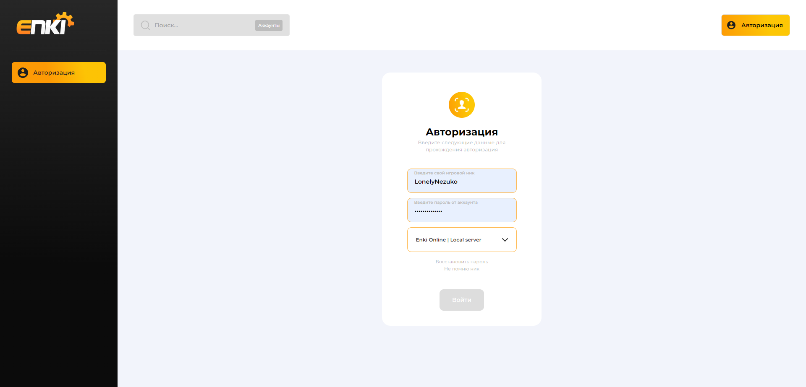
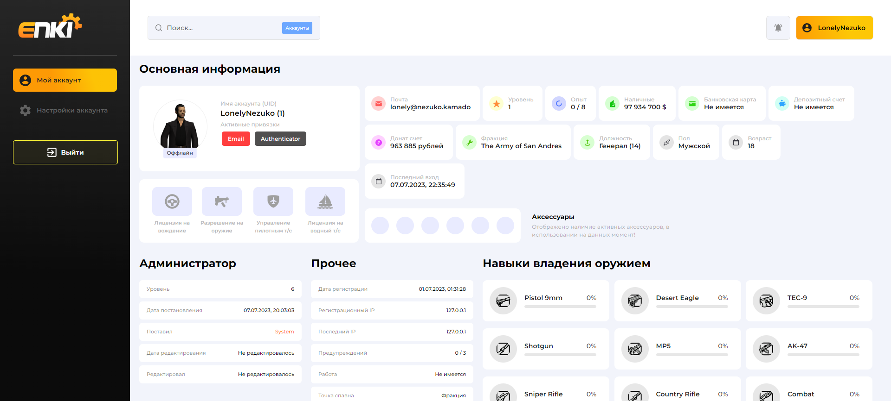
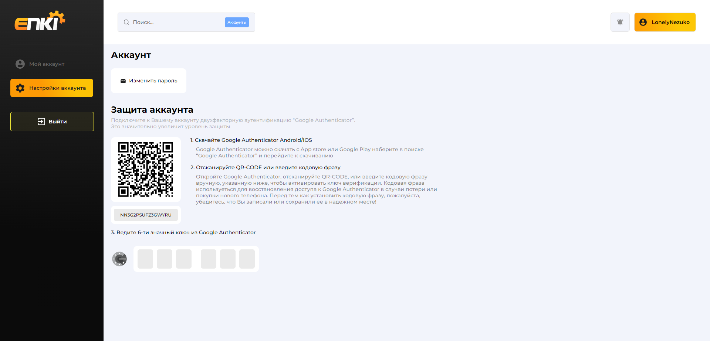

# LK for ENKI ONLINE
Личный кабинет для SA:MP проекта ENKI ONLINE


<details>
<summary>Изображения</summary>

    


</details>

<details>
<summary>Пример кода Express</summary>
    
```javascript
const express = require('express');
const router = express.Router();

const sha256 = require('js-sha256')
const speakeasy = require("speakeasy")

const user = require('../../modules/user')
const server = require('../../modules/server')

const { modeHandle } = require('../../modules/mysqlConnection')

router.get('/', (req, res, next) =>
{
    res.render('index', { pathname: '/account' })
})
router.get('/settings', (req, res, next) =>
{
    res.render('index', { pathname: '/account/settings' })
})


// post
router.post('/_get', (req, res) =>
{
    if(!req.body)return res.sendStatus(400)

    const account = user.getCookiesAuth(req.cookies)
    user.load(account, true).then(result =>
    {
        if(result === 'no')return res.send('remove_cookies')

        account.data = result
        get()
    })

    async function get()
    {
        const _result = {
            account: account.data
        }

        var results = await modeHandle.query(account.server, `select * from logs where userid = ${modeHandle.format(account.uid)}`)
        _result.logs = results

        res.send(JSON.stringify(_result))
    }
})
router.post('/_login', (req, res) =>
{
    if(!req.body)return res.sendStatus(400)

    req.body.password = sha256(req.body.password)
    user.load(req.body).then(result =>
    {
        if(typeof result === 'string') res.send(result)
        else res.send(JSON.stringify(result))
    })
})

router.post('/settings/_get', (req, res) =>
{
    if(!req.body)return res.sendStatus(400)

    const account = user.getCookiesAuth(req.cookies)
    user.load(account, true).then(result =>
    {
        if(result === 'no')return res.send('remove_cookies')

        account.data = result
        get()
    })

    async function get()
    {
        let result = await modeHandle.query(account.server, `select pGoogleAuth from players where pID = ${modeHandle.format(account.uid)}`)

        account.data.pGoogleAuth = result[0]['pGoogleAuth']
        account.data.pGoogleAuthCode = ''

        if(account.data.pGoogleAuth === 0) account.data.pGoogleAuthCode = speakeasy.generateSecret({ length: 10 }).base32
        res.send(JSON.stringify(account.data))
    }
})
router.post('/settings/_save', (req, res) =>
{
    if(!req.body)return res.sendStatus(400)

    const account = user.getCookiesAuth(req.cookies)
    user.load(account, true).then(result =>
    {
        if(result === 'no')return res.send('remove_cookies')

        account.data = result
        save()
    })

    async function save()
    {
        req.body.data = JSON.parse(req.body.data)

        switch(req.body.save)
        {
            case 'notf':
                account.data.siteSettings.notf = req.body.data
                await modeHandle.query(account.server, `update players set siteSettings = ${modeHandle.format(JSON.stringify(account.data.siteSettings))} where pID = ${modeHandle.format(account.uid)}`)
                break
        }
        res.send('')
    }
})
router.post('/settings/_addGoogleAuth', (req, res) =>
{
    if(!req.body)return res.sendStatus(400)

    const account = user.getCookiesAuth(req.cookies)
    user.load(account, true).then(result =>
    {
        if(result === 'no')return res.send('remove_cookies')

        account.data = result
        add()
    })

    async function add()
    {
        const
            value = req.body.value,
            token = req.body.token

        if(!value || value.length != 6
            || !token)return res.send('error')
        if(account.data.pGoogleAuthCode === 1)return res.send('')

        if(!speakeasy.totp.verify({
            secret: token,
            encoding: 'base32',
            token: value }))return res.send('invalid_code')

        modeHandle.query(account.server, `update players set pGoogleAuth = 1, pGoogleAuthCode = ${modeHandle.format(token)} where pID = ${modeHandle.format(account.data.pID)}`)

        server.sendCMD(account.server, 'player.googleAuth.set', `${account.data.pID};${token}`)
        user.sendNotf(account.server, account.data.pID, -1, 'Подключение Google Authenticator', 'На Ваш аккаунт успешно был подключен Google Authenticator')

        res.send('')
    }
})
router.post('/settings/_removeGoogleAuth', (req, res) =>
{
    if(!req.body)return res.sendStatus(400)

    const account = user.getCookiesAuth(req.cookies)
    user.load(account, true).then(result =>
    {
        if(result === 'no')return res.send('remove_cookies')

        account.data = result
        remove()
    })

    async function remove()
    {
        const value = req.body.value

        if(!value || value.length != 6)return res.send('error')
        if(account.data.pGoogleAuthCode === 0)return res.send('')

        if(!speakeasy.totp.verify({
            secret: account.data.pGoogleAuthCode,
            encoding: 'base32',
            token: value }))return res.send('invalid_code')

        modeHandle.query(account.server, `update players set pGoogleAuth = 0, pGoogleAuthCode = '-' where pID = ${modeHandle.format(account.data.pID)}`)

        server.sendCMD(account.server, 'player.googleAuth.remove', `${account.data.pID}`)
        user.sendNotf(account.server, account.data.pID, -1, 'Отключение Google Authenticator', 'На Вашем аккаунте успешно был отключен Google Authenticator')

        res.send('')
    }
})

router.post('/_clearnotf', (req, res) =>
{
    if(!req.body)return res.sendStatus(400)

    const account = user.getCookiesAuth(req.cookies)
    user.load(account, true).then(result =>
    {
        if(result === 'no')return res.send('remove_cookies')

        account.data = result
        clear()
    })

    async function clear()
    {
        await modeHandle.query(account.server, `delete from notf where notfAccount = ${modeHandle.format(account.uid)}`)
        return res.send('')
    }
})
router.post('/_readnotf', (req, res) =>
{
    if(!req.body)return res.sendStatus(400)

    const account = user.getCookiesAuth(req.cookies)
    user.load(account, true).then(result =>
    {
        if(result === 'no')return res.send('remove_cookies')

        account.data = result
        clear()
    })

    async function clear()
    {
        await modeHandle.query(account.server, `update notf set notfRead = 1 where notfAccount = ${modeHandle.format(account.uid)} and notfRead = 0`)
        return res.send('')
    }
})

router.post('/_changepass', (req, res) =>
{
    if(!req.body)return res.sendStatus(400)

    const account = user.getCookiesAuth(req.cookies)
    user.load(account, true).then(result =>
    {
        if(result === 'no')return res.send('remove_cookies')

        account.data = result
        change()
    })

    async function change()
    {
        const
            oldpass = req.body.oldpass,
            newpass = req.body.newpass

        if(oldpass === undefined || newpass === undefined
            || !oldpass.length || !newpass.length)return res.send('invalid_data')

        if(account.data.pPassword.toLowerCase() !== sha256(oldpass).toLowerCase())return res.send('invalid_old_pass')

        await modeHandle.query(account.server, `update players set pPassword = ${modeHandle.format(sha256(newpass).toUpperCase())} where pID = ${modeHandle.format(account.uid)}`)
        return res.send('')
    }
})


module.exports = router;
```
</details>

<details>
<summary>Пример кода CSS</summary>
    
```css
.account-user,
.account-lic
{
    display: flex;

    background-color: white;
    padding: 30px;
    padding-bottom: 40px;

    border-radius: 11px;

    width: 415px;
}
.account-user .account-user-image
{
    width: 115px;
    height: 115px;

    position: relative;
}
.account-user .account-user-image.account-user-image-online .avatar
{
    background-color: #F1FFE9;
    border: 1px solid #55FF2B;
}
.account-user .account-user-image.account-user-image-ban .avatar
{
    background-color: #f9d8d8;
    border: 1px solid #F85C5C;
}
.account-user .account-user-image span
{
    position: absolute;

    bottom: -12px;
    left: 50%;

    font-size: 11px;
    color: #4E4E4E;

    transform: translateX(-50%);
    background-color: #E9EBFF;

    padding: 3px 8px;
    border-radius: 4px;
}
.account-user .account-user-image.account-user-image-online span
{
    background-color: #63FB72;
}
.account-user .account-user-image.account-user-image-ban span
{
    background-color: #F85C5C;
    color: white;
}

.account-user .account-user-info
{
    margin-left: 30px;
}
.account-user .account-user-info div h2
{
    color: #B9B9B9;

    font-size: 12px;
    font-weight: 500;

    margin-bottom: 4px;
}
.account-user .account-user-info div span
{
    font-size: 16px;
    font-weight: 600;
}
.account-user .account-user-info div + div
{
    margin-top: 6px;
}
.account-user .account-user-info div span .button
{
    padding: 7px 13px;
    border-radius: 5px;

    margin: 3px;
    cursor: default;

    background-color: #504F4F;
    color: white;

    font-weight: 500;
    font-size: 12px;
}
.account-user .account-user-info div span .button.button-select
{
    background: #FF3E3E;
}


.account-lic
{
    margin-top: 17px;
    padding: 17px;

    width: calc(415px + 34px - 10px);
    align-items: center;
}
.account-lic .account-lic-item
{
    display: flex;
    flex-wrap: wrap;
    justify-content: center;

    position: relative;
}
.account-lic .account-lic-item svg
{
    background-color: #E9EBFF;
    padding: 14px 26px;

    border-radius: 10px;

    width: 34px;
    height: 34px;
}
.account-lic .account-lic-item.account-lic-item-other-on svg
{
    cursor: pointer;
}
.account-lic .account-lic-item span
{
    font-size: 11px;
    font-weight: 600;

    text-align: center;
    margin-top: 7px;

    color: #B9B9B9;
}
.account-lic .account-lic-item.account-lic-item-select span
{
    color: black;
}
.account-lic .account-lic-item .account-lic-item-other
{
    position: absolute;

    top: -100%;
    left: 0;

    transform: translateY(-35%);

    background-color: white;
    filter: drop-shadow(0px 4px 21px rgba(0, 0, 0, 0.25));

    border-radius: 11px;

    display: flex;
    flex-wrap: wrap;
    justify-content: space-between;

    width: 270px;
    z-index: 5;

    padding: 8px;
    transition: .2s;

    opacity: 0;
    visibility: hidden;
}
.account-lic .account-lic-item .account-lic-item-other:before
{
    position: absolute;

    display: block;
    content: "";

    width: 100%;
    height: 28px;

    background-color: transparent;

    bottom: --28px;
    left: 0;
}
.account-lic .account-lic-item .account-lic-item-other div
{
    background-color: #E9EBFF;
    padding: 13px 23px;

    border-radius: 10px;

    display: flex;
    align-items: center;
    justify-content: center;

    position: relative;
    margin: 8px;
}
.account-lic .account-lic-item .account-lic-item-other div svg
{
    background-color: transparent;
    padding: 0;

    border-radius: 0;

    width: 26px;
    height: 26px;

    cursor: default;
}
.account-lic .account-lic-item .account-lic-item-other div span
{
    position: absolute;

    top: 5px;
    right: 5px;

    font-weight: 700;
    color: #9F9F9F;

    font-size: 10px;
    margin: 0;

    cursor: default;
}
.account-lic .account-lic-item .account-lic-item-other div.account-lic-item-other-select span
{
    color: #FF8515;
}
.account-lic .account-lic-item.account-lic-item-other-on svg:hover ~ .account-lic-item-other
{
    transform: translateY(-45%);
    opacity: 1;
    visibility: visible;
}

.account-info
{
    display: flex;
    flex-wrap: wrap;

    /* width: 100%; */
}
.account-info .account-info-item
{
    background-color: white;
    border-radius: 11px;

    margin: 0 3px;
    margin-bottom: 8px;

    padding: 21px 14px;
    padding-right: 20px;

    display: flex;
    align-items: center;
}
.account-info .account-info-item svg
{
    width: 31px;
    height: 31px;
}
.account-info .account-info-item div
{
    margin-left: 10px;
}
.account-info .account-info-item div section:first-child
{
    font-weight: 500;
    font-size: 12px;

    color: #B9B9B9;
}
.account-info .account-info-item div section:last-child
{
    color: #171717;
}

.account-acs
{
    width: 710px;

    display: flex;
    align-items: center;
    justify-content: space-between;

    margin-left: 3px;
    margin-top: 13px;
}
.account-acs .account-acs-wrap
{
    background-color: white;
    border-radius: 11px;

    padding: 18px 6px;

    display: flex;
    align-items: center;
}
.account-acs .account-acs-wrap .account-acs-item
{
    width: 38px;
    height: 38px;

    border-radius: 100%;
    background-color: #E9EBFF;

    margin: 0 8px;

    display: flex;
    align-items: center;
    justify-content: center;

    position: relative;
}
.account-acs .account-acs-wrap .account-acs-item.account-acs-item-select
{
    background-color: #FFE193;
    border: 1px solid #FFA41B;

    width: 37px;
    height: 37px;

    cursor: pointer;
}
.account-acs .account-acs-wrap .account-acs-item img
{
    width: 28px;
    height: 28px;
}
.account-acs .account-acs-wrap .account-acs-item.account-acs-item-error img
{
    width: 14px;
    height: 14px;
}
.account-acs .account-acs-wrap .account-acs-item.account-acs-item-select:hover > div
{
    top: calc(-100% - 10px);
    opacity: 1;
    visibility: visible;
}
.account-acs .account-acs-wrap .account-acs-item div
{
    position: absolute;

    top: -100%;
    left: 50%;

    transform: translateX(-50%);

    font-size: 11px;
    font-weight: 500;

    color: black;

    background-color: white;
    box-shadow: 0px 1px 11px rgba(0, 0, 0, 0.25);

    border-radius: 5px;
    white-space: nowrap;

    padding: 8px 11px;
    transition: .2s;

    opacity: 0;
    visibility: hidden;
}
.account-acs .account-acs-wrap .account-acs-item div:before
{
    position: absolute;

    display: block;
    content: "";

    width: 100%;
    height: 14px;

    background-color: transparent;

    bottom: -13px;
    left: 0;
}
.account-acs .account-acs-info
{
    margin-left: 24px;
}
.account-acs .account-acs-info h1
{
    font-size: 14px;

    margin: 0;
    margin-bottom: 4px;
}
.account-acs .account-acs-info span
{
    font-size: 12px;
    font-weight: 500;

    color: #0000004D;
}

.account-other
{
    min-width: 100%;
    position: relative;
}
.account-other-wrap
{
    display: flex;
    width: 350px;

    transition: .2s;
}
.account-other .account-other-item
{
    width: calc(100% - 32px);

    background-color: white;
    border-radius: 7px;

    padding: 11px 16px;

    display: flex;
    justify-content: space-between;

    margin-bottom: 7px;
}
.account-other .account-other-item:last-child
{
    margin: 0;
}
.account-other .account-other-item.account-other-item-empty
{
    padding: 17px 16px;
    background-color: transparent;
}
.account-other .account-other-item span,
.account-other .account-other-item span a
{
    font-size: 11px;
    font-weight: 500;
}
.account-other .account-other-item span:first-child
{
    color: #00000080;
}
.account-other .account-other-item span:last-child
{
    text-align: right;
}
.account-other-select
{
    display: flex;
    align-items: center;
    justify-content: center;

    margin-top: 14px;
}
.account-other-select button
{
    width: 10px;
    height: 10px;

    border-radius: 100%;
    background-color: #CECECE;

    border: 0;
    margin: 0 3px;

    cursor: pointer;
    user-select: none;
}
.account-other-select button.account-other-select-btn
{
    background: linear-gradient(259.38deg, #FDC705 31.85%, #FD9A05 102.19%);
}

.account-ban
{
    display: flex;
    align-items: center;
    justify-content: space-between;

    background-color: white;

    /* border: 1.5px solid transparent;
    border-image: linear-gradient(92.81deg, #FF5858 -4.55%, rgba(255, 88, 88, 0) 82.47%);
    border-image-slice: 1; */

    border-radius: 11px;

    padding: 18px;
    position: relative;

    z-index: 2;
}
.account-ban:before
{
    position: absolute;

    display: block;
    content: "";

    width: calc(100% + 2px);
    height: calc(100% + 2px);

    top: -1px;
    left: -1px;

    background: linear-gradient(92.81deg, #FF5858 -4.55%, rgba(255, 88, 88, 0) 82.47%);
    z-index: -1;

    border-radius: 11px;
}
.account-ban:after
{
    position: absolute;

    display: block;
    content: "";

    width: 100%;
    height: 100%;

    top: 0;
    left: 0;

    background: white;
    z-index: -1;

    border-radius: 11px;
}
.account-ban section
{
    display: flex;
    align-items: center;
}
.account-ban section svg
{
    width: 38px;
    height: 38px;
}
.account-ban section div
{
    margin-left: 14px;
}
.account-ban section div section
{
    display: block;
}
.account-ban section div section:first-child
{
    color: #FF3F3F;
}
.account-ban section div section:last-child
{
    color: #FF3F3FB2;

    font-size: 12px;
    font-weight: 500;

}
.account-ban .button
{
    background: #FF7474;
    color: white;

    font-size: 12px;
    padding: 12px 30px;
}


.account-skills
{
    display: flex;
    align-items: center;
    flex-wrap: wrap;
    justify-content: space-between;

    width: 100%;
}
.account-skills .account-skills-item
{
    background-color: white;
    border-radius: 10px;

    padding: 15px;
    padding-right: 28px;

    display: flex;
    align-items: center;

    margin-bottom: 15px;
}
.account-skills .account-skills-item img
{
    width: 31px;
    height: 31px;

    padding: 14px;
    background-color: #E7E7E7;

    border-radius: 50%;
}
.account-skills .account-skills-item.account-skills-item-select img
{
    background: linear-gradient(259.38deg, #FDC705 31.85%, #FD9A05 102.19%);
}
.account-skills .account-skills-item .account-skills-item-info
{
    margin-left: 16px;
}
.account-skills .account-skills-item .account-skills-item-info h1
{
    display: flex;
    justify-content: space-between;

    width: 155px;
    margin: 0;

    margin-bottom: 7px;
}
.account-skills .account-skills-item .account-skills-item-info h1 span:first-child
{
    font-weight: 600;
    font-size: 14px;

    color: #202020;
}
.account-skills .account-skills-item .account-skills-item-info h1 span:last-child
{
    font-weight: 400;
    font-size: 14px;

    color: #494949;
    text-align: right;
}
.account-skills .account-skills-item .account-skills-item-info section
{
    width: 155px;
    height: 6px;

    background-color: #E7E7E7;

    border-radius: 10px;
}
.account-skills .account-skills-item .account-skills-item-info section section
{
    background: linear-gradient(98.39deg, #FF6635 14.05%, #FFA215 36.67%);
}


.account-baninfo-wrap
{
    position: fixed;

    top: 0;
    left: 0;

    width: 100%;
    height: 100%;

    background-color: rgba(255, 255, 255, .3);
    z-index: 255;

    display: none;
}
.account-baninfo-wrap.account-baninfo-wrap-show
{
    display: block;
}
.account-baninfo
{
    position: absolute;

    left: 50%;
    top: 55px;

    transform: translateX(-50%);

    background: url(/images/account/baninfo_bg.png);
    background-repeat: no-repeat;
    background-size: cover;
    background-position: center;

    width: 412px;
    height: 610px;

    transition: .2s;
}
.account-baninfo .account-baninfo-center
{
    position: absolute;

    top: 85px;
    left: 72px;

    width: 65%;
    height: 68%;
}
.account-baninfo .account-baninfo-svg
{
    width: 100%;
    display: flex;
    justify-content: center;

    position: relative;
    padding-bottom:
}
.account-baninfo svg
{
    width: 86px;
    height: 86px;
}
.account-baninfo h1
{
    margin-top: 25px;
    color: #FF3F3F;

    font-weight: 500;
    font-size: 17px;

    text-align: center;
    position: relative;

    padding-bottom: 11px;
}
.account-baninfo h1:before
{
    position: absolute;

    display: block;
    content: "";

    width: 100%;
    height: 2px;

    background-color: #C4C4C466;

    bottom: 0;
    left: 0;
}
.account-baninfo section
{
    margin-top: 11px;
}
.account-baninfo section h2,
.account-baninfo section h2 span,
.account-baninfo section h2 a
{
    font-size: 12px;
    color: #737373;

    text-align: center;
    font-weight: 500;
}
.account-baninfo section h2 span,
.account-baninfo section h2 a
{
    color: black;
}
.account-baninfo section h2 + h2
{
    margin-top: 4px;
}
.account-baninfo section h3
{
    margin-top: 25px;

    font-size: 12px;
    font-weight: 500;

    text-align: center;
}
.account-baninfo section h3 a
{
    font-size: 12px;
    font-weight: 500;

    color: #FF3F3F;
}
.account-baninfo .account-baninfo-bottom
{
    position: absolute;

    bottom: 0;
    left: 50%;

    transform: translateX(-50%);

    display: flex;
    align-items: center;
}
.account-baninfo .account-baninfo-bottom .button
{
    padding: 14px 35px;
}
.account-baninfo .account-baninfo-bottom .button:first-child
{
    background-color: #FF3F3F;
    color: white;
}
.account-baninfo .account-baninfo-bottom .button:last-child
{
    margin-left: 15px;
}


.account-settings .button
{
    color: black;
    padding: 26px 38px;

    margin-right: 17px;
    margin-bottom: 17px;
}
```
</details>


<details>
<summary>Пример кода JS</summary>
    
```javascript
import auth from '../../_auth.js'
import url from '../../_url.js'
import functions from '../../_functions.js'
import _renderLogs from '../_renderLogs.js'

import { returnItemData, jobNames } from '../../_other.js'

export function _renderAccount(data)
{
    $('.menu .menu-nav-item[href="/account"]').addClass('menu-nav-item-select')

    data = JSON.parse(data)

    const logs = data.logs
    data = data.account

    data.invModel = data.invModel.split(',')
    data.invQuantity = data.invQuantity.split(',')
    data.invCustom = data.invCustom.split(',')
    data.invSimCost = data.invSimCost.split(',')

    const spawnNames = [ 'Стандартный', 'Фракция', 'Бизнес', 'Дом' ]

    $('.body').html(`
        ${data.ban ? `
            <div class="account-baninfo-wrap">
                <div class="account-baninfo">
                    <div class="account-baninfo-center">
                        <div class="account-baninfo-svg"><svg viewbox="0 0 86 86" fill="none" xmlns="http://www.w3.org/2000/svg">
                                <rect width="86" height="86" rx="10" fill="#FFD2D2" fill-opacity="0.5"></rect>
                                <mask id="accountBanInfoSVGMask" style="mask-type:alpha" maskunits="userSpaceOnUse" x="19" y="19" width="48" height="48">
                                    <rect x="19" y="19" width="48" height="48" fill="url(#accountBanInfoSVGPattern)"></rect>
                                </mask>
                                <g mask="url(#accountBanInfoSVGMask)">
                                    <rect x="19" y="19" width="48" height="48" fill="#FF3F3F"></rect>
                                </g>
                                <defs>
                                    <pattern id="accountBanInfoSVGPattern" patterncontentunits="objectBoundingBox" width="1" height="1">
                                        <use xlink:href="#accountBanInfoSVGImage" transform="scale(0.0104167)"></use>
                                    </pattern>
                                    <image id="accountBanInfoSVGImage" width="96" height="96" xlink:href="data:image/png;base64,iVBORw0KGgoAAAANSUhEUgAAAGAAAABgCAYAAADimHc4AAAABmJLR0QA/wD/AP+gvaeTAAAF8ElEQVR4nO2dXWhcRRTHf+s2sdrUmrSJWDVg/Ci1PhhbsaAIgvpSxdaoWKwifRD8qsY+FMTWvAh+4IP2qYqIiG/iSxWEKhLji/1Sm1ajD1XRpq0mrcU0aDW7PswuhLC9c++dc2bu3b0/OFC6m5n/nHN3dj7OzEJBQUFBQatSCi0gJhcDtwKrgWVAH7AY6Ki9PgVMAoeBMeAr4HPgqHelTUQ38AywD6imtD3A07WyCmLSC2wHpknv+Lk2DbwBXOaxHbmjDfO0/oWc4xsFYgiY76lNuWEFcBA9x8+1UeAaLy3LAeuB0/hzft2mgPs9tC/TPAnM4N/5dasAm9VbmVEeJ5zj59qgclszx3qSP/njwA5gA9CPmQfMq9ni2v9tAN7EjP+TlD1DC3VHK0jW5w8Da4BygjrKwJ3ASIJ6poDlTi3LAecSf7QzDqwVqHMAOBKzzgNAu0CdmWUr8RyxB7hEsN5u4LOYdT8nWG+m6CXe7PZD4DyF+tuBD2LUfxq4VKH+4GzH3vjd6Di/TjvxPgmvK2oIQjf2p38c2W7nbPTU6orSMk2TLeANYn/qJL5w43JvDD1PedSjjm1JeTiAJtsQdXcATSosxf60rQmg6y6LpgpwUQBd4jyIve9PMsmSogwcs2h7QFvEOdoVADdaXt+JWQrwzQzwkeU9q7VF+AjAMsvrIx40nI0vLK/btDvjIwBXWl4/5EFD2rpt2nPBJNH9bFc4aSyJ0FUFJsJJk+MfohvZFk4a7RG6qhjtqvjIC6o6algErAJuAFZicoQ6ZxnAyVl2FNiLWdDbB5xS1pd5bHOARlwNbMNsnldilBE1lj9QK+sqQX25Im4D5wNPYJ7etA632V7MVujstJSWD0A78CjwW4z3StlxYAtm5bXlAxB3t0rD4tStSha+hLOOqo98TMQKIigCEJgiAIEpAhAY7QDkfhZJzr+EX1Au3wfbQgtIy92EzXyWsgpmEz9X9GIWwUI7T8r+JEfHm0rAJ4R3mrTtIiffaRsJ7ywte0TQTyp0YM86y7MdARaIeQv5UdBmzIZJs7KUDJ+mOR/7/m8z2AkEPwWSn4CNhN1g90Un8HBoEY34Hj9P4NfAY8C1mIAvqP17EH9njb8T8pkY16Pf6DOYXayoT20Z2FR7r7ae61L4SY2X0G3sv8DtCfTcgX4QXkygRx3t7ufZFJo2KWsaTaFJhR7cUkdstp90M9Aypq/W0lXBnE92QmIUdDO6U/QdmAYnZQZ4S1jLbErATa6FSASgX6CMKFyyp3eJqWjMStcCJAKgnUF82OFvfxFT0RjntuchAC78p1x+JgKgfY6qz+FvLxdT0RjntksEoMP+Fiduc/hb7cN/C5XLj4Ut/9/VDpHuEF8Z+ElZm/r5gThoB6BKuonY8x50/Z1ClzgT6Df0DOb+n7isw09CwB8JNKnxM/oNrQdhSww9Q/jLxnAZIouheaCikdnwqcX5OgOJUdCPAmXklR9cC5AIgLOIHJOJABwUKCOvOB8yl1jF7MFceuEraclWT5zvCQnqt6k4HeaW+AT8TtjrBkLxLQIn6aWyIrSXfbPIp6EFzGYVrTcMzdSmPJg90lYJgFiXK5mY9a5gWVFErUAu8qThbU/1JGIhJm1P++lbF6FhwEP9E+gvwadmCH0HjNE4BbILMyvXrn+rk4eU6cQMS7Wd8CtwH3BBzQbw4/xj+OvmUtPMBzQeEvSTGiXgS8I7S9qGyckRJYArMAfbQjtNyk7ilhwQhDj3M+fF7hH2jTdeI7zzXO1lca94pAS8Q3gnprX3aYL7NNqAjwnvzKS2k7BXaooyDzN9D+3UuPYeTeT8OiXgVcI7N8oqmD4/N8PNNKzFz5pRUjtFC/2YWx/m5vLQTq/bMPqJvJmjhDlve5xwjp/E3Fna1F2OjQsxlyL5PGU/gVnVzPzCmk86MEm4moetRzEHujO7np8V+jEjpm9wy/OcwZysf4UM7uFCPvq+JcAtmJ8gX465Wb0L03XVn+QpzOLfCUy22hhm33aEJvkRhoKCgoKC5uN/lwFJ7zSJGXQAAAAASUVORK5CYII="></image>
                                </defs>
                            </svg></div>
                        <h1>Аккаунт заблокирован</h1>
                        <section>
                            <h2>Заблокировал: <a href="/">${data.ban.banAdminName}</a></h2>
                            <h2>Причина блокировки: <span>${data.ban.banReason}</span></h2>
                            <h2>Дата блокировки: <span>${new Date(data.ban.banDate).toLocaleString()}</span></h2>
                            <h2>Разблокировка: <span>${new Date(parseInt(data.ban.banTime.toString() + '000')).toLocaleString()}</span></h2>
                            <h3>Если Вы не согласны с решением администратора, Вы можете подать на него <a href="/report">жалобу</a>.</h3>
                        </section>
                        <div class="account-baninfo-bottom">
                            <a class="button" href="/report">Жалоба</a>
                            <button class="button" id="accountBanInfoClose">Закрыть</button>
                        </div>
                    </div>
                </div>
            </div>` : ''}

        <div class="mainbox" style="display: flex;">
            <div class="mainbox-section mainbox-section-flex">
                <h1>Основная информация</h1>
                ${data.ban ? `
                    <div class="mainbox-section-wrap" style="margin: 0; margin-bottom: 17px; width: 100%;">
                        <div class="account-ban">
                            <section>
                                <svg viewbox="0 0 38 38" fill="none" xmlns="http://www.w3.org/2000/svg">
                                    <circle cx="19" cy="19" r="19" fill="#FFD2D2"></circle>
                                    <mask id="accountBanSVGMask" style="mask-type:alpha" maskunits="userSpaceOnUse" x="9" y="9" width="20" height="20">
                                        <rect x="9" y="9" width="20" height="20" fill="url(#accountBanSVGPattern)"></rect>
                                    </mask>
                                    <g mask="url(#accountBanSVGMask)">
                                        <rect x="9" y="9" width="20" height="20" fill="#FF3F3F"></rect>
                                    </g>
                                    <defs>
                                        <pattern id="accountBanSVGPattern" patterncontentunits="objectBoundingBox" width="1" height="1">
                                            <use xlink:href="#accountBanSVGImage" transform="scale(0.0104167)"></use>
                                        </pattern>
                                        <image id="accountBanSVGImage" width="96" height="96" xlink:href="data:image/png;base64,iVBORw0KGgoAAAANSUhEUgAAAGAAAABgCAYAAADimHc4AAAABmJLR0QA/wD/AP+gvaeTAAAF8ElEQVR4nO2dXWhcRRTHf+s2sdrUmrSJWDVg/Ci1PhhbsaAIgvpSxdaoWKwifRD8qsY+FMTWvAh+4IP2qYqIiG/iSxWEKhLji/1Sm1ajD1XRpq0mrcU0aDW7PswuhLC9c++dc2bu3b0/OFC6m5n/nHN3dj7OzEJBQUFBQatSCi0gJhcDtwKrgWVAH7AY6Ki9PgVMAoeBMeAr4HPgqHelTUQ38AywD6imtD3A07WyCmLSC2wHpknv+Lk2DbwBXOaxHbmjDfO0/oWc4xsFYgiY76lNuWEFcBA9x8+1UeAaLy3LAeuB0/hzft2mgPs9tC/TPAnM4N/5dasAm9VbmVEeJ5zj59qgclszx3qSP/njwA5gA9CPmQfMq9ni2v9tAN7EjP+TlD1DC3VHK0jW5w8Da4BygjrKwJ3ASIJ6poDlTi3LAecSf7QzDqwVqHMAOBKzzgNAu0CdmWUr8RyxB7hEsN5u4LOYdT8nWG+m6CXe7PZD4DyF+tuBD2LUfxq4VKH+4GzH3vjd6Di/TjvxPgmvK2oIQjf2p38c2W7nbPTU6orSMk2TLeANYn/qJL5w43JvDD1PedSjjm1JeTiAJtsQdXcATSosxf60rQmg6y6LpgpwUQBd4jyIve9PMsmSogwcs2h7QFvEOdoVADdaXt+JWQrwzQzwkeU9q7VF+AjAMsvrIx40nI0vLK/btDvjIwBXWl4/5EFD2rpt2nPBJNH9bFc4aSyJ0FUFJsJJk+MfohvZFk4a7RG6qhjtqvjIC6o6algErAJuAFZicoQ6ZxnAyVl2FNiLWdDbB5xS1pd5bHOARlwNbMNsnldilBE1lj9QK+sqQX25Im4D5wNPYJ7etA632V7MVujstJSWD0A78CjwW4z3StlxYAtm5bXlAxB3t0rD4tStSha+hLOOqo98TMQKIigCEJgiAIEpAhAY7QDkfhZJzr+EX1Au3wfbQgtIy92EzXyWsgpmEz9X9GIWwUI7T8r+JEfHm0rAJ4R3mrTtIiffaRsJ7ywte0TQTyp0YM86y7MdARaIeQv5UdBmzIZJs7KUDJ+mOR/7/m8z2AkEPwWSn4CNhN1g90Un8HBoEY34Hj9P4NfAY8C1mIAvqP17EH9njb8T8pkY16Pf6DOYXayoT20Z2FR7r7ae61L4SY2X0G3sv8DtCfTcgX4QXkygRx3t7ufZFJo2KWsaTaFJhR7cUkdstp90M9Aypq/W0lXBnE92QmIUdDO6U/QdmAYnZQZ4S1jLbErATa6FSASgX6CMKFyyp3eJqWjMStcCJAKgnUF82OFvfxFT0RjntuchAC78p1x+JgKgfY6qz+FvLxdT0RjntksEoMP+Fiduc/hb7cN/C5XLj4Ut/9/VDpHuEF8Z+ElZm/r5gThoB6BKuonY8x50/Z1ClzgT6Df0DOb+n7isw09CwB8JNKnxM/oNrQdhSww9Q/jLxnAZIouheaCikdnwqcX5OgOJUdCPAmXklR9cC5AIgLOIHJOJABwUKCOvOB8yl1jF7MFceuEraclWT5zvCQnqt6k4HeaW+AT8TtjrBkLxLQIn6aWyIrSXfbPIp6EFzGYVrTcMzdSmPJg90lYJgFiXK5mY9a5gWVFErUAu8qThbU/1JGIhJm1P++lbF6FhwEP9E+gvwadmCH0HjNE4BbILMyvXrn+rk4eU6cQMS7Wd8CtwH3BBzQbw4/xj+OvmUtPMBzQeEvSTGiXgS8I7S9qGyckRJYArMAfbQjtNyk7ilhwQhDj3M+fF7hH2jTdeI7zzXO1lca94pAS8Q3gnprX3aYL7NNqAjwnvzKS2k7BXaooyDzN9D+3UuPYeTeT8OiXgVcI7N8oqmD4/N8PNNKzFz5pRUjtFC/2YWx/m5vLQTq/bMPqJvJmjhDlve5xwjp/E3Fna1F2OjQsxlyL5PGU/gVnVzPzCmk86MEm4moetRzEHujO7np8V+jEjpm9wy/OcwZysf4UM7uFCPvq+JcAtmJ8gX465Wb0L03XVn+QpzOLfCUy22hhm33aEJvkRhoKCgoKC5uN/lwFJ7zSJGXQAAAAASUVORK5CYII="></image>
                                    </defs>
                                </svg>
                                <div>
                                    <section>Аккаунт заблокирован</section>
                                    <section>Ваш аккаунт заблокировал администратор ${data.ban.banAdminName}</section>
                                </div>
                            </section>
                            <button class="button" id="accountBanInfo">Подробнее</button>
                        </div>
                    </div>` : ''}
                <div class="mainbox-section-wrap" style="margin-left: 0; margin-top: 0; width: 475px;">
                    <div class="account-user">
                        <div class="account-user-image ${data.ban ? "account-user-image-ban" : data.pOnline != -1 ? "account-user-image-online" : ""}">
                            <div class="avatar avatar-full">
                                
                            </div>
                            <span>${data.ban ? "Заблокирован" : data.pOnline != -1 ? "Онлайн" : "Оффлайн"}</span>
                        </div>
                        <div class="account-user-info">
                            <div>
                                <h2>Имя аккаунта (UID)</h2><span>${data.pName} (${data.pID})</span>
                            </div>
                            <div>
                                <h2>Активные привязки</h2>
                                <span>
                                    <button class="button button-select" disabled="disabled">Email</button>
                                    <button class="button ${data.pGoogleAuth ? "button-select" : ""}" disabled="disabled">Authenticator</button>
                                </span>
                            </div>
                        </div>
                    </div>
                    <div class="account-lic">
                        <div class="account-lic-item ${data.invModel.indexOf('20') != -1 || data.invModel.indexOf('21') != -1 || data.invModel.indexOf('22') != -1 || data.invModel.indexOf('23') != -1 || data.invModel.indexOf('24') != -1 || data.invModel.indexOf('26') != -1 ? "account-lic-item-select" : ""} account-lic-item-other-on"><svg viewbox="0 0 34 34" fill="none" xmlns="http://www.w3.org/2000/svg">
                                <mask id="accountLicItemCarSVGMask" style="mask-type:alpha" maskunits="userSpaceOnUse" x="0" y="0" width="34" height="34">
                                    <rect width="34" height="34" fill="url(#accountLicItemCarSVGPattern)"></rect>
                                </mask>
                                <g mask="url(#accountLicItemCarSVGMask)">
                                    <rect width="34" height="34" fill="${data.invModel.indexOf('20') != -1 || data.invModel.indexOf('21') != -1 || data.invModel.indexOf('22') != -1 || data.invModel.indexOf('23') != -1 || data.invModel.indexOf('24') != -1 || data.invModel.indexOf('26') != -1 ? "url(#accountLicItemCarSVGGradient)" : "#9F9F9F"}"></rect>
                                </g>
                                <defs>
                                    <pattern id="accountLicItemCarSVGPattern" patterncontentunits="objectBoundingBox" width="1" height="1">
                                        <use xlink:href="#accountLicItemCarSVGImage" transform="scale(0.01)"></use>
                                    </pattern>
                                    <lineargradient id="accountLicItemCarSVGGradient" x1="-2.26667" y1="-3.4" x2="17" y2="34" gradientunits="userSpaceOnUse">
                                        <stop stop-color="#FF6635"></stop>
                                        <stop offset="1" stop-color="#FF8515"></stop>
                                    </lineargradient>
                                    <image id="accountLicItemCarSVGImage" width="100" height="100" xlink:href="data:image/png;base64,iVBORw0KGgoAAAANSUhEUgAAAGQAAABkCAYAAABw4pVUAAAABmJLR0QA/wD/AP+gvaeTAAAJTUlEQVR4nO2da4xdVRXHf53pTMd0KjPE+IgzHUGBaitIgxEDBi1TUol+sEEkGkASHxi0CIo0ULE+qGC0aoyPxIIFUQIiCZiQaAtEKSoPNdSinYJtJfjBIKX2NdN2Zq4f1rmZYc/tzFlrr33OueP9Jyu9Z9Kz13/vdc7Ze6+99trQQgsttNBCCzbMKZtADnQBp2RyMvBm4ERgfia92b8AB4GXsn8PADuB7cAQsCP7fbhA7mpU0SBzgdOAwUzORozigVHgKWBzJo9QcQOVhTbgXOA2YB9QK0j2ARuBZRmH/3v0A+uA5yjOCMeS54Abgb6kNa4oTgC+CwxTviFCOQLcjvRZsx4nAD9DvuVlN/xMchS4A3hDkpYoGR3AlcB+ym9orRwC1gLz3FulJAwiw86yGzZWtiOdf9NiLvJkjVF+Y3rJONL3dTq2UyHoBx6l/AZMJY8j/WFTYAWwh/IbLbW8CJzn1GbJ8BFk2Fh2YxUlR4HLXFoug6fr5CrgW85lTsYO4DGkc92RyQEmfFcw4dtaAJyE+L4WAWdm1ykwDlyN9C2VwVfwf/qGgbuAi4HXO3DsAy4BfkGaCelaB44uuArfij0BfBzoSci5B/hEpsuT+5UJOefCh/Eb1m4B3k/xHuizgV9Fcq/LOHBpsfQnsAKfDnw7MnksG+fhM4E9TAmjrwHih7bDwPVUa5I1D1hDfB/zIrCwKNIdxE/6hoC3FUXYgNORUVxMHf9IQQ/bNyOJ3okMS6uOVwJ3E1fXm1OTHEQ6LivBb1DNZeNjYQ5xD+A48J5U5OZh7/TGgc+nIlYArsH+IP6dRJ+uLxoJ1WhuY9RxDfb6r/YmM4C4KSxkbvImUyKsn6+DOHuHf24kcifN1WfMhDmI68XSFrd7kXgj4tXUEngGGanMNnQjk1lte4wCb/IgsMGgfAQZy89WnIpt8vijWMX9iCtAq/i6WMVNgC+hb5cjRM7g1xmUbmcWRWhMgy7ks6xtn69ZFbZhiyisgqOwKKxA3z67MYatnmtQ9rCpWvnRC3wAWA/8GvgH4uQ8msme7G+/Ab4DfBB4VWJOj6BvJ9Ps/TaDouW2Os2I5cD92PqzUWATYpz2BNwsb8mtWiWd6KPQH7fXqSHakEb8k5LHdLITWMXEfhIvPKnk8V/Ea54b71IqqCHLrl54O/B7A4e88i9kCdfrjbncwOGdGgU3KAsfxmcNvB/xCsR4lDWyFZ/VvV5k7qXRfb1GwcPKwu+KrNB84MuIz6cIQ4TyALA4sg73KHU+mLfgLvTWvthYiVcAVwDPK/WlkKPALUgslwUfVeobJud87TRDZbS7jnqRV/bfBl2pZQxxIJ6hrNNCg6635in4QmWhQzkJH4+MmrwC1bYicVCLmdiRuzj7218dyq8Bf0HWchblrKN25n5BnkK1C1GhW3kBEsDwPmSIuQH4M37xWyPAp5h+ttuOfAot85ZjyT+RNfbVwEpkJBjGBtyhLDNXx64tNHQkXuvYCI2MoZnlLsPXKKF8IdC3Rnn/lDWSRk+ZdmUr/GTlfb0t+Cw698xDwOcScYGpdc37+a4jV1tvRWflML4q1YRuKzanXDuwLRGnRwNdpyvvfyok26iC2lW+l4Lr1ynvz4sNyIRRizFkOJsCrw2u9yrvnxKf1sgg3cpCD0TenxebI+7d5Mbi5Qgf3v3K+3MFDGo7wTDmKFUnGmPoBYk4jQR65kXenyS/x1iCMiEueiVV5It7+zUqMPa122PkMhP6I+5NFYl+KLjWxixPaetmMkjM4leqhbNwQFMJg4Ru91QG+Ri29Yv27N4UeD647lXen8sg+5SFhsFfu5T358USZCFIiyuAtzhzqWNHcK0NhJvS1o0MsltZaJjGyHspdzLWI8EXeTGIxOOmQlhXbUqnKQ9vI4Nop/9FGqQTWUz6NNN/vtoRx+YDKNeulXgiuNYaJFdba93v4WvbQTGJybYhW7KXIHOU7uz31cDTBegfZqqxn1WWkcv9fqqBXMyQdD7y7V2JuDiKzLk4CtyHJBRYRNzkc8Cgf0megrvQP+GXRFQkxKuB75M+0GETORskJy5T6j+EIuT2IWXhdztUKMSHENIpjHET/rPsXyo5qHxz2lVDrzCgECvxf1O+noCnJQxItUPgLGXhNSTwLAV+aOAy3Wcqhf/OEih3pkZBB/rONRwCeuE12Pc3TpZRfPuMOuagD3fdi6RAVOEnSiU10uX42GjgEsp9ibi918Blg0XRMoOi39rqNCMuMHAJxXMkOBlbDFzOsShqQ0JfqvCWnGTgEUqKTNXnG3jsImJ95kaDwiH8t7R1G3iE4p1fpQv9zLwGfDVGaR+2Jdk1MUqPgViDeGOtgcMIDukKf2xUvDRWcYAqGeQM9POOGvADD+UnYk8ccJwHgQxVMUgPso9Rq/8Ijuk1fmogUENcKl4BBlUwSBt6F0ldNjpxACRIwDo5+54ThyoYZL1R90ESHHtxnZFMDUltFIuyDbI6QrdH/aegE0nGZSE07kCqTINci93J+TQJVy2XRRCrEZeKvAyDtAHfjtA5hnFWrsHNEQRryA4qS9qmog1yHHBvpM51Br1qzMXmv5ksu1G6nyP1aQ2yFNssfLL8gbQBFi/DQiRZcAzhESTFUd5DI2MCJ4Zz6uhCZuCWSd9keYESjt9bjk+k+zNIvpCZ0IE8uZcjwRBbkDdtD/KtHst+70ISwtyS/d+l5HtSzyf+rahlbaKJHXPFRcyOZPwPRnKvyxgSC1AqVuFTmbo8CXwSfZysBscjb49nYpsa8JmEnFWweD5nkhEkXcWl+GwnGECyLdxLfB/RSG5w4Oj6eViFjNlTHfL7LBNHHg0hDr69mdS31XUjzr8eJPiuftz3O5DsqikwjuwO9nIRuWIlaZ6+qsphpB+tNJYD/6H8xkotL1DiaEqLPmy5CJtFHqMJDy2ezUevFjYDT4F3A3+j/MaMlW0U4CgsCvXju4vcauAlB5E3vUpnZblhIZJ+1rJGX7QcQaI3Y/a+NA0GkG9xETuttHIYSZuU6qjWSqMPyYVuiZD0lt1IEJvHMa9Njzak878VSTJclBH2Il7hc0jnYVChiqfftCM5uAYzOQvJXuqBUSRH1eZMfof0FZVBFQ0SohPZkHkyEjB9ChK8143E6/YwsVnzAPLU789+72TiuO+hTCplgBZaaKGFFlrwwv8AcOTXrP632iAAAAAASUVORK5CYII="></image>
                                </defs>
                            </svg><span>Лицензия на вождение</span>
                            <div class="account-lic-item-other">
                                <div ${data.invModel.indexOf('21') != -1 ? "class='account-lic-item-other-select'" : ""}><svg viewbox="0 0 26 26" fill="none" xmlns="http://www.w3.org/2000/svg">
                                        <mask id="accountLicItemOtherASVGMask" style="mask-type:alpha" maskunits="userSpaceOnUse" x="0" y="0" width="26" height="26">
                                            <rect width="26" height="26" fill="url(#accountLicItemOtherASVGPattern)"></rect>
                                        </mask>
                                        <g mask="url(#accountLicItemOtherASVGMask)">
                                            <rect width="26" height="26" fill="${data.invModel.indexOf('21') != -1 ? "url(#accountLicItemOtherASVGPaint)" : "#9F9F9F"}"></rect>
                                        </g>
                                        <defs>
                                            <pattern id="accountLicItemOtherASVGPattern" patterncontentunits="objectBoundingBox" width="1" height="1">
                                                <use xlink:href="#accountLicItemOtherASVGImage" transform="scale(0.01)"></use>
                                            </pattern>
                                            <lineargradient id="accountLicItemOtherASVGPaint" x1="-1.73333" y1="-2.6" x2="13" y2="26" gradientunits="userSpaceOnUse">
                                                <stop stop-color="#FF6635"></stop>
                                                <stop offset="1" stop-color="#FF8515"></stop>
                                            </lineargradient>
                                            <image id="accountLicItemOtherASVGImage" width="100" height="100" xlink:href="data:image/png;base64,iVBORw0KGgoAAAANSUhEUgAAAGQAAABkCAYAAABw4pVUAAAABmJLR0QA/wD/AP+gvaeTAAAJRUlEQVR4nO2ceZAdRRnAf283C2F3gYAguJoNZENACFCgImisoCJ4EC0hiFyhqLKMSxAqqFGqhCpFUP4Q8SjKC00l4RAiSKA4glVADEcUQsAQQohsTDgSjEFy78tmn398b9jZb3qme+bNm7fZ9K/qq61528fX3dPX118PeDwej8fj8Xg8Ho/H4/F4PB6Px+PxeHZ39gOmAD8DFgBrgD7gFeDUBuq1x/FhYA6wA6jEyH+AfRul4J5CBzAX6Ce+IcJyVWPU3DP4OPAWbg0RyFpgRCOUHe58BejFXOmvA7cAFwNfAHaq/3+mAfoOa0rABqINsQy4kGgPmKfC/aIwTfcQSsgEHVRwP/BjoCUm/FcZ3CCvVdPw5MiXkUZ5C+kVSXQR7U0T6qqdJ5FLiDbIlSpMF7J3WYTsXTYDZaTBFwHXAp0F6TvseZJogzyowow1hNGyA7i0GJWHL92YK3crMFKFXRkTNiy7gIlFKD7cOAy4geQN4+kqzq8SwoblT3kpOZw2RO3Ah4CTgI8AY4D9gVHVv/rtN3EGYu8KeBiY7hDv5FSaDnM+BswCtpFuh26SZSrtfYnfbOq5JBdc1t5jgUnAscBRwGjgvcDeyJsHsvPdEoqzCViHrO+fAu4HXs5H5XfpBH4NfK4O6a4NPT+K3SpcAZpy1mMQBwBXAC9S+1sXbNTmAQflpN/nkUbPQzctX1N5fc+xfHVhJHAd+XR/k7wKvK9GHSfjNoxklbtUfkc7xMltyAozAVhRx4IG8g/iTRo2xgLv1Fm/t4kudmz18u+M5YnlBMzGuXrJ9zPquaAg/SarfH9iCX9HxvIYGYW0cFGNUUEWAdNJNxFOKlC/u1XeH00Im/vG8KcFFlTLauAHiN3Ixt0F6rUDWdgElJAVoylc7qaTtwssaJKsRSr9KuQQ6Vhkeb1/9W9fwfp8XdXTzynAuFhC9g9teSc8DFiKzK2F0owY1U7HH9BoDgUeYfAmse4EjXAKYkg70RK+F/gb8DjwT2Q5uAFZirYArYjXx3jgOOCTyIS4V96KF8SdwLmNVOATyKHMk8B6ZMzchbwp55FtaBuF7H6fovHzVFrpA47IUObdhknAYzS+ouPkTeA59dvv61ITQ4gScAHSAxvdAGH5O3AI8Gn1ey/wgbrURE4cAVwG3I68Tf9FhrYy4mSwBPEc7CZ5WdiBWFIb3RAVYCGDXUqfUf+/KfS/McjeY261/BuQRitX62IpMvdcgdjB6kILMBVYHFOgOOlHFgD6JC5gBOLA1sjGWAm8R+l1rgqzGTiHbMPtUmAabgdkTkwG/pVDwRdhNjGUgBtzSD+LlDG7/zQjlukK8DRyCjmjxrxeA86nhu1FOzA75wroA64masMqIad+RTfI9Qnlv6yqa3P1eW+gJ4c855PhXKgDeKGOFbGAgdPGgL1IPyTWIuuAfWLKfzhyOKd7z0U55f0qsldzooOB7lpPedxQIYcB/ysg7wrww5jydyHL3wpRq28T8GxO+a/HoVHaqW/P0DKf6GHQ5QXkW0ZePM1BwKpQuH7k4k+Yk5HNch56rAYONujxLnnPGS5ytdJhBOL9Uc88FxnKXgLuNYR9yBD2dznq8hAxE/3kFIlsQ66LnYN0uzbEjtWFrCRuR95Cl7R2IN4sYc7LscAmuc5Q/qkJ4b+kwr4fabxuxCI8qloH45F7KnOB7Sn0uUQr04L70nYWbjvXMciQ5JLmQhW3mXxWNHFyhsqvFbHqxoXvYWC+m1J9tl2FG437iLMeZSe82CFSmeihjQvfxu2+32kq3rWOhcki2vPlUoc41yM79uC5FzjeofzTcBstZoQjuSw3szRGwHcc0r9XxTnGIU4W2U50zHbxP/smsFz99gKyP7HxDYf0XwoCj3cIPMuQSRswE7H7bEHmlSWI84JWsoR9+OoFDlTx3nDQLa2sV3lMcIjzh2rYiURXWDcY6sbEHId8TgCpwKRA24jOGeNIdtV/CZn4wnQRvWypZYqKc4dDIdKK9qGy9d6tDF4i36z+7+p1Mhr7RD8T4DZLoDkq4TbET9dW8BVEe4qtgm9S4a9xyCetvKnyuNMS/o8qfDvRl3E14ohh41ZLXvc0AR+0JDJfPU/Hbdt/JNF55x5LnGPU80qHfNLSaslTc7963oIs7cuh38YAf8Z+VK3rUjMe7B6L+ghTnxWkkdctCmlOqyGvJAkvMW3lj/MZ+5Yh7C2W8tjm641gd1xuV4lurqEidlkU1pxUQ15JEu7htiWpLn9ACfNwNyMmPMghWFJeO6HYBulLUNbEKTXklSTh8d7m6R/XICA9Tdv++og/kLM1yLYmpIKT0JuoWi7e6CWnjQPsQVKzCvE+DNhkCZ90fWIrYlZZF/qtGfhlhrQANjVhdwTT3ntpLjhejnTtQK4k+Q15RMU/JEVeLpQR+1OYHkscm/diD+L6Gr5BVokJa/N762kitEOM4Yvq+WbceskK4Lfqt7MscV5Uz8c55OPKK8CngL+q35db4unym1jCwFH3KqK3sFzTWg72jeF2ZFMTpovkSyzLiZ43jCP9xvAuS3ib7AQeQD61EbcktdnxTOXPQif2jeFUkGWtrWCzDRm0Iku/xUh33Yosibsxm07us+RhMp2ANOxZyCZxNnKWsQzZcW9koNLeQHrYfcCPkMZ1Obs+FLtnvan8abFtCncSGqJdjIvTalDmuw7pa+NikTyYoFce5XexJg/6tEfS4UwgZcRqmZaZZDO/F8lnE/Sqtfzd2IfqCuqMpoXBZ8lJMge3MfVwxOzgkqY+oGoErs7gruXvxD5MBfKEKYEzHSMHY/atiIffkcgGqQ2ZuC9ElsYub0UF8xFuIzgR91taceU/Cvk42m24H+H2kbAcHgpODo2kHtZlm1yTpFA78HyBypjcgBpJE+5+AHmV33oTuShHuceI9xxsJK0Uc4flUVKUv4P69hSTK+lQYiTRL5fmKfPI4A1fpLP1UCSwvaXxr7LJ9mqaNV2wPRP3JXGSLGH3/BTeOOAvuH+63CT91TRcPpDgxAhk8/h0BkUWAmeze/SKJI4HfsOAucZFNiLf9HLx3wKydZ1xyK5yIrIG70QOXkrI9eg1iHHxCcSwtyZDHkOZFuQkMyj/aAbmw3eQ44yXEZvbYtIfynk8Ho/H4/F4PB6Px+PxeDwej8fj8Xg8Ho/H4zHwfxM+RKMxsjgEAAAAAElFTkSuQmCC"></image>
                                        </defs>
                                    </svg><span>A</span></div>
                                <div ${data.invModel.indexOf('20') != -1 ? "class='account-lic-item-other-select'" : ""}><svg viewbox="0 0 26 26" fill="none" xmlns="http://www.w3.org/2000/svg">
                                        <mask id="accountLicItemOtherBSVGMask" style="mask-type:alpha" maskunits="userSpaceOnUse" x="0" y="0" width="26" height="26">
                                            <rect width="26" height="26" fill="url(#accountLicItemOtherBSVGPattern)"></rect>
                                        </mask>
                                        <g mask="url(#accountLicItemOtherBSVGMask)">
                                            <rect width="26" height="26" fill="${data.invModel.indexOf('20') != -1 ? "url(#accountLicItemOtherBSVGPaint)" : "#9F9F9F"}"></rect>
                                        </g>
                                        <defs>
                                            <pattern id="accountLicItemOtherBSVGPattern" patterncontentunits="objectBoundingBox" width="1" height="1">
                                                <use xlink:href="#accountLicItemOtherBSVGImage" transform="scale(0.0111111)"></use>
                                            </pattern>
                                            <lineargradient id="accountLicItemOtherBSVGPaint" x1="-1.73333" y1="-2.6" x2="13" y2="26" gradientunits="userSpaceOnUse">
                                                <stop stop-color="#FF6635"></stop>
                                                <stop offset="1" stop-color="#FF8515"></stop>
                                            </lineargradient>
                                            <image id="accountLicItemOtherBSVGImage" width="90" height="90" xlink:href="data:image/png;base64,iVBORw0KGgoAAAANSUhEUgAAAFoAAABaCAYAAAA4qEECAAAABmJLR0QA/wD/AP+gvaeTAAAElUlEQVR4nO2cz28VVRTHP5bShxQtYKxJIRqlCGxMSMCfiT8St0riDtkriZiYKCkbKH8AkbAg8cdaYGmgC+OOkGhiVFz5I6k/FrIQFXzQPguV4uJM4dHeO3Pnvjv3zjzOJzmZtm965nu+78fce+fMA0VRFEVRFEVRFEVRlP7hngjH2AzsBp4HtgIPAKsiHDePOeBv4AfgHHACmE6qqAe2AFPAAnCz5rEAnAEer8SJCtkHXCO9gWVjDnirAj8q4SjpDes1jgR3JTD7SW9SqHg3sDfBeAK4TnqDQsU8sD2oQ4E4h110B3gfeBIYSSWwi7XAU8jHXAe77rOpBNrYiV3sL8Bj6aQVMg78il3/znTSlvMRZpFXgIcT6nLlEeAq5ho+TqjrDoaAvzCLPJRQV1kOY67hEtBKqOsWuzALvI7MApvCOuxj/10Jdd3iFGZxp1OK8uQM5lpOpRQFMAzMYBa3O6EuX17HXMsssCahLvYYRNVCmCfD2E+KexLqYsoi6kRKUT1yEnNNU6kErcd+8ngllagAvIp9pjiaQtBei6BLyJCvqazEPlzdm0LQWYuYD1OICYxtAhZ9Sj4G3LCIeTG2mAp4CXNtC8gsMhrvWYRcAAZiCqmIAaQWU437Ywr5xiLi05giKuY05hq/9Unmc3F2C/Cj5bGLwKPI0qOJYWAj8FDXdhSZ/o5kcX+2XY2cVIe7/v8+YDD7+T9kzLvILDLt7wBtZEGrncVl4I8sLmTb37P/MbEa+A140PL4NuweGBks3mUZeTO+UeSEcQxYgSxBLsYmxNBQDC7J55P7MnL1exr4OdveAN7BbjKIB5MexyvFT5jfUndTTFNxq8aOGhRZl9hRxriyI4Q3Su7fz7xZRdJV2JdD7+Y4ScCuqyHg8xoUVdf4DJm298wHNSim7nHc292Ml2tQRBNiAZm2e/N1DYpoSnzl6THP1UB80+IZm5l5w7vXch5TzFg9yzPa+uwsoYP0b4wj/Q/jyPT0X1d1yBrFBLABmXGFiA3AgSy3K73W4urZHfxJ8VtlFng656B5fW3dMeEj0JEJRw0harnoI3DeIfHBghyTDjluIhcSqmLMUUOIWuZ9BLqI21SQY9wxTx2MDlVLaVySFl2EbTnmqfKj44CjhlC1lCbEq2CzY55riNkhX9ljWU7Xe2lC1VIal6RF3aK2Ds06RqhaSuOStIN9SPMs7qOOOkSoWkpTRuAkcrIYyraHkbFnavN8zO61FiN5l2O8nh3F7Gk/9GA0AjU6Emp0JNToSKjRkVCjI6FGR0KNjoQaHQk1OhI+bbs2XkDWbNcibVL3In3OLeSewzVIR88I8gQv/r6470pu35s4wPKvm1jaKw23e6K7aSN9FiA3m84jaxVz2c8z2ePtrt9nkOXUdte+/2R/C3LfSsi1jhjfOJaCID7oR0ck1OhI5Bk9UyLPlV6F1JggPuQZ/X2JA5TZt2kE8SHP6E9KHKDMvk2jch9awHcUX7o5T7Pv/S4iig8bCw5yHulx63ei+NAC3ga+RG6gvAp8gXz/aD+/kpeiPiiKoiiKoiiKoiiKoiiKovjzPybl9QWT0vrYAAAAAElFTkSuQmCC"></image>
                                        </defs>
                                    </svg><span>B</span></div>
                                <div ${data.invModel.indexOf('22') != -1 ? "class='account-lic-item-other-select'" : ""}><svg viewbox="0 0 26 26" fill="none" xmlns="http://www.w3.org/2000/svg">
                                        <mask id="accountLicItemOtherCSVGMask" style="mask-type:alpha" maskunits="userSpaceOnUse" x="0" y="0" width="26" height="26">
                                            <rect width="26" height="26" fill="url(#accountLicItemOtherCSVGPattern)"></rect>
                                        </mask>
                                        <g mask="url(#accountLicItemOtherCSVGMask)">
                                            <rect width="26" height="26" fill="${data.invModel.indexOf('22') != -1 ? "url(#accountLicItemOtherCSVGPaint)" : "#9F9F9F"}"></rect>
                                        </g>
                                        <defs>
                                            <pattern id="accountLicItemOtherCSVGPattern" patterncontentunits="objectBoundingBox" width="1" height="1">
                                                <use xlink:href="#accountLicItemOtherCSVGImage" transform="scale(0.01)"></use>
                                            </pattern>
                                            <lineargradient id="accountLicItemOtherCSVGPaint" x1="-1.73333" y1="-2.6" x2="13" y2="26" gradientunits="userSpaceOnUse">
                                                <stop stop-color="#FF6635"></stop>
                                                <stop offset="1" stop-color="#FF8515"></stop>
                                            </lineargradient>
                                            <image id="accountLicItemOtherCSVGImage" width="100" height="100" xlink:href="data:image/png;base64,iVBORw0KGgoAAAANSUhEUgAAAGQAAABkCAYAAABw4pVUAAAABmJLR0QA/wD/AP+gvaeTAAAEgElEQVR4nO2dS49URRiGn54xxChgJkKUixrdmBi8oi5ZIKgLYnQWbsYY40ZDBkGM8SeogfADEBa60YUoS2CDG1ZGLjrGiBEXysSMGMVooFFmXFR3eqipPreuW/e8T1KL7pxT9X7fe6rqnNN1ToMQQgghhBBCCCGEEEIIIYQQQgghhBBCCCFECtYC7wPngTawMCLlGvADsA9Y4y1bgXkc+JX0yQtdZoFHPOUsGGtZHmZ0y8/AhJfMBWAMeBu4I7WQiGwE9qQWUcT3pD9qY5evvWQuAC3MBL4itZDIXAFuSS3CRQtzxCxHWqkFuBhLLUDciAzJDBmSGTIkM2RIZsiQzJAhmSFDejS96v8bOAe8B9yXUsiwlxB5+Bc4ANxcmvUCUidmlAzpltPA3WWJd6FbJz1852EW2AL8WGcnzSHhWA+cpGZPkSFhuQv4lBp302VIeJ7AnIFVQnNIj5B5WAAmgaNlG8qQHqHz8AewGfipaCMNWfGYAD6hwnyS+npgGK5D5oCXgdvKkmmxx1HX/rKdUicmd0PmgA1lSexDC/jcqm8e2FG0U+rE5G7IVFHyKjABXLDqvIQ5JXaSOjG5G1J3mHLxJEuX554CbnJtnDoxuRviC9d84rw+SZ2Y5WJICzhi1T0PPFdVyKiXqnnwiWs+mcOsry4VMurFJoYh4J5PDlcRMurFJpYhAG9ZbfwHPFgmZNSLTUxDxoGvrHY+LhMy6sUmpiEAz1rttIE1urnYo18eQi7KPgc8tOjzbt1cLCfk01YfWp+fliHlvBiw7i+szw9ryOrRLw9/YX71Ox9Aw62YdV1drqmHlLMa+BJ4Df/D1z/W5xXqIT2yyIN6SGbIkMyQIZkhQzJDhmSGDMkMGZIZMiQzZEhmyJDMkCGZIUMyQ4ZkRkhDZjCr9TYBKztlU+e7mYDthiJaPL4XD7SBnRSbPQ5Mk/Z1tFXzEDse72ZsLRBu85SnIEIZkiIer0HurCG+yy7PGnwakiIeLnsK8BtM163LOGYMjmlG26Ejh3j+HAPONmjUxSHgeoP9rmOtbY3AhQrbpIjnDMBL+DnqHmgoAszZSswe8q5DQw7xTIE5ezjuIchVAwSwykP7VctF4HaHhtTxHGPRwovVnS9G3ZCLwGN9NKSM5xjGgxtoYYavkzSb6HMdstrAd5hhytUzusSO5zIm11N4Wj/8mdXA7gHq2mvVdWRgdfWxn2waunimrUYHOU381qqryfn/oBxkyONZB1y1Gp5uUM8bVh1XgTs9aazDFkuHr3iuEDGeQ1bjbcztg6psw/wl0eI6PvCssQ6n8B/PQc8aC1mHeSuBHcQuirv7OOZIssX/1qkzFY+y9F7UoPFE7+2TmKtTu7vPAG+y9Hb1XpaOsQudOp6PrN2F6wH/oYvnVdymVC3zwOvRVffnHQY71c4inkngd+qLvwS8kEBvGa9gHtZpEk8OPR0wf7h1mGq/CbQxE3jTVx/F4F7gI8wLkqvGs36QBkM9YboRc9Q/A9xPb6KexfwJ2QnMe6R+CdS+b+7BHPXbCRzP/+Zs0D7HIu2dAAAAAElFTkSuQmCC"></image>
                                        </defs>
                                    </svg><span>C</span></div>
                                <div ${data.invModel.indexOf('23') != -1 ? "class='account-lic-item-other-select'" : ""}><svg viewbox="0 0 26 26" fill="none" xmlns="http://www.w3.org/2000/svg">
                                        <mask id="accountLicItemOtherDSVGMask" style="mask-type:alpha" maskunits="userSpaceOnUse" x="0" y="0" width="26" height="26">
                                            <rect width="26" height="26" fill="url(#accountLicItemOtherDSVGPattern)"></rect>
                                        </mask>
                                        <g mask="url(#accountLicItemOtherDSVGMask)">
                                            <rect width="26" height="26" fill="${data.invModel.indexOf('23') != -1 ? "url(#accountLicItemOtherDSVGPaint)" : "#9F9F9F"}"></rect>
                                        </g>
                                        <defs>
                                            <pattern id="accountLicItemOtherDSVGPattern" patterncontentunits="objectBoundingBox" width="1" height="1">
                                                <use xlink:href="#accountLicItemOtherDSVGImage" transform="scale(0.01)"></use>
                                            </pattern>
                                            <lineargradient id="accountLicItemOtherDSVGPaint" x1="-1.73333" y1="-2.6" x2="13" y2="26" gradientunits="userSpaceOnUse">
                                                <stop stop-color="#FF6635"></stop>
                                                <stop offset="1" stop-color="#FF8515"></stop>
                                            </lineargradient>
                                            <image id="accountLicItemOtherDSVGImage" width="100" height="100" xlink:href="data:image/png;base64,iVBORw0KGgoAAAANSUhEUgAAAGQAAABkCAYAAABw4pVUAAAABmJLR0QA/wD/AP+gvaeTAAAEl0lEQVR4nO2dTYgcRRTHf7vLJkLWgxfNGsXFqIm6mxwiCIGgRsSDC66IIMEPlIAxakhOQdSTMR5UUC9+rIKCiBfNQRDxCwTBq5DFL4galJBkk4MoyX64Gw81DZOanpmq7pqqms3/Bw+2Z6rf/71+U9093T1vQQghhBBCCCGEEEIIIYQQQgghhBBCCCGEEEIIIYQQwosBj7GrgTFgpEex9APLwN/AWeAf4N/QAt0KshW4H5gErgIGQwfQ58wCPwMzwOfAV8CZXghtBr4Gzsm87AzwBnCl/yZvz5PAYgbJ9bPNAc/gd0go5eUMkllJ9ilwsVcFmngigwRWon0DrPKoAwDjaDfVS5t2L4XhswyCXuk26VqMTRkEeyHY78CabsUYBO7tNkgEYQx4zGXgd6T/9Fwo9icOB/ijHg7ngOeB64Dhbo5LGAY2AC80fMXSTaV/CeYSS7Ovh7uttOAR1C0ewXTjVtw2Smjd2PqvWv6+77aC66fkQI2g2nEwkW5M/auBJcvnRKcVXAuyoWZgZVyfSDe2/heWz9c6DXYtSJ19dzuGE+nG1r/P8nkauKjdYNeC9IpUujH1VwEnLL87ygbq/kYcFoD3rdd2thusGRJHfz3mjmPhdxm41h6kGRKPI8C3TcsDwKNlAzVD4unvsHwfp+SkQQWJp78acx++2f89zQO0y4rLPPCB9VrLwV0zJK7+hOX/P2C0eNNnhvTqi2EK3ZT6h4EfmpaHgAeKBZ+CrA8VURPXJNJNrf+etfxQ8YdPQR4ME0t5IJF1U+t/iHmGoWAc2FIsuB5D5jCXrENxG+YgF1s3F/1Dls7rxRuuBSmCOwhspPoNqo3Ai7htjFC6ueg3M2VpnAAGBohzJiPcmND3kLzYroLkxTYVJC/GVJC8GNVBPS8WVZDM0C4rM1SQzFBBMkMFyQwVJDNUkMxQQTJDBckMFSQzVJDMUEEyQwXJDBUkM0IWZAbYi3mkZaRh443XZgLqpCJafj5PnZTZPLCbzsUdwrR98nnSIxeLmd8CAYLd3iFQm9sDBB27GDHz+4OaAe/2CLbgqZqaMS12fl+Ce+MA2w5jpqovQ5h9buqNnWN+jw9iWmtU4R3MD+J9WQLeragZk9j5nQQ+AniFatW8oYJowXhFzZgWM79lzG/ZAbgMUx3fgCv3Emysm3qD55LfEqa94nncjH9R6jRUHvHUSmEx8psBtrVzcinwEvArbgf6LeVunLjJMeCU1ov8TmN+PfUmcAc128h+Yjl/toav5yxfH9cJLBB9l5/dRvYIFdqfNtb5zfJV5Xw/NH2X3yitDb/2V/DztOXjLLA2UIx16Mv8pi2xReAuj/Unae0P/FbgGOvQi/zeDhzjeayltRPBPOaKZ6eLb4PAPlpPFk6Sx+woCJ3fLBHym6K1Zd054EdgD3Ajpj/tGswXpD3ATyXjl4C7ex1sBULmNxUr6EfaBO1qyzj2sE1EiPx2xQ56CjhVIdhZ8pwZNlXzO0XEmWGzDnMRzuUewDzmAHd5kkir4ZvfNDXzq/0PRxpcgWkzdCemi2fRTOUY8AumK+ch4K9AerGJlt//+qJwpsfEBv4AAAAASUVORK5CYII="></image>
                                        </defs>
                                    </svg><span>D</span></div>
                                <div ${data.invModel.indexOf('24') != -1 ? "class='account-lic-item-other-select'" : ""}><svg viewbox="0 0 26 26" fill="none" xmlns="http://www.w3.org/2000/svg">
                                        <mask id="accountLicItemOtherESVGMask" style="mask-type:alpha" maskunits="userSpaceOnUse" x="0" y="0" width="26" height="26">
                                            <rect width="26" height="26" fill="url(#accountLicItemOtherESVGPattern)"></rect>
                                        </mask>
                                        <g mask="url(#accountLicItemOtherESVGMask)">
                                            <rect width="26" height="26" fill="${data.invModel.indexOf('24') != -1 ? "url(#accountLicItemOtherESVGPaint)" : "#9F9F9F"}"></rect>
                                        </g>
                                        <defs>
                                            <pattern id="accountLicItemOtherESVGPattern" patterncontentunits="objectBoundingBox" width="1" height="1">
                                                <use xlink:href="#accountLicItemOtherESVGImage" transform="scale(0.0111111)"></use>
                                            </pattern>
                                            <lineargradient id="accountLicItemOtherESVGPaint" x1="-1.73333" y1="-2.6" x2="13" y2="26" gradientunits="userSpaceOnUse">
                                                <stop stop-color="#FF6635"></stop>
                                                <stop offset="1" stop-color="#FF8515"></stop>
                                            </lineargradient>
                                            <image id="accountLicItemOtherESVGImage" width="90" height="90" xlink:href="data:image/png;base64,iVBORw0KGgoAAAANSUhEUgAAAFoAAABaCAYAAAA4qEECAAAABmJLR0QA/wD/AP+gvaeTAAAEj0lEQVR4nO2cX4hVRRzHP7trZtsfNcQiC4xqN6lW0yy0F4NVhAjrJerVQFSoRFAhsUDUl+ihDBMhA3vpIbBHXS2RNjYQcR9CSIS22BT/7RYmpK17e5jrunubOTtzzpyZObffB34vwzkz3/ne3zlnZs6cC4IgCIIgCIIgCIIgCIIgCIIgCIJgYjHwAdADDABXgZpFDAOfAneFl1wdWoA3gVPYmZoVewNrrwyPA99T3OBbcQ1oDdqDCvAy6pL3ZbIYrWEVcAO/JteAz0J2InWWAH/j1+Ah4BPkYTjGdOAXsk07AawHngbujSOz+nyM2eBzwKvxpDUPczHfMk4Dj8STpmgpeH4r0AEsGhfzUZdxClxGTVQGYguZ4nj8Q0w0dSlwv29RHtlEAiaDOaN1mfos1XqADACPAaOxhei4A/gQNaTxPQ4NHTsz+jkP+Bz4DRixrG8I6APWAtPs7DTzUQADQsWLhj6upvhYux91G83NhYjG+Iw/0D9/VgI3PbXxEzDV3tqJxDbIVxzU9K0FOOO5nU321k4ktkG+Yp2mb0tKaOc8llndrKtRPZqylSW08yDwep4TY2eijzhr6FufQx3Xgc0UfOBlEdskH7FH06+Z2A/jasCWPOZl0Yy3Dt1toxtoc6jjgCctYzSb0SPAMU35csd6znvQMoFmM/pH4E9NeXdoIY00m9FHNGWdwKOhhTTSaPRQFBX+0N2fVwRXoaHRaO8PgYAMo15VNZKE0Y1MRW0UGSX+MM01vjb0x3ZH0vgIxnLg1xwCY8YaTT+W5ayrtImKjvuAfVQnu+dq+rAzZ13eJyw2rCD97P7ZoP1Ezvquo8wOmtmQfnbv1miehb+158niL9QY/h3gTgdfjaSa3a9otL4RSUs/8LCLqSZSy+4b6F8a74+oqR9PmQ3pjEyOG/QNRtb1toOXk5JCdm/V6Hoqop5b0efopRUxs3uxRs/GSFrGx9XxgnwsKnUAXZjfbJTJFeCkptx1WbQM7vFV0SLgEHFvG19pdE1D7c6PndE1Nzv/SyuwC/gngY68pdHXnYCuwka3AV8m0IGqRG7eT0B8lWIMl/3RLwC9uG/1/T+Ta//5Ycy/3CDwLuq1UXs9nqyX/Z5xXipRln5nujIq6yV7h/+M+jGxzYyh35mthoouArMtzp8NXMoptswoW/8YthOWlwzlu+tiJ+Mi6sP11Chbv/MH+wPof7Euh0YXGOqIGaH0W3+wb5pptTsIvbuA0LIilP5rtreO2uSHCFnYGn3JUP6EQ1sdDseGIpT+A7ZGm1bmVjk05nJsKMrWP4x64G60PeE9ig2PHsA8PNrsIDwvWwxtJ6f/GczLob2oQb2JGcAPhnNHcbt889JJhfQfMjRWQ01TN6Cmre2oJ/S8elnWFPawb5EZ9FRF//P4XYO+CSwsQ6iB5/C7z6NU/ds8Ct1elsgM8m4RC66/DfjCg8j9uH1T4otK6W8BdpDvMhxBZULR/wkpQuX0LwC+cxD5LepPU1IhqH4fv0wn8Brqpegcbu87G6zHUeAbzDs+Y1N1/YIgCIIgCIIgCIIgCMH5F2C0RX9HY4HGAAAAAElFTkSuQmCC"></image>
                                        </defs>
                                    </svg><span>E</span></div>
                                <div ${data.invModel.indexOf('26') != -1 ? "class='account-lic-item-other-select'" : ""}><svg viewbox="0 0 26 26" fill="none" xmlns="http://www.w3.org/2000/svg">
                                        <mask id="accountLicItemOtherHSVGMask" style="mask-type:alpha" maskunits="userSpaceOnUse" x="0" y="0" width="26" height="26">
                                            <rect width="26" height="26" fill="url(#accountLicItemOtherHSVGPattern)"></rect>
                                        </mask>
                                        <g mask="url(#accountLicItemOtherHSVGMask)">
                                            <rect width="26" height="26" fill="${data.invModel.indexOf('26') != -1 ? "url(#accountLicItemOtherHSVGPaint)" : "#9F9F9F"}"></rect>
                                        </g>
                                        <defs>
                                            <pattern id="accountLicItemOtherHSVGPattern" patterncontentunits="objectBoundingBox" width="1" height="1">
                                                <use xlink:href="#accountLicItemOtherHSVGImage" transform="scale(0.015625)"></use>
                                            </pattern>
                                            <lineargradient id="accountLicItemOtherHSVGPaint" x1="-1.73333" y1="-2.6" x2="13" y2="26" gradientunits="userSpaceOnUse">
                                                <stop stop-color="#FF6635"></stop>
                                                <stop offset="1" stop-color="#FF8515"></stop>
                                            </lineargradient>
                                            <image id="accountLicItemOtherHSVGImage" width="64" height="64" xlink:href="data:image/png;base64,iVBORw0KGgoAAAANSUhEUgAAAEAAAABACAYAAACqaXHeAAAABmJLR0QA/wD/AP+gvaeTAAAEzUlEQVR4nO2aXYhWRRjHf7vvpiu7lVi7UFFGZtAHaCXRB4HuhRexEUXljRdBQUQlgl4oeuNGedFlVOuCWldmaR+udFGBQR8QC+1ikGRqlJS7S1qubCq6r13MOe28s2dmnplzzrpL5wcD+77v8/yfmWfnzOeBioqKioqK/y1NgfYdwGgZFTEIrVc0zYH2d5ZSi8tIaALuKKUW8dwOrJrOgG8Cl0oso8BTwro8C0wAv+ZvlpwD2Cs/Hqj1o+H/PmqMkXA/UNd8p61njmJPwG+BWq8Y/rcF+PZrfl8DNwbGjqIDd/f9PlBvqeG/LsB3WPNbGBg3muW4E/BZhOYRzf9AgJ8eNxchs4BvCvwzIv5e7e+HgWsiNHIRkgDfQJM3ATVgpcDH/K/n6gVF9oCTEfEHaBw8H43QyMXl7gGXgI+0z48AV0ToRCNNwLX45+iYBEDjY3A18FCkThTSBNwlsIl5BAC+AU5on7sjdaKQJkCyCYrtAXXgY+3zY5E6UbQI7SRLzUHgIjAGHAd+Ar4FPkcte118CLyQ/H0rKpmHE43DWvlZWN/Cce0BJOUH4EWg3aLfgmq0T2fC8v3NhO9sxdRw7wFCyjDwPNkHHttzap8FDgJ7gNeAZ4AHyLm4ugn4sqDG6+UL4Dotzj3ALyXEybVcXgmctgieBz4BXkJtTTuBOUAbsBi1rF2fJO+CReMEat5/DjhXYuOjEvBk0sisbrYVtS6Q0gG8DvxTciMLTcBSpj73e1GDTSzXo1Z9syIBoM7bfkfN05uN32pMDmSdwIgWbCT5jsSmpvk1ARtR0+WMTwDAIuBp47su1Gg7CPQAQxkBh5LfBhPbLkNjNY1HWjM2ASa7c1Rit6G1abYloAX7QkRSJpi68tw3WxJQA9YWUJG1NI4Jt6BmlhmdgF0lVOg9TX/rTE5AV4mVSo+/FlL+gBhFDTWCl1Wpg0w+Dl+VGKfP1UjXDqqOGrh89AMrUDu9dlSv2S/wm0hipBo+/kZtmB5HXaKk8RYBT6AaOmb4fAe8LNC20oM7uxsdvr5prkez7XbYnUPdIs0X1Hc+sAW1jB8GbhD4WOkke5GTln0CDf0KyyxDTK4YF1tsjgP3aXrpgekazSZdqLVpdvcCD4pa6UBf3maV5QIN3yA6ktg1ozZNcyw67cAO4A/UDfUpTWMYeBc4k9i0WTSC8Q0uttMdnSsFOhLeEOikZYtQEyjxGKlgTgfYni0qqO8RWCHQkD4CNpaguvWY4XcU2Ab0Jn/rv40DnwLLRK104BsEJVPXfoe/Pgja6M3w2wG0ajatwM4Mu15B/bz4psFNDt/NHt8eu+t/HDJ8jgBzM+xagWOG7YBA30kTaj/vG3T6UV3dXAj5/Abxvw53N43L5Lcdtn2aXR3hixOui5FmGnduNrqJu86qJTFcq82/Mnxs1I3PCyjgBaoyN0PmKVEWA4bPURqf/5SsR+BQYFutlLEd3iWMvS3DdyeNSZgHvJNhV8ggmFLWgYiPZagpbdzQOYZKTh9TL1TGUDPFksi2WinjSEzKhoA4r4YIh6wELwIfhIgb7Ek0YpgXYHtVZAwxRRyLh9KG6tZnUBsf/T3BU8BbqKu27RS4GXIRezGSl7Rxq7R4a5LvpvXdooqKioqKioqKWc+/As4qekL663sAAAAASUVORK5CYII="></image>
                                        </defs>
                                    </svg><span>H</span></div>
                            </div>
                        </div>
                        <div class="account-lic-item ${data.invModel.indexOf('555555') != -1 ? "account-lic-item-select" : ""}"><svg viewbox="0 0 34 34" fill="none" xmlns="http://www.w3.org/2000/svg">
                                <mask id="accountLicItemGunSVGMask" style="mask-type:alpha" maskunits="userSpaceOnUse" x="0" y="0" width="34" height="34">
                                    <rect width="34" height="34" fill="url(#accountLicItemGunSVGPattern)"></rect>
                                </mask>
                                <g mask="url(#accountLicItemGunSVGMask)">
                                    <rect width="34" height="34" fill="${data.invModel.indexOf('555555') != -1 ? "url(#accountLicItemGunSVGGradient)" : "#9F9F9F"}"></rect>
                                </g>
                                <defs>
                                    <pattern id="accountLicItemGunSVGPattern" patterncontentunits="objectBoundingBox" width="1" height="1">
                                        <use xlink:href="#accountLicItemGunSVGImage" transform="scale(0.0111111)"></use>
                                    </pattern>
                                    <lineargradient id="accountLicItemGunSVGGradient" x1="-2.26667" y1="-3.4" x2="17" y2="34" gradientunits="userSpaceOnUse">
                                        <stop stop-color="#FF6635"></stop>
                                        <stop offset="1" stop-color="#FF8515"></stop>
                                    </lineargradient>
                                    <image id="accountLicItemGunSVGImage" width="90" height="90" xlink:href="data:image/png;base64,iVBORw0KGgoAAAANSUhEUgAAAFoAAABaCAYAAAA4qEECAAAABmJLR0QA/wD/AP+gvaeTAAADkUlEQVR4nO2cS2xNQRyHv1ZTty0JqagKdh4rNlYSaTw3LKULdgiJSOxIiGKDCEpD1K5hayE2LBCRildQEVRrJ91UUoJSCa3FuTfk5txx5nFmzrn3/yX/zU06880v0zkzc24uCIIgCIIgCIIgCIIgCIIg1DR1DtuaCth35qkPLVArSNCeaAgtkAMqLYlaS5/MaE9I0J6QoD0hQXtCgvZEkqALwD7gMfCN6CkcV7pUaidr5YUFwEtPA8pbaaHaCxaIZvFy3UZrBK19tOrAshsJWYXWQUa1Rm+1dxFKqKb/V2CGL5EqIjZTVdDenrhVhvbSIThEgvaEBO0JCdoTErQnJGgzRoh2F3EViwRtxlWXjYW+tMlijQAngUbdMKvt5azNd0W07i50US0doy46ECJUQb/xZlEDqIK+7M3CngfAhtASptQDA4R/AKnqHtDhaLxO3qSYskYhELL6gfWOxxo0aIC7Cok8z+Bygge9VyGR5xlcTvCgFysk8jyDywkedItCwkWNOPJsA04DnYZ/HzzoOuC3QsS2Tlj6tQFngPFiewOG7QQPeq5CwnYmG90bFJkHnOVvwP+WyZ46eNDrFBJJa4lDn3agG/iu6O+WQbufYtoZc+CbmMMxAjo16MijHTiHOuBSTQIrNdu/ENNOjwvxpDyJEdCpU5b9zwfOAz80+72t2U8T0Eu0FI0Dl4qfeaGdaHbYBL3a0mG7Rd8bDfpTvilJi53YhfwRmGbp0AAMGfb/jJy8RbqBXdB9jjy2WTjscuSQGk2ov3iepLY4cqkHXhk6jBFtUTPLJuxCngBmOvRZa+FyxaGHc3qxC/pmCk7XLHw2p+DjBNN/1VLtScFpIebL2SjRcT1zxB1tk9YksCglL5sD1HUy+KsKg5gP6EWKXgXgvYXbwRTdjDiE+WCOpezWgfmN4m+iB31mmA7cx2wwuvcMJvQYuk0Bn4GlHhwT0wgcAb6QfBAf8LMOtgDDGl7l9RaY48FTi1bgKNFM+N8A9nv0WgX8SuBUqQaA2R59E9MKHKfyDL+DxxuvIt0VXJJWfwDnxJRm+Dui++HXwAHCCDdjt0OaArq8W+eUFSR7IVCphvwr55cdmAc9EcA31/QhM9oLzZjd0cgabcAy9Pb9D8nwriPrdJIs5OdEOyjBgouoQ35KRg8reaORync1j4BZ4dSqjwLRXc0w8JNod9FV/FwQBEEQBEEQBEEQBEEw5A+a9nXfvauSsQAAAABJRU5ErkJggg=="></image>
                                </defs>
                            </svg><span>Разрешение на оружие</span></div>
                        <div class="account-lic-item ${data.invModel.indexOf('555555') != -1 ? "account-lic-item-select" : ""}"><svg viewbox="0 0 34 34" fill="none" xmlns="http://www.w3.org/2000/svg">
                                <mask id="accountLicItemAirSVGMask" style="mask-type:alpha" maskunits="userSpaceOnUse" x="0" y="0" width="34" height="34">
                                    <rect width="34" height="34" fill="url(#accountLicItemAirSVGPattern)"></rect>
                                </mask>
                                <g mask="url(#accountLicItemAirSVGMask)">
                                    <rect width="34" height="34" fill="${data.invModel.indexOf('555555') != -1 ? "url(#accountLicItemAirSVGGradient)" : "#9F9F9F"}"></rect>
                                </g>
                                <defs>
                                    <pattern id="accountLicItemAirSVGPattern" patterncontentunits="objectBoundingBox" width="1" height="1">
                                        <use xlink:href="#accountLicItemAirSVGImage" transform="scale(0.0111111)"></use>
                                    </pattern>
                                    <lineargradient id="accountLicItemAirSVGGradient" x1="-2.26667" y1="-3.4" x2="17" y2="34" gradientunits="userSpaceOnUse">
                                        <stop stop-color="#FF6635"></stop>
                                        <stop offset="1" stop-color="#FF8515"></stop>
                                    </lineargradient>
                                    <image id="accountLicItemAirSVGImage" width="90" height="90" xlink:href="data:image/png;base64,iVBORw0KGgoAAAANSUhEUgAAAFoAAABaCAYAAAA4qEECAAAABmJLR0QA/wD/AP+gvaeTAAAEfUlEQVR4nO2dTWwVVRTHf0WlxeKipCBQReMO62dCNGFB0CgJURYsJC4MCSzQLpSNpi6MC6OJiSFhZWJidMMGSHThxujCSBCBIFA/iUTClxBaaA3Y8hnr4lzT5tl5nblz77kz751fcvJe2ndn/uffO/fNnJl7C4ZhGIZhGIZhGBWlI+G+7wDuAZYB97noBRZMix73uR7XZi7Q7d6PAzfc+zHgJjDq3o+6uAiccnEaOOs+p05soxcA/cCDwAOIqfcC9wNLgDmR99/IP8B54CRi/BngBPAr8Avyx4lCKKPnAY8CjzFlbD9wd6Dta3EBMfw/448APwJXU4rqAl4FDiCH42SLxk3gILDV5axKHzDkKbzOMeRyV6ETOBo5oSrHUedBdLYmSK5q8VppF3NwMFFyVYr9RU3zOesYB+70aNdKjAPzizTwMXrSo00rUsg77QuGtsWMVqJORt8ABpHz2D7gTaZqHS1Jqm/6wRm0DCbUU4g6fRkuRQpC01k8w8+0KORdnYzO0lo1PTNSpzG61pjRSpjRSpjRSpjRSpjRSpjRSpjRSpjRSpjRStTB6DHg5Sa/3wCMKGlR5RZ6FbIvkGLSbCwEdinqUnmsbFwhkVFgi4e2F4BhBX2XPbQV5lLkJHYDi0roW+S2EVOjylB1PJJ4316cRczefSygzkz2RhCedywuSqyx+9sIWv9HyMNyGOl5sQndu3cqaOb9QGJ3IT1Oix7go0Da39MQvLmkSK1enMU64NwMuorERg2hT5QQqN2Lsyg7dq/QENkJXPMUWJReYDUw0OQzA+4zvR7b98nhKjKXphC+Uyv2A096tMvaXy/wELC84XV6789zF3wE+Bn4reH1Yo62efkeWFm00e0eOwL4Gj+j8xhahoXAUy6mk/UH8OEbb3UerCDMt3eIYUdbx6rCbuE/dHQgU8fU5nNQjQdoRpGnowoXlXzLpJPI1Vy78Rmelbsy9ejPS7StKypXhI10IMWVdhmjf6dExyzToyeBD0u0rxvbkSnOSbgL+Iu4PekYsKmJhk3EP7LGKDg5KAbbiJPcEFJTuC2HhjlIDeNAJC0fFHYlAn3A34RLag+wtoSetW4bofRcIU6t3Iu3CZdYKELpeSugptLMQxYfaTWjz1DByasv0XpGvxhQTzA6gK8Id8imji9JuxRSU5YiJcnUJpWNEWQpokqznvRGlY0NwV2JxKekN8s3PongRzS6kDsRqU0rGoeo4FnGbCxGljxLbV7e+BPd+npQHifsVWOsuIIsJ1drngEmSG9mVkwAT0fLXplnkdv0qU1tjOvAcxHzTsLz+D8PEiOuOU0tyWri16/zxGVgTeRck9NP2rORc8gaqm3BMuAH9E0+hKz221Z0AR+jZ/IOangxEpIB4p7+TQCvqGVTcZYDhwlv8k/AI4p51IJO4F1kibWyBl8H3sHj8dp24mFgH/4mf4c8oWrkZB3wB/kNPo08nlDZuyJVphN4A7njkWXwMPA6SotntzrdyNnJPqb+/cdeZDJ+d5N2hmEYhmEYhmEYxmz8C7nxYOkRXuWwAAAAAElFTkSuQmCC"></image>
                                </defs>
                            </svg><span>Управление пилотным т/c</span></div>
                        <div class="account-lic-item ${data.invModel.indexOf('555555') != -1 ? "account-lic-item-select" : ""}"><svg viewbox="0 0 34 34" fill="none" xmlns="http://www.w3.org/2000/svg">
                                <mask id="accountLicItemWaterSVGMask" style="mask-type:alpha" maskunits="userSpaceOnUse" x="0" y="0" width="34" height="34">
                                    <rect width="34" height="34" fill="url(#accountLicItemWaterSVGPattern)"></rect>
                                </mask>
                                <g mask="url(#accountLicItemWaterSVGMask)">
                                    <rect width="34" height="34" fill="${data.invModel.indexOf('55555') != -1 ? "url(#accountLicItemWaterSVGGradient)" : "#9F9F9F"}"></rect>
                                </g>
                                <defs>
                                    <pattern id="accountLicItemWaterSVGPattern" patterncontentunits="objectBoundingBox" width="1" height="1">
                                        <use xlink:href="#accountLicItemWaterSVGImage" transform="scale(0.01)"></use>
                                    </pattern>
                                    <lineargradient id="accountLicItemWaterSVGGradient" x1="-2.26667" y1="-3.4" x2="17" y2="34" gradientunits="userSpaceOnUse">
                                        <stop stop-color="#FF6635"></stop>
                                        <stop offset="1" stop-color="#FF8515"></stop>
                                    </lineargradient>
                                    <image id="accountLicItemWaterSVGImage" width="100" height="100" xlink:href="data:image/png;base64,iVBORw0KGgoAAAANSUhEUgAAAGQAAABkCAYAAABw4pVUAAAABmJLR0QA/wD/AP+gvaeTAAAIuUlEQVR4nO2de4xdVRXGf3eYQsvLvmgRDTMKAWFo6QwgJSoqVcsziAloAlFICG+FQIwaDQLh5SPRGIEAaowmvIkCGiIUAghCoS3P4aFQKNak0M5MKSHTaWd6/ePbN3Nn33NnzmPvc86du79k5ebknrP22muds59rrQ0BAQEBAQEBAQEBUTgeeA94HzipYFnaHp3AeqBq6L/FihNwAuPGqFFAgbiLicZYX6w47Y05wDDjxhgGDi1UojbH+Uz8On5TrDgBTzPRIEdY/58CDAD/A76Rr2jth0VMNMYOYOe6/yvAprr/x4DzcpaxrfB7GkdXM617hiPu+UmOMrYNFgJbaVR2t3XfCxH3VIFfoy8owBGuIlrRx1n33d7kvirwZ2CnnOSd1pgFbCRayZdZ917e5L4a3Ylm+qVCR9ECJMS3gflN/jvYun51Cl6nAbfSejooDXYB1tH8jf+XdX/PJPfW062EPiUVvsfkit1k3T8LDYfjGOUG/+JPL+wGbGBqxe5uPdesv4miy31XYjrhx8RT6kHWc6tjPlebXJ7luR7TAnOAQeIpdbn17F9jPlejbRE8ckUrjDCuRkaJgy7rOumG1QzgbmBJwuecoewG6QXOTXD/Aut6Q4oy9wD+AsxL8WxmlNkgFTT6STKjtr+kzSnL7kYTx9xn82U2yFnAUQmfmWtdD2UofxlqLgOAvZAXSZIOuQrcZ/E5LgUPe+R1ip8qthbuIZ0CH7P4HJWSTz0NAJ/wUssWwRmkV569fNKXgZdt6DI3796wD3oj0ypulcVvcQZeNl3qvrrlRgV4kGxKe9nieVBGfvW0FS1Ytg1+SHal2UvuBzjgWU9P0iZN1xeB7WRX2AsWX9cGqQLnuK16+bCAif65WWilxXuJI771tBn1dV5Q9Oc3A7gDd8PKEet6liO+9fgYcK0HvqXAjbh9e/9m8V/mmH+NxoDD3KlhHEV+IZcgd1CXGLSu93DMv4YO4HpfjIvACcAvPfAdsK7t1V+X+ApwrGumRRhkKf5WUjda1z4NAnCFa4Z5G6QH+DvaI/eBddb1Qk/l1HAk+lJaEt24G942o89ZZd7vubwqjQuaLYEuYC3+lfNxq9zXciizCnw2s4ZyRBfwFv6VYnfoHUQ7ZfugP2ZVUl7Yn8m9DV3S41bZPpZNmtEwzV1cE8Fnp96LFuP29VhGPVZb13l6jswEznTByJdBvow6O9+jnHrYnWtvjmWDNtZKibPRmlJezUUVGAVmW3L8M2cZqsAh6dXmHp0oEjZvJVRp3CncE3kh5i3HNWmV5xpzgRUUY4wq8HNLnpMLkuOVlPpzij7gTYozRpXGkOgbCpTFjnXMDR3A98m/v7Dp3xGyFfmCXJhUkS7QRbFNVD3ZC3xHFizP3cnVmQ1fBz50ILgLGqFxt/HmgmXaQM4hcmlcPH3RHyzZdkV73kXLtV9SpdaQZmI4mrYwxxhBMev1+A7a8y4aqf230hjkbJTQpWjcDLxTd70z8u0qA+wQbe/oAI5GE0HfexzNaKkl08UFyRFFf0qsUYfoQBtDvwLeJb9K2xG37+RY9lRkrxwUhgp6c38BvI3fStseJXlsgMUl2/ulNDgcucv4mKh9wSprOcU1nzaN0QLJbXrR4tvruKn0TRFldJhyLgUeALY4KisNOdmwyguLgCuBftJXeISp97I70cz9R8BDwEcZyktKB6ZRTEBAQEBAgG/sDVwHPAN8QPHDylakMeSfdj0Z19t6SJZ3KtDU9HAiC1jIGhkbKJpst1cg3kbKhzSuGwVkQxWlD7HdX2Mtvxcdhzgd8SARxoB4yn7XrSxtjw+AC5r9Gccgj7qTpe0xCpxOY2BRIhxG8R3gdKBRlAjaCdKmSwok2gZ8K7HWJ8E8yrUB1Eo0gqcDZXrJd/l6OtAmlLzAG5ZTHie5stMqGtPWTok0HnZ9KLS5gnbl1qGcJUtRiHDWecuQ4fsG2gZdgk7ztE/QSYqtSO4XUS7FA9HJoHZcSVKMIbfaZ1DztJ/5vcyUmQsWMPHMpxoOAB4h3Ru1HfgZ0THse6MkNWnf1jsMDxu7o1CGtKmhVqA4ytLjVJTdLa4h7ieet98ylFcxzqkHO4CngGNi8O0xMsQ1zEumjs7h2yn4EOBrqJn7NArsGUXLBv3AcyiDj50SYyp8CuVL6UNfZS1f7yBq6p5HzdPbCfkuAE5E8SYHo9Flp+G7FliD9ua9BeZkNUgXSnj8FnAbak9dYD5yWd2CHKpdtcW7Gb4zgd/RZD0pBXZCM/BuFLOe+3LTDBSYUj/ieorsQY8V4JvoOO4a334aU2akwVeZmMDgPXTsUdaXchFqRmt8t6C1qlzOt+pCDs3NHN/G0Kz+ZKI7/WaYjwy8pgnfKvAP9BYmSVyzJ4off2ISvquRApMk398Fxcnci+ocxfc/wA9IGKdfQcPUZWh9fjP6jAdQrMVc1Pb3oXb1COK/UYNIEWvQUPN9NKTtNHw/afgejr6AGTH5foSyNqxBfcUGxnO8z0EbP31oDe5o4qf5246+8lXISOsN31HDdyE6/LjP8I17hMYOw/NZI/Naw3cY6XwJqv9W4KcAt5BtAhR1oqYLGqH525eFxvAXF5lVF09C+gQtm5H34WyUuWGyZiEJbUOxH11oOHqXI8OMocRpPYb3LbiLZX8c+JLRxZWkdwQZAKWkiPvAKNofuYjGoyFADtC/JZ3T82p01lRUWHEPygSaxi/4dfNsVBBNNzofd7K+qxmtN3X9fATfucB3ja5GE/C8roLawgtNpfdFHeGuqK0eQqORF9Fk6Gkaj6eLQgW1jX0o/3ptrjDbCDhk+PQb3iuJv2nzGdTvLDYyz2G8PR9CfVc/mpiuQgaJgy7kB3woGi3OM3w7UWswiEKwX0IGrJ21OxX2QstKiw3vhYbvLPRFbETLLiuAlWEe4gZhHpICYR6SgG+YhxiEecg4ip6HjGBOGw3zEHcU5iEJDRHmIQkozEPCPGQCSjEP+T8ZgUTZp+DfXwAAAABJRU5ErkJggg=="></image>
                                </defs>
                            </svg><span>Лицензия на водный т/с</span></div>
                    </div>
                </div>
                <div class="mainbox-section-wrap" style="margin: 0; width: calc(100% - 475px - 8px);">
                    <div class="account-info">
                        <div class="account-info-item"><svg viewbox="0 0 31 31" fill="none" xmlns="http://www.w3.org/2000/svg">
                                <circle cx="15.5" cy="15.5" r="15.5" fill="#FFD1D1"></circle>
                                <mask id="accountInfoEmailSVGMask" style="mask-type:alpha" maskunits="userSpaceOnUse" x="8" y="8" width="16" height="16">
                                    <rect x="8" y="8" width="16" height="16" fill="url(#accountInfoEmailSVGPattern)"></rect>
                                </mask>
                                <g mask="url(#accountInfoEmailSVGMask)">
                                    <rect x="8" y="8" width="16" height="16" fill="#FF5959"></rect>
                                </g>
                                <defs>
                                    <pattern id="accountInfoEmailSVGPattern" patterncontentunits="objectBoundingBox" width="1" height="1">
                                        <use xlink:href="#accountInfoEmailSVGImage" transform="scale(0.0104167)"></use>
                                    </pattern>
                                    <image id="accountInfoEmailSVGImage" width="96" height="96" xlink:href="data:image/png;base64,iVBORw0KGgoAAAANSUhEUgAAAGAAAABgCAYAAADimHc4AAAABmJLR0QA/wD/AP+gvaeTAAAELklEQVR4nO2cTahVVRiGH/Xeq6WhhiRkWEYqqIgUFtiFyiAkcuDfoEmTQIeCE4c2iIgo6UoOImjQUMTJRZG0ErpUSD9iSUnpQDTSkPz/vXoarLNR9J5z1v7W2met7XkfeLmTfdf6vu/de6+99lpngxBCCCGEEEIIIYQQQgghxP0sAD4CDgPngEaP63yzFh82a1MZE4EPgFsZJJ2rbuKMGDDWuCUTgF0ZJFgX7cGdsNF4N4Ok6qZNpkq34O8MEqqbvvEp7Hifg3D3fVGOsz4HTfBs7GFguT2WnuMqsAE42elAXwNGcJfViyX+p1c5CqwBvq+i8XnAV6S/v+aoG8D7wCRzdT0ZB7wF/Jso0Rw1AiwMKaqFR4FPgdsBgddd54CN+D/MVMJLwO+kL0a3NQw8EaF+UZgEvANcI31hqtYpYHWcssVnLrCP9EWqQrdwt9xHolWrIopB+gzpixZLh4DnYxapG0yn/oP0FdyttT9ybUrRB7wBDOLO7rK8AvxB+mKW1R7gKUO+M4D3gI+JNEh/fldQXwPzDW1MBLZQj0H6H+BNQ45jzY9+MLRzH1fuCfAa7rK0zPjm4UxMXeSxdBv4DHfrLMszwP4x2ozyErNVwH8BrxnbXAecbtN2t/Un8Kohjz7cROxSm7aD6RT8DuAxQ7vTgSHSLnEW728sq1fPAj959BGMTyL/YZ+SDwK/efYTUyPYFtGn4k6cUc9+gimT1LfYXkr10/lSjqWQk2UlcKJkf8FYLushYLKhr6eBvYY+fTUMzDLE9Tiw09hnMNZkjwErjH2uxK0mxSr8SWCVIY7xwHrgQkDfwcQ46ywTkmmED9Ih728W457jQ/MPJsYZWNx3LcuZy4BfDX0eApYa+nsIN8+5bugzWwMK/Qg8Z4iheN6+6NHHZWAzNrNfxq3pxsw5mJjBNHDb94aAKYZY5uDe0bRqezfwpKHdmcAXkfLL3oBCx4HXjTGtxu06uNHUd9gG2XHA27g9PFXlGUxVgRXagXvMs9DXlIX5wIGIedTWgAZ3Fre7seeoHzdGXO1SbsF0I8hCP2N7cvFlEDjS5ZyC6WawDe4M0jHXXmPMKXrGgEKngLUR4o89q+4ZAwoNA7MNcc8ijx+VBJM6gQblJldlJm0yoKR+AV5oE+sS4GAGcT6wBjRwCyHbcbPigjnAJ/gvkmRjgM82kyguVsTp5t+ZSaNoT9sa192AOtC2xkm3VQsZkBwZkBgZkBgZkBgZkBgZkBgZkBgZkBgZkBgZkBgZkBgZkBgZkBgZkBgfAy5VHsWDy4VOB/gYcCJCIL1Kx9r5GLAvQiC9ypcxGllEnovduWuUiF/R2p5BQnXTNlOlWzCAPtZXRvup4PvRA+S79yYXjeLO/OjFv5uFwFbcD+dy2f6XUhebtdhKgi8nCiGEEEIIIYQQQgghhBAif/4HH6PKnl6xpw8AAAAASUVORK5CYII="></image>
                                </defs>
                            </svg>
                            <div>
                                <section>Почта</section>
                                <section>${data.pEmail}</section>
                            </div>
                        </div>
                        <div class="account-info-item"><svg viewbox="0 0 31 31" fill="none" xmlns="http://www.w3.org/2000/svg">
                                <circle cx="15.5" cy="15.5" r="15.5" fill="#FEFFD1"></circle>
                                <mask id="accountInfoLevelSVGMask" style="mask-type:alpha" maskunits="userSpaceOnUse" x="8" y="8" width="16" height="16">
                                    <rect x="8" y="8" width="16" height="16" fill="url(#accountInfoLevelSVGPattern)"></rect>
                                </mask>
                                <g mask="url(#accountInfoLevelSVGMask)">
                                    <rect x="8" y="8" width="16" height="16" fill="#FF8C39"></rect>
                                </g>
                                <defs>
                                    <pattern id="accountInfoLevelSVGPattern" patterncontentunits="objectBoundingBox" width="1" height="1">
                                        <use xlink:href="#accountInfoLevelSVGImage" transform="scale(0.01)"></use>
                                    </pattern>
                                    <image id="accountInfoLevelSVGImage" width="100" height="100" xlink:href="data:image/png;base64,iVBORw0KGgoAAAANSUhEUgAAAGQAAABkCAYAAABw4pVUAAAABmJLR0QA/wD/AP+gvaeTAAAGCElEQVR4nO2dW2gdRRjHfyeXU01Ta6K92BbUxivWQkUQ01qrtKJFi7eKWoTGSxFEEfrgoz72QSkIPgRBQUGhoODlQbxgxQsqGLRFKxhRY1PB0kaTNsaepuvDd9aenibn7GXmm509+4OPZA+Hnf8335nZndlvZqGgoCDfbAL2A78DNzvW0vKcDxwDgqqNAh1OFaWkzbWAlAwAnTXHSyhaiTNKwM+cbB2hvelSVCuzgdODEQAVYLFDXanwucsamOXzDmCLppACmA9MMnMLCYB97qS1Jo8xezBCu8aZuhbkG5oHZNCZuhbjSpoHIwD+BrocaUyMjxf1hyN+7yzgbptCCqAMHCRaCwmAj93IbB3uIXowAuAEcJETpQnxrct6MOb3S8BWG0IKYBlwnHgtJEBmgtsd6E2ETy1kgGQVuxS4ybCWlqcEDBO/dYS2S19yvrmB5MEIgH+BBeqqE+BLlxX3Yl5PGbjfhJACmUg8SroWEgB7tYXnlUdJH4zQrlbWnku+wlxAXlDWnjuuwFwwAuAvMj7hmPWL+kOGzzcfuN3wOVuGMvAnZltIAHyo6USeuAvzwQiQCcc+RT9ikeUua7YkhrSUgAcsnTu3LEbSeWy0kABJO83khGNWW8gAdlNClwE3Wjx/7tiHvdYR2utq3njOWuwHI0AmHM9V8ikyWeyybF3M6ykD9yqV5S3dwAQ6LSQAhnTcik7J4LnOBHpq7IwIn9Uf9wJzDGqKyhQwVrV/6o6jfnYI6QZTEQakDzgPmFe1s2v+767+7ak7rv1eJwUgAZqo2hhwpPr/EWAcmUubqPl8HEnomwB+Bf4AeB69LqKw2a0CbC0B02Tz4t6K7G1DJvAKssGBNmAjMOJaSQEjwJPhwTnAR7jvR1vVPgUW1UeoA9iRAXGtZoPIIHVWHkHup10LzbtVgMcbBaKWfuSe2LXovNpBYF3UYIQsxWzGR2FiQ8gOFImYA7ycASfyYq9hKOtlG3af4OXdjgNPxa71JlyPnSyQvNshLC6H6ENyZF076Yv9CFyWqKZj0A284dhRH+xdJDFPhRLSJ05bdMhXO4EMsJ1M2N6KzPG7roSs2ASS4OeUS5G+0nVluLZhYEXKujRGL/A+7ivFlX1CBpfMtdOak5ODZPwR9n003ssqLzaFXspSalYBv+G+0mzZKB7ux7UA2I37yjNtXyAZOl5SBl7EfSWasleRPDLv2capGx77ZhUsTA66Zh2SGOa6cuPaOAkeJiXFZCppM8rAYWCuYpkmmETGWanTRKOgOd+yBv+CAfJAqV+rMM2ArFcsyzRq2jUDskGxLNOoade6hvQgmRaZXGgZgWlgIXINtIpWC1mPv8EA0a6ySFQzIL6TBx/+Z6b3fPhmvxivFUf04b4yTdlyw3VzGhpdVp6aunVfNALi8+1uPdZ9sX3b244k1/VaLkeLMeSxwrStAmy3kKvITzBAxlOrbBZgOyB56q5CrPpkOyB5uqCHWPXJ5jWkC5lqcLEzg02OId3wURsnt9lC1qIXjPeqpkEZuE6pLKM8h/2B2mHk8XDY0jejs2TiWVOVpMl32K2UXcgMbD09SPKazbK/TVk36ixCssBtVMYocEcEDbdgLzfsBJ693nULdiphEHn7WlS6kPTWJG/maWZevW3B9ELRn5B3iCSlH/jesKaXUuhRZwQzTleQX7iJu7VOJLdqypC2/QY0qXA5ZhweQqZeTLMC+NKQRuvrB03wBOmcnER+yTYf+bYht8tp93eMvDWGS94muYO7gYsVtV6ADCiT6n1LUWsiOpA9BOM6NsapAzxtNhPvla6hjZPxxTpriO/UO8ASF2LrWAi8Qnz9q12IjcozRHfkAHCnG5kN2Ui8AeXTbmRG43OaO5BkgKfNXOR2O8o6/M8caWzKPJqvARnGr7cSrAZ+oLFPFTL649pEY9E7kJ2sfSMcUDbaZe82Z+oasJOZxX4NrHSoyxQrEV9m8nGnqUJMPqCqH8hNAtuBa4E9BstxxR7El+2Ib7Vkct3LJcjUeAB8gEKWn0OWc3LnilEyPIVSRuayXA3wtLmQJlu8FhQUmOQ/sDFDXczFESwAAAAASUVORK5CYII="></image>
                                </defs>
                            </svg>
                            <div>
                                <section>Уровень</section>
                                <section>${data.pLevel}</section>
                            </div>
                        </div>
                        <div class="account-info-item"><svg viewbox="0 0 31 31" fill="none" xmlns="http://www.w3.org/2000/svg">
                                <circle cx="15.5" cy="15.5" r="15.5" fill="#D1D6FF"></circle>
                                <mask id="accountInfoExpSVGPath" fill="white">
                                    <path d="M22 15.5C22 16.8624 21.5719 18.1904 20.7762 19.2963C19.9804 20.4022 18.8573 21.2302 17.5655 21.6631C16.2737 22.096 14.8785 22.1121 13.577 21.709C12.2756 21.306 11.1337 20.5042 10.3127 19.4169C9.49171 18.3296 9.03311 17.0118 9.00173 15.6498C8.97034 14.2877 9.36774 12.9502 10.1378 11.8262C10.9078 10.7023 12.0116 9.84872 13.2931 9.38613C14.5746 8.92354 15.969 8.87533 17.2794 9.2483L16.7341 11.164C15.8253 10.9053 14.8581 10.9388 13.9693 11.2596C13.0805 11.5804 12.315 12.1724 11.7809 12.952C11.2468 13.7315 10.9712 14.6592 10.993 15.6039C11.0148 16.5486 11.3328 17.4625 11.9022 18.2166C12.4717 18.9707 13.2636 19.5269 14.1663 19.8064C15.0689 20.086 16.0366 20.0748 16.9326 19.7745C17.8285 19.4743 18.6075 18.9001 19.1594 18.133C19.7113 17.366 20.0082 16.4449 20.0082 15.5H22Z"></path>
                                </mask>
                                <path d="M22 15.5C22 16.8624 21.5719 18.1904 20.7762 19.2963C19.9804 20.4022 18.8573 21.2302 17.5655 21.6631C16.2737 22.096 14.8785 22.1121 13.577 21.709C12.2756 21.306 11.1337 20.5042 10.3127 19.4169C9.49171 18.3296 9.03311 17.0118 9.00173 15.6498C8.97034 14.2877 9.36774 12.9502 10.1378 11.8262C10.9078 10.7023 12.0116 9.84872 13.2931 9.38613C14.5746 8.92354 15.969 8.87533 17.2794 9.2483L16.7341 11.164C15.8253 10.9053 14.8581 10.9388 13.9693 11.2596C13.0805 11.5804 12.315 12.1724 11.7809 12.952C11.2468 13.7315 10.9712 14.6592 10.993 15.6039C11.0148 16.5486 11.3328 17.4625 11.9022 18.2166C12.4717 18.9707 13.2636 19.5269 14.1663 19.8064C15.0689 20.086 16.0366 20.0748 16.9326 19.7745C17.8285 19.4743 18.6075 18.9001 19.1594 18.133C19.7113 17.366 20.0082 16.4449 20.0082 15.5H22Z" stroke="#597EFF" stroke-width="4" mask="url(#accountInfoExpSVGPath)"></path>
                            </svg>
                            <div>
                                <section>Опыт</section>
                                <section>${data.pExp} / ${(data.pLevel + 1) * 4}</section>
                            </div>
                        </div>
                        <div class="account-info-item"><svg viewbox="0 0 31 31" fill="none" xmlns="http://www.w3.org/2000/svg">
                                <circle cx="15.5" cy="15.5" r="15.5" fill="#D5FFD1"></circle>
                                <g clip-path="url(#accountInfoExpSVGClip)">
                                    <path d="M21.4402 14.08H18.5602V8.32001C18.5602 8.19681 18.4895 8.08481 18.3788 8.03137C18.2681 7.97857 18.1366 7.99297 18.0399 8.07041C17.9942 8.10689 13.4559 11.7488 12.0982 12.7767C10.4236 14.0442 10.2402 14.6442 10.2402 15.6227V21.76C10.2402 22.6422 10.958 23.36 11.8402 23.36H21.4402C21.6169 23.36 21.7602 23.2166 21.7602 23.04V14.4C21.7602 14.2234 21.6169 14.08 21.4402 14.08ZM15.3398 14.1667C15.6844 13.7821 16.1881 13.6464 16.4642 13.8634C16.7407 14.0807 16.6854 14.5687 16.3407 14.9533C15.9961 15.3379 15.4927 15.4736 15.2162 15.2563C14.9398 15.0391 14.9951 14.5514 15.3398 14.1667ZM12.4802 21.76L18.4111 18.0141C18.5039 17.9555 18.5602 17.8534 18.5602 17.7437V14.72H20.1602V19.28C20.1602 19.4221 20.0665 19.5475 19.9298 19.5872L12.4802 21.76Z" fill="#0FC60C"></path>
                                </g>
                                <defs>
                                    <clippath id="accountInfoExpSVGClip">
                                        <rect width="16" height="16" fill="white" transform="translate(8 8)"></rect>
                                    </clippath>
                                </defs>
                            </svg>
                            <div>
                                <section>Наличные</section>
                                <section>${data.pCash.toLocaleString()} $</section>
                            </div>
                        </div>
                        <div class="account-info-item"><svg viewbox="0 0 31 31" fill="none" xmlns="http://www.w3.org/2000/svg">
                                <circle cx="15.5" cy="15.5" r="15.5" fill="#D5FFD1"></circle>
                                <mask id="accountInfoBankSVGMask" style="mask-type:alpha" maskunits="userSpaceOnUse" x="8" y="8" width="16" height="16">
                                    <rect x="8" y="8" width="16" height="16" fill="url(#accountInfoBankSVGPattern)"></rect>
                                </mask>
                                <g mask="url(#accountInfoBankSVGMask)">
                                    <rect x="8" y="8" width="16" height="16" fill="#30D615"></rect>
                                </g>
                                <defs>
                                    <pattern id="accountInfoBankSVGPattern" patterncontentunits="objectBoundingBox" width="1" height="1">
                                        <use xlink:href="#accountInfoBankSVGImage" transform="scale(0.0111111)"></use>
                                    </pattern>
                                    <image id="accountInfoBankSVGImage" width="90" height="90" xlink:href="data:image/png;base64,iVBORw0KGgoAAAANSUhEUgAAAFoAAABaCAYAAAA4qEECAAAABmJLR0QA/wD/AP+gvaeTAAABWklEQVR4nO3cPU7DMABH8QdCtAOcAE7GGYCeiqvwMQELB6Hdy5CoU2MgTf5J3feTPFmRnCcnijIYJEmSJEmSJEm/WAIr4A3YAFsH27bFK/AILHrXbd0CnzO4qbmPj7ZVL0uM/N/YvXb2agaLP7bx0BXzvBD6rjCn/TqbnRUuWgNXw6+lahvget9EKfR2nLVUb2/T0qtDAzK0JEmSJJ06/3UMz38dUzJ0iKFDDB1i6JCLA68vfbUMoZovH3d0iKFDDn11VPNoj80dHWLoEEOHGDrE0CGGDjF0iKFDDB1i6BBDhxg6xNAhhg4xdIihQwwdYugQQ4cYOsTQIYYOMXSIoUMMHWLokFLoTWwV9fjumiiF/hphIbXrbFYK/TTCQmrXq9mC5oixqU/eOpbxDlz2CQ3NoXnG/lvkm56NdxY057m90JwcNvVNzWWsgWfgngN2siRJkiRJkiSdiB8dMg642RtnxAAAAABJRU5ErkJggg=="></image>
                                </defs>
                            </svg>
                            <div>
                                <section>Банковская карта</section>
                                <section>${!data.pBank ? "Не имеется" : data.pBankCash.toLocaleString() + ' $'}</section>
                            </div>
                        </div>
                        <div class="account-info-item"><svg width="31" height="31" viewbox="0 0 31 31" fill="none" xmlns="http://www.w3.org/2000/svg" xmlns:xlink="http://www.w3.org/1999/xlink">
                                <circle cx="15.5" cy="15.5" r="15.5" fill="#D1FFF4"></circle>
                                <mask id="accountInfoDepositeSVGMask" style="mask-type:alpha" maskunits="userSpaceOnUse" x="8" y="7" width="16" height="16">
                                    <rect x="8" y="7" width="16" height="16" fill="url(#accountInfoDepositeSVGPattern)"></rect>
                                </mask>
                                <g mask="url(#accountInfoDepositeSVGMask)">
                                    <rect x="8" y="7" width="16" height="16" fill="#2EA7FF"></rect>
                                </g>
                                <defs>
                                    <pattern id="accountInfoDepositeSVGPattern" patterncontentunits="objectBoundingBox" width="1" height="1">
                                        <use xlink:href="#accountInfoDepositeSVGImage" transform="scale(0.0104167)"></use>
                                    </pattern>
                                    <image id="accountInfoDepositeSVGImage" width="96" height="96" xlink:href="data:image/png;base64,iVBORw0KGgoAAAANSUhEUgAAAGAAAABgCAYAAADimHc4AAAABmJLR0QA/wD/AP+gvaeTAAAFs0lEQVR4nO2dW2xURRiAvwqitkgbFEGkSECDRhIl3iLxQWMDXrGI1UTiXXzz8qpGTXz0SYnREA1eEl+UaEq8Ro2JiUZEiDWiiGiwVYrYqEBbqWxbH/4SSrt79pwzl3/n7HzJ/7K7M+ef/5/bmflnFiKRSCRSrzRoKzCB+cCNwHXAAmDe2Oe/AbuBd4BOoEdFuwJzBrAeKAGjVWQYeANxUMQC7cBBqht+ohwAViroWygeQmp0VuOPbw0Pete6ILRjZvzxTogtISPzyNftJHVHc72WIHA2YM/4R+RFryUImPmkm+1klRJHp63BcJzCM9uBKQ7ynYK8QwSFhgOucZj3tQ7zdoKGA85ymPcih3kXBpuzn4ly0GM5rKDRAlwyqq1AVjQcsNdh3nsc5u0EDQf86DDvnQ7zdoKGA95zmPe7DvMuDHOBQ9gfgA8Bp3ssR9A8h30HPOu1BIEzB/gDe8bfC8z2WoICcCV21oSGgeWedY9EIlZwsSpZiywC1gC/AgMG+SwHHke6zx7gT3PV6oMnOLpn8BHQARyfIf1CYBPHjj2DwBK7atqjCXhAW4lxfMfkwft34DGgOSHdicCTiLHLTQCed6dyfm5DAqlGgUuUdQG4lORZ1F+IkU+ekO56YFeVtK+7Vz89LUjA1HgFv0BagxZNwJckG/GI7AHuQsaLid1NJXnKX1GSuQAJHSyn5FYk1LDFoz4tSA3eVkGnJBnJ8Ns1vgqUxAokLMTWW21Ioj4IrwIOo28IDdmP8oZWG25WNUORD8xNmN+D5wJvASfYUCJQNmk9uAnYjn4N1JRhFEMh16dQsOjyubEVx8jaBV0G3Gfr4QHTqfHQBmROr137akE2A9PMzJmdlRYUL5I8Y2bO7Gy2pHhRZAS3ca7HcL6HAoUouzFc60o7CN9u8pACcybwiIuMW4GNyBpPH9CPfm2rVekHZuUzc/ktyVbgG+BC5E23EYURPyCmITttn9jKcCP6tSo0+YecY0G5MSDG2GSnGTl6lZminQ+wRQ9wMzBjTG6ielT3HbYe/jb6TVpTuoGZZewyE3FMUtouYC2ymZ+bxchGtbYhtGR1gm06UubxA3BRspmTaUU22PcrG0NDJkZHjGdGhnwGgauSzZyOAQ+FriVJckBzxrwGgHOSjJtmEK638Lu2nN+VoxF4BcOLsbagXyt9yg4qD8I7c+a5opJx07SA4E4eGrIYmc10cHQauhoJ8Do7Z553myj0KPq1MnTprWTcNC3gsxS/iSQzB5he7os0DtiCxP9EzGgs92EaBwzh9mxvPVAC/i73Rdq1oJfs6VKX/IyEcE4irQM+RI73RPJRMYou7RmxUaQPs/JqXWeUgPuRnUUjmpB3Au0pXWjyQpJRs5ySPIxciHRDhjT1ThdwKxX6/zxMRV7VtWtVCLIVOK2aQbPuiJWAjzOmqTeGgKeBy4F91X48NccDvs+RpsgMIyvGO5AzyBvIcCtYdIAZ3cBSZAfRG6ei37/WgvyHhOurYPOun1DlYWMrGvBpBaXqRazdzpU3Lqiex4FXsVj78zpguy0FAmMdcA/SClS5Av1uwKeUqK3bX5iFvlF8SS81Gi+7D33juJb3ke3EmqToM6Gv7JmqMibR0UWfCXm558jEAUWfCRlFOKfFxAFfW9OiNvnFx0NMHLANOZpjyiAWtusc4KWCmdwbOoIszC0z1GEdcDWyz9AHnIRMc7VP76zFQ8Uw/Tvb2chYcErO9H3AeUzeuGhETmkuRS7RWzgmTUis5nTEQQeQFjSErMH3IEvE3cC9yF12eXgTuCVnWu+sIt9/QpZw+79fS8h3vjnIm9jvRNbH0xZyCIuH2hJoI9txq16kRQbJxUgUQLVCduF3I2MBcsFSNb06kaNZQdOA3Nf5MnKYoR85pvMT8Bpyf6jW4LpsTK9dwL9IrOa3yL95mE4kIpFIJBKJRCKRSCQ1/wMfheiOHqkSrAAAAABJRU5ErkJggg=="></image>
                                </defs>
                            </svg>
                            <div>
                                <section>Депозитный счет</section>
                                <section>${data.pLevel < 5 ? "Не имеется" : data.pDeposit.toLocaleString() + ' $'}</section>
                            </div>
                        </div>
                        <div class="account-info-item"><svg viewbox="0 0 31 31" fill="none" xmlns="http://www.w3.org/2000/svg">
                                <circle cx="15.5" cy="15.5" r="15.5" fill="#FED1FF"></circle>
                                <mask id="accountInfoDonateSVGMask" style="mask-type:alpha" maskunits="userSpaceOnUse" x="8" y="8" width="16" height="16">
                                    <rect x="8" y="8" width="16" height="16" fill="url(#accountInfoDepDonatePattern)"></rect>
                                </mask>
                                <g mask="url(#accountInfoDonateSVGMask)">
                                    <rect x="8" y="8" width="16" height="16" fill="#E441FF"></rect>
                                </g>
                                <defs>
                                    <pattern id="accountInfoDepDonatePattern" patterncontentunits="objectBoundingBox" width="1" height="1">
                                        <use xlink:href="#accountInfoDDonateVGImage" transform="scale(0.015625)"></use>
                                    </pattern>
                                    <image id="accountInfoDDonateVGImage" width="64" height="64" xlink:href="data:image/png;base64,iVBORw0KGgoAAAANSUhEUgAAAEAAAABACAYAAACqaXHeAAAABmJLR0QA/wD/AP+gvaeTAAADtklEQVR4nO3by4tcRRTH8c/Y08bxAXmgJmKCETFmKYoLiVmKDqP+D/4BbtSNC42PhavggBGiWwVjtm7EjWAWGhSX8ZFEyUTCjJKHD/CVGRc1je3t2z19q+re20P6C2dxe7qrzu9M3XqeYsqUKdcyMw3U0cEDeAT3YR/uxFbcjDX8jstYwrc4hRP4Elcb8DE7XTyJ44KwtUi7jA/Wy+o2qiCSHXgZK+JFD7MVHML2xtRU4Ea8hl/lF160X/AK5hpRNgYL+F79wot2FvMN6BvKFixiVfPi++3oui+NsgtfJDqe005iZ62K+9iL72oWFPtK3FujbnAPLrQsdJRdWPexFm4TJiltixynJezKLX6LyXrnN7KTMneMb06AqKq2mEv8wgSIibFVGeYJc8I71baYWPsBN40S2NkgAIeEhchmZSv+wScxP94h39y+Cl3swQG8gDOJdV/Btoo+IKzqcjXFFGbxHP5KqP+lqpV25V3S5uBx8UFYUXE/4anIiuoMADyf4MMTVSo6nlDROAEY9d1VnMfbBhc4s/gx0odj44rvSNvGSg1Avy0JU/B+Xo304aKNRz3wUGbxKQFYw5HCbx9O8OPBoiPXlTh3YEhg2mKh8HwuoawBbWUB2J9QQR3cXnj+KaGsAW1lAdiXUEEdLBeeiwGpwoC2sgDsTqigDj4sPKf4t6f4QVkAbkmoIDfnhRlpPwcTyhtL25/aHQV684B3DM4DOtL2I/8oOjI7TkQiGXXuGHsm+Ywa9/x6/Kye/3oqj0pvnWONILlOeXLRwbPyvJpni4WXvQJLuCujgKp0cYfQYx/E07g7U9kDk6iyAHwjnOWn0t8Kiu/8jNDZNc3XxQ/KhsFTDTjSFmMF4EQDjrTFp+N8qYNL2ukEc88/+u2SkuVwWQu4io8jBUwyHynJNyoLALxXry+t8G6VL+fYFI2hrua/bMim6LAW8DfeihRRJqbIzBBH6+KIoKkS24WEpDpmhcMCUIeNPBgZ1gIIm4hvjPj7ZuGwMAJEMSf9aKrNFnAaN8SK7zGv/UywGFvFY6nieyxOgKCqdjiXeLheSDtpW9S49vm6z1m5VVgpti1uIzujxpzBazpNrsdek5ku10iiZI+dJqtP+EzagUkUs3hd+0PkUTV0eFWY104m2WkZx/lU5oSMslxrh1F2Rcj5mZgLE/1sE5yr48rMMl4UmfHVNF0hJ+eYtO21i3h/vaxaLk01dW3ufiE5Yb9wRL3bf9fm4DchLeec/1+b+8omvTY3ZcqUzcG/wmrevvn0084AAAAASUVORK5CYII="></image>
                                </defs>
                            </svg>
                            <div>
                                <section>Донат счет</section>
                                <section>${data.pDonate.toLocaleString()} рублей</section>
                            </div>
                        </div>
                        <div class="account-info-item"><svg viewbox="0 0 31 31" fill="none" xmlns="http://www.w3.org/2000/svg">
                                <circle cx="15.5" cy="15.5" r="15.5" fill="#D8FFD1"></circle>
                                <mask id="accountInfoFractionSVGMask" style="mask-type:alpha" maskunits="userSpaceOnUse" x="8" y="8" width="16" height="16">
                                    <rect x="8" y="8" width="16" height="16" fill="url(#accountInfoDonFractionPattern)"></rect>
                                </mask>
                                <g mask="url(#accountInfoFractionSVGMask)">
                                    <rect x="8" y="8" width="16" height="16" fill="#50C509"></rect>
                                </g>
                                <defs>
                                    <pattern id="accountInfoDonFractionPattern" patterncontentunits="objectBoundingBox" width="1" height="1">
                                        <use xlink:href="#accountInfoDFractionVGImage" transform="scale(0.0111111)"></use>
                                    </pattern>
                                    <image id="accountInfoDFractionVGImage" width="90" height="90" xlink:href="data:image/png;base64,iVBORw0KGgoAAAANSUhEUgAAAFoAAABaCAYAAAA4qEECAAAABmJLR0QA/wD/AP+gvaeTAAADv0lEQVR4nO2dz29MQRzAP2iUdOPURLVx4dCgG9JGiyDpya+Ds78A9R+42KOEohfFnyCRCEKchIObSksIRTSSJqqbqoqqra7D7Car2dmd1/dm5k33+0nm8va9737nk9l5M+/NewuCIAiCIAiCIAgpZY3vBCzRDBwA+oEs0Am0AZnS5z+BSWAcGAGeAs+BReeZBkoPcAv4DhQjlilgn/uUw6IbeEx0uZUl5zzrgNgIDKF+8iLZEp3AGPEEi+Q67EX1qXElX3CdeEj0AXNIS7ZKJzCNSLbKBuAl0l1YZwhpydbpJv4QTlqyAXEnIyLZgB7idxneWes7AQNO+06gBn2+E0iKZlZ2gchFi84BX4EmS/Gd0k98yTZE5ypiHzQ5IO1dR7/vBKqQ4/+T62FfiSTJXdLVoitbcrncSTC+N96QHtHVJBdRVxCDJ086ROskF4FvCcT3zgL+RdeSXAR+x4yfCnyLrid51Yj22XWYSC6ibkAEz2v8iDaVXCzlWJe0z2rGgV0JxEnihKjjvclOaZ+wvPCdgAGjJjulXfQz3wkY8MR3AknQRDJ3u22VPLDepCJpb9GLpLv7uA388Z1EEkQ5+7suS8Aee1V3R5olF4H79qrujrRLLgC7rdXeEWmXXAQuWau9I0KQPIpaxRosIUieArbbEuCCECTPoVaxBksIkvPAflsCXBCC5BGku7BaCsBl1CrWYEmz5CXUZCRrrfaOsC35ESu7EJUHhpFptVEpr39eh1pBdB617mIMJXKhVKaBV6XPcsAhDK/ChYBtybI0F5HsBJHsAJHsAJHsAJFsgQ5gAHgIvEW9C8Om5IZ7hK0V9exfAbtiG7olHwdmcSe4IVvyGeI/XCmS63AE95IbrrvYgnQXTriBXsgvYBB1q6elVHqBK8B8jeNE8jI60I8uPgM7axzbBUxojhXJyziHviXXklymC/OW3bCSQU1GqkkZjBDjqiaGSK7gHdXFRLn93quJIZIr0L0sqiVCjIwmRkMO4XT8oLqgTK2DlrFJE2M20UxTiulC9EnN9h0Rvku3ry72qsJU9EfN9lMRvku374cIMVY9A1T/2c9j9nhaFv3w7qyFfIOl1oRlAjVO1pFFP2EpAO3Wsg6UYfSjhnnUOLkPdYLMoN7FfA31rLTuuOtOaxAIbSTzfqNymQE2O61BQCR1mfQvcMJx7sER98L/YimGYMAxVtaNzABHPeQbNK3ARcxeXlIAbqL6+YYkib8HaQdOovrcbcDW0vYvwCfgAXCPBpkBCoIgCIIgCIIgBMc/IoUZzSiRm/QAAAAASUVORK5CYII="></image>
                                </defs>
                            </svg>
                            <div>
                                <section>Фракция</section>
                                <section>${data.pFraction === -1 ? "Не имеется" : data.fraction.frName}</section>
                            </div>
                        </div>
                        <div class="account-info-item"><svg viewbox="0 0 31 31" fill="none" xmlns="http://www.w3.org/2000/svg">
                                <circle cx="15.5" cy="15.5" r="15.5" fill="#D8FFD1"></circle>
                                <mask id="accountInfoFracRankSVGMask" style="mask-type:alpha" maskunits="userSpaceOnUse" x="8" y="8" width="16" height="16">
                                    <rect x="8" y="8" width="16" height="16" fill="url(#accountInfoFractioRankPattern)"></rect>
                                </mask>
                                <g mask="url(#accountInfoFracRankSVGMask)">
                                    <rect x="8" y="8" width="16" height="16" fill="#50C509"></rect>
                                </g>
                                <defs>
                                    <pattern id="accountInfoFractioRankPattern" patterncontentunits="objectBoundingBox" width="1" height="1">
                                        <use xlink:href="#accountInfoFractRankVGImage" transform="scale(0.0104167)"></use>
                                    </pattern>
                                    <image id="accountInfoFractRankVGImage" width="96" height="96" xlink:href="data:image/png;base64,iVBORw0KGgoAAAANSUhEUgAAAGAAAABgCAYAAADimHc4AAAABmJLR0QA/wD/AP+gvaeTAAAEjklEQVR4nO2cTWxUVRiGH1tth1h/FiLVKHGDjQSFxAWCLjSsNRoF487ExIjuDa4R/1CisjMmxJVKkBiNLjTuFMU0LBRNEBc1Kgjlp9SR1mqti+9OMqnj3DP3nnu+O+37JF9o6Jw57/nemXPO/eAcEEIIIYQQQoj+4pIsRGLWAh8DF7L4KPs7kYCNwBSwsCimst+JCrkdOMd/k99uwh1u6pY4ecmXCRUSmnyZUAG9Jl8mRKRo8mVCBMomXyaUIFbyZUIBYidfJvRAVcmXCQFUnXyZ0IVUyZcJHVhL59pOChNuSTC+2vMZ6ZPfik8SjK8rdailzwANp76bwBVOfQMw4Nl5xsll2jdQDwNeWaZ914qngB+Beaqf9+ezvrYnGVkOdVgDemUh5/d9NaY6TEHLGhngjAxwRgY4IwOckQHOyABnZIAzMsAZGeCMDHBGBjgjA5yRAc7IAGdkgDMywBkZ4IwMcEYGOCMDnJEBzsgAZ2SAMzLAGRngjAxwRgY4IwOckQHOyABnZIAzlzr0OQysx84Gr8M+BJ8CBxNqGAAeALZgBz6OAuPAN8CfCXUkYQi4B3gO+BqYo/PRofcI+0DkHUHKo4Fd+Nep7RxwONN6d6a9LxkC7gP2Y0dBQ89v7Qh477IG7OxBTxN4F7gXuCzgvd25DngZOEOxA3QTAX1Md2k/FdD+p4LaJoHdwGhAH8kZBfZih67LnGBsBvR1sEv7AwHte/lGdoqLwOvAqoC+krCN4p/4xfFVQH9jwNkObc8CawLaH46kdRLYGtBfZQwBbxFnMK24P7DvG7D1pXVz7gHCkk/WR0zN+3BYHwaBD0sKXzz1PJFQ/3bKT0Xt8T6Wk2TsKin4b+AItm48gs+FGSPAw9h8Pg781UVvSOxMJXysoNhjmHFbsMHXjcux55VnMa29jm+O8GmwFK/2IOoElvQNKYRFZj2m/VfCx7snhbDvAoRMAE/idw9QTBrYWCbIH/e3KQRdzBHxAXBlCiGJGcF2Xt3G/kevb1qkGppXrGpii+xSYwH4J+c1SQp5R8j/Kv4CPEofF7PaGAIeI2wtGE8h6PkAIa04ie0qkuwOIjOGVUVPET7eXSmE3cT/l5S7xVHMjM3YvwnUjWHgTizp31NsG7o6ldhnCghsjxngc+BFrJZ0G2lNaWDbzG3AS5mW2QLjaI+niwgper3XAFYnf6hg+07MY1u9Y9ga8htwGpt7J7FS8wz2ENjEFsQLWdurMk0jWF1mBXA1cC1wffbnKFZDGsO+xTFLB/uxJ/q8RToqg8CblPvULIV4g8R1oMVsJV45up/iPPB4hPxFYRVW1Co7j/ZDzAKvYdNa7ViNLayn8U9U7DgFvADcGC1bFTKMLdDvAL/jn7yiMQ28DTxIRQ+VKS45bWB7/7uwffYmnC/M7sI08CVwCNuaHsKmnMrwuGV2ELgVM2Md9pR8M7ZFTKVnAfgZOA78gFV4v8CqmfOJNAD1uuZ3BWbEGuy/t1wDrMQW+NbPw9nrGpiRrarrNJa4WexZYRbbmZ3BnidaP5/Akn48e50QQgghhBBCJOdfSIWG2wvb9h8AAAAASUVORK5CYII="></image>
                                </defs>
                            </svg>
                            <div>
                                <section>Должность</section>
                                <section>${data.pFraction === -1 ? "Не имеется" : data.fraction.frRanksName.split(',')[data.pRank]} (${data.pFraction === -1 ? "0" : data.pRank})</section>
                            </div>
                        </div>
                        <div class="account-info-item"><svg viewbox="0 0 31 31" fill="none" xmlns="http://www.w3.org/2000/svg">
                                <circle cx="15.5" cy="15.5" r="15.5" fill="#E4E4E4"></circle>
                                <mask id="accountInfoGenderankSVGMask" style="mask-type:alpha" maskunits="userSpaceOnUse" x="9" y="9" width="14" height="14">
                                    <rect x="9" y="9" width="14" height="14" fill="url(#accountInfoFraGenderSVGPattern)"></rect>
                                </mask>
                                <g mask="url(#accountInfoGenderankSVGMask)">
                                    <rect x="9" y="9" width="14" height="14" fill="#3C3C44"></rect>
                                </g>
                                <defs>
                                    <pattern id="accountInfoFraGenderSVGPattern" patterncontentunits="objectBoundingBox" width="1" height="1">
                                        <use xlink:href="#accountInfoFGendernkSVGImage" transform="scale(0.01)"></use>
                                    </pattern>
                                    <image id="accountInfoFGendernkSVGImage" width="100" height="100" xlink:href="data:image/png;base64,iVBORw0KGgoAAAANSUhEUgAAAGQAAABkCAYAAABw4pVUAAAABmJLR0QA/wD/AP+gvaeTAAAIp0lEQVR4nO2da2wVRRSAP5CCCkUsFhQCiIKvxBeoIKKooMZI4lswRokPECM+4hNM1BiiRFRM9Lf+MWo0Ro1R46uIL0CiJILiA1EJUtQKhRaKlNL6Y+4N27l398zszN5793a/ZJJu9+ycs3t2d2bOnNkLGRkZGRkZ8ehVbgNSRFcplPQuhZIMczKHVBiZQyqMzCEVRuaQCiNzSIWROaTCyBxiTi+LciqwtTxmZuicAvyLGkjGKRkecXVG5hCP+HBG5hBP+HJG5hAPjEM14CYXW5Sr9mjvUOA8YCJwHDAaqAf6A32AHUATsBFYBXwGLAd2GdY/DvgYqDOQ3QZcAHxrbn51UAfMA74m3iujHVgKzABqIvTYPhnjcsf1mFfWMGAJsBM/7/IuoBF4FKjVdMV1BgbyqacPcBfQgj9HFHPMDTl9Ng14M3C6Zm9VO2QssJrkHKGXBuI/GXmq1iGXohrlUjnDpoQ5A4NjU8ksYC/lv/DFSrHXVJCqc8gtQCflv/C2T0aeqnLIpUAHdhepBXgFmI26c+tR3dma3N9n5Pa9ilvHwMQZGNSTGsZi12Y0AnOBgy10HIx6Atdb6LFxBgZ1pYIazHtT/wEPo0bjLvoezNVlorPBou6qcMgDmF2YJuAcj3rPBLYY6r7asM7UO2QYZqPvtcCIBPSPzNUt6f+TwhF9VbIE+WJsIRln5BkJ/GVgxyMJ2lAR1CE/HbtRr5akOQu5TdlMdEAy9cxDvisfLqE9CwzsuaaE9ninHhXmfgp4FzhI27+K6JNvxK03ZUtfYINg09IS2uOFOuB2YAXdR9zrNLmhyCPyuaUxuRtzBJvaKe1NEpvDgWeAVoqfyIua/MwQuXxpwW7Q54v+hJ9DvkyLW3kpEuVqUOOIX4B7gAEhciu17YlCve8CbYHtfrGss2cX8L4gMyVu5Uk75BjUHPWTyH30n7XtYwX5T7Xt64G3MJvfdkVqJ6KivWVjOvKjHSwnasf/KsjrJ/1m7v+bkJ8uVyYItv2UsH5rbsU+Kjtcq0OaJj1Mk/85sG8ncKHncwoyRLCtOUHd1sSdr9C7vHsE+b6avB463wNc5vXM9tNPsK09Ib3WTAf2YeeINuCNInXtFo47UJMvNtfdRjLv8/6CbXsS0GnN8djNV2wEbia8sZeirEdo8mGDyM0Uvg5dGS3Y9q9nfdb0Ab7BzBG7Ud1g/Q7XWSfUozfcL0TIfozfNflnCrbpPUZjfHV77wfGG8htBM4GFqMCdZJsFKdp23o3OMg0VGKELyYI+zd41GXN4Zh1b7+nsGcUxeNCfXq7M1yQ3wocantyIbwj6HrWk55YPB9iVLD8jv17/CqhzjZgoHbMGuEYH5HhgcjJEFd50BOLQ5HnK/YAJ8Woux459+oO7ZhHBPkm3AN/9wo69qECo2XhbsE417vyE6HuzXQfv5xgYM8tDvb0Q7VtUfV/4VC/MytDjMqXDbjNoM0V6u8CrrS06UMHe54wsGeeQ/1ODEcekeuvFFtqUQtdonR8pB0zQ5DfCwyOYctpyK/QHcAhMer2wrUGxoWF2m14TNDTQffeWy3yhbvc0oajUK9H6el42vbkfPJciFH58rYnPYOB7YKu67VjlgnyCy30j0COPHflbLTp1hfFZWAozVfYZPNFsRWVRRjFJG37PUHeNO3zPFQE4mgD2YWUOWQi3TXSaNaGXsDnEbpWaPKTBNt+EPQNQk2qmS55WA4c4HB+XpAa2yM96xsN/BOia7MmO1SwrTFExzBgPnZrzrcBYzycnzPSfEUSmRdnh+ht0+Sk+YrdRepuwH7qoAO4yNfJudJOtLH6BJIvrqNwNrJFk5Ecogc2awT5YmUffgOWzkg9H+ceRwRX0D2tU5/DlqZYmzT5QYK8XtqpMGeASuuJMvqMhPVPZX+b8qa2b6Jg2y+a/BhBPliacci7knDp9v4h7D/ZoW4TGlBrxpcCH1jqXq9tjzTU+RXq42SfGMpb4+KQb4T95zvUbUoj6vshL2v/nyocp8/o6SlIOs2ojxNMQb4Ry8bFRD/a5Ur1HIA8JaCvdnotRK4ZFVCsL4XhrgxEzr1yCXXHRUqG7qTwAm8K7O9AhV5upnACrOL5kuiTX09pF7D0A34TbFquHTMYNSW7CBV09DXNWxZmIfdKpDiUTx4ysKccSxhKxoHIYYb/KAz+JcFk5OhBCyl/AkxYjHxX/oV51zIOo4C/Dex4MkEbKoY61MhXuhhrScYpI1EpRpL+HZQx+aDUzMZslNuEw2KWIkzCbLlyF2oc0WPojbxAM9imLMAt+NgX1YBLbUa+rEKlu6aW2dglAkzGbnFOFyojZQ52YfoBuWOkrm2wNKPmxFNL/rsiazB758ZxRrC0okbKt6JmGYegnoC+ub8noLqqr2P/gcu9wCXxLkNlcCfdT2gdahYtDFdnJFk6gRtdLka5uYnieVa/o6ZPdc4i2S+BupQO1Gs3tcwievpSd0olPxnbSflragZmCzQ3oZY52zhjK2reolTOWEXKG3BQuaimizS3YOeMfP7TNajvSSXliB2oxO9Ud22DzME+48LUGXlqUcsFTFIyTUsrKnQzxNuVqCBmYb+23NQZQWpQT0wDcuZKsdKJCqHfRhUGCvWFkDOBl4j/6Od/kmG1oXx/1ALKKaikiFGou70WdeFbUdHk34AfUUsNllGYNVLVTMf8a5zBIn3ROcOB6cgL94NlG+YJzBkRhGWdbKF4umUYBxE9os9wYBzxfuCqncLlZRmOjMf89zGKlQ72//BJhiPjkZcYmDol1UG9SmASfn8cpZMyrkZNOzZR21bMv4WeOSUGvVFdXJNvlu9EpY9OQcWlJDrpYQM4nywi+m7fCZwbkB9F9BrDTsqTRlpVhDlFd0aeERRfI9KJijNleEB3Spgz8gyl8Kcc7kvYxh5H3imSM/IMAb7LHTM/Qbt6NItQM4OmDCblc9gZGRkZGRlp53+vmVXQ5EP9rQAAAABJRU5ErkJggg=="></image>
                                </defs>
                            </svg>
                            <div>
                                <section>Пол</section>
                                <section>${!data.pSex ? "Мужской" : "Женский"}</section>
                            </div>
                        </div>
                        <div class="account-info-item"><svg viewbox="0 0 31 31" fill="none" xmlns="http://www.w3.org/2000/svg">
                                <circle cx="15.5" cy="15.5" r="15.5" fill="#E4E4E4"></circle>
                                <mask id="accountInfoAgeSVGMask" style="mask-type:alpha" maskunits="userSpaceOnUse" x="8" y="8" width="16" height="16">
                                    <rect x="8" y="8" width="16" height="16" fill="url(#accountInfoAgeSVGPattern)"></rect>
                                </mask>
                                <g mask="url(#accountInfoAgeSVGMask)">
                                    <rect x="8" y="8" width="16" height="16" fill="#3C3C44"></rect>
                                </g>
                                <defs>
                                    <pattern id="accountInfoAgeSVGPattern" patterncontentunits="objectBoundingBox" width="1" height="1">
                                        <use xlink:href="#accountInfoAgeSVGImage" transform="scale(0.0104167)"></use>
                                    </pattern>
                                    <image id="accountInfoAgeSVGImage" width="96" height="96" xlink:href="data:image/png;base64,iVBORw0KGgoAAAANSUhEUgAAAGAAAABgCAYAAADimHc4AAAABmJLR0QA/wD/AP+gvaeTAAAB40lEQVR4nO3dyU3DQBxG8Y8lnIA6INQBlUA3rKIZljKgAkog3IIUDuaAkFhmHPsR5v2kOcE/seeRECLkJJKkVq2NcB+LP3AM30GPb33IG9fPDAAzAMwAMAPADAAzAGwZAQ6SXCR5TPKS7nX1x/WTz98/9io9vpf3cz1PMv3F/GC2klwneQ2/idR6TXKVZNJzL4ttJbnvceD/bd1l5AjXA5zEqq/LXjta4CBtP+18teZJ9ks3s+aX8EmSjYq5/24zyXHpUE2Aw4qZVhyVDtS81TpLsl0x14JZkt2SgZoAi4qZlhTtqX8JwwwAMwDMADADwAwAMwDMADADwAwAMwBsc4DbpP/Xc2hLfS/MRwDMADADwAwAMwDMADADwAwAMwDMADADwAwAMwDMADADwAwAMwDMADADwAwAMwDMADADwAwAMwDMADADwAwAMwDMADADwAwAMwDMADADwAwAMwDMADADwAwAMwDMADADwGquFTFLsvPN11u+ruhz6UDNI+CpYqYVxXtTE+CuYqYVN2PcyTRevv6ry9fv9djXIlcjnNCqrfNeO1poku6piD7pv7JuA3yOzCTdx3bMexz4qq95up/80Tf/o2mSsyQP6V6i0psy9Jq9n+tpKj6yRJIkSZIkSe16AxSOldL3k7zMAAAAAElFTkSuQmCC"></image>
                                </defs>
                            </svg>
                            <div>
                                <section>Возраст</section>
                                <section>${data.pAge}</section>
                            </div>
                        </div>
                        <div class="account-info-item"><svg viewbox="0 0 31 31" fill="none" xmlns="http://www.w3.org/2000/svg">
                                <circle cx="15.5" cy="15.5" r="15.5" fill="#E4E4E4"></circle>
                                <mask id="accountILastEnterAgeSVGMask" style="mask-type:alpha" maskunits="userSpaceOnUse" x="8" y="8" width="16" height="16">
                                    <rect x="8" y="8" width="16" height="16" fill="url(#accountInfoLastEnterSVGPattern)"></rect>
                                </mask>
                                <g mask="url(#accountILastEnterAgeSVGMask)">
                                    <rect x="8" y="8" width="16" height="16" fill="#3C3C44"></rect>
                                </g>
                                <defs>
                                    <pattern id="accountInfoLastEnterSVGPattern" patterncontentunits="objectBoundingBox" width="1" height="1">
                                        <use xlink:href="#accountInLastEntergeSVGImage" transform="scale(0.0104167)"></use>
                                    </pattern>
                                    <image id="accountInLastEntergeSVGImage" width="96" height="96" xlink:href="data:image/png;base64,iVBORw0KGgoAAAANSUhEUgAAAGAAAABgCAYAAADimHc4AAAABmJLR0QA/wD/AP+gvaeTAAAB40lEQVR4nO3dyU3DQBxG8Y8lnIA6INQBlUA3rKIZljKgAkog3IIUDuaAkFhmHPsR5v2kOcE/seeRECLkJJKkVq2NcB+LP3AM30GPb33IG9fPDAAzAMwAMAPADAAzAGwZAQ6SXCR5TPKS7nX1x/WTz98/9io9vpf3cz1PMv3F/GC2klwneQ2/idR6TXKVZNJzL4ttJbnvceD/bd1l5AjXA5zEqq/LXjta4CBtP+18teZJ9ks3s+aX8EmSjYq5/24zyXHpUE2Aw4qZVhyVDtS81TpLsl0x14JZkt2SgZoAi4qZlhTtqX8JwwwAMwDMADADwAwAMwDMADADwAwAMwBsc4DbpP/Xc2hLfS/MRwDMADADwAwAMwDMADADwAwAMwDMADADwAwAMwDMADADwAwAMwDMADADwAwAMwDMADADwAwAMwDMADADwAwAMwDMADADwAwAMwDMADADwAwAMwDMADADwAwAMwDMADADwGquFTFLsvPN11u+ruhz6UDNI+CpYqYVxXtTE+CuYqYVN2PcyTRevv6ry9fv9djXIlcjnNCqrfNeO1poku6piD7pv7JuA3yOzCTdx3bMexz4qq95up/80Tf/o2mSsyQP6V6i0psy9Jq9n+tpKj6yRJIkSZIkSe16AxSOldL3k7zMAAAAAElFTkSuQmCC"></image>
                                </defs>
                            </svg>
                            <div>
                                <section>Последний вход</section>
                                <section>${data.pOnline === -1 ? new Date(data.pLastEnter).toLocaleString() : "<span style='color: #5ad166'>Онлайн</span>"}</section>
                            </div>
                        </div>
                    </div>
                    <div class="account-acs">
                        <div class="account-acs-wrap"></div>
                        <div class="account-acs-info">
                            <h1>Аксессуары</h1><span>Отображено наличие активных аксессуаров, в использовании на данных момент!</span>
                        </div>
                    </div>
                </div>
            </div>
        </div>
        <div class="mainbox" style="display: flex; flex-wrap: wrap">
            ${data.admin ? `
                <div class="mainbox-section" style="min-width: 350px; margin-right: 20px; overflow: hidden; margin-bottom: 30px;">
                    <h1>Администратор</h1>
                    <div class="mainbox-section-wrap" style="margin: 0;">
                        <div class="account-other-wrap">
                            <div class="account-other" data-id="0">
                                <div class="account-other-item"><span>Уровень</span><span>${data.admin.aLevel}</span></div>
                                <div class="account-other-item"><span>Дата постановления</span><span>${new Date(data.admin.aInviteDate).toLocaleString()}</span></div>
                                <div class="account-other-item"><span>Поставил</span><span><a class="href" href="/accounts?id=${data.admin.aInviteUserID}">${data.admin.aInviteUser}</a></span></div>
                                <div class="account-other-item"><span>Дата редактирования</span><span>${data.admin.aEditUser === 'None' ? 'Не редактировалось' : new Date(data.admin.aInviteDate).toLocaleString()}</span></div>
                                <div class="account-other-item"><span>Редактировал</span><span>${data.admin.aEditUser === 'None' ? 'Не редактировалось' : `<a class="href" href="/accounts?id=${data.admin.aEditUserID}">${data.admin.aEditUser}</a>`}</span></div>
                                <div class="account-other-item account-other-item-empty"></div>
                                <div class="account-other-item"><span>Форма</span><span>${data.admin.aFormStatus === 0 ? "Не установлена" : data.admin.aFormTag}</span></div>
                            </div>
                            <div class="account-other" data-id="1">
                                <div class="account-other-item"><span>Выдано затычек</span><span>${data.admin.aMutes}</span></div>
                                <div class="account-other-item"><span>Выдано деморганов</span><span>${data.admin.aJails}</span></div>
                                <div class="account-other-item"><span>Выдано предупреждений</span><span>${data.admin.aWarns}</span></div>
                                <div class="account-other-item"><span>Выдано блокировок</span><span>${data.admin.aBans}</span></div>
                            </div>
                        </div>
                        <div class="account-other-select">
                            <button data-id="0" class="account-other-select-btn"></button>
                            <button data-id="1"></button>
                        </div>
                    </div>
                </div>` : ""}
            <div class="mainbox-section" style="min-width: 350px; margin-right: 20px; margin-bottom: 30px; overflow: hidden;">
                <h1>Прочее</h1>
                <div class="mainbox-section-wrap" style="margin: 0;">
                    <div class="account-other-wrap">
                        <div class="account-other" data-id="0">
                            <div class="account-other-item"><span>Дата регистрации</span><span>${new Date(data.pRegDate).toLocaleString()}</span></div>
                            <div class="account-other-item"><span>Регистрационный IP</span><span>${data.pRegIP}</span></div>
                            <div class="account-other-item"><span>Последний IP</span><span>${data.pIP}</span></div>
                            <div class="account-other-item"><span>Предупреждений</span><span>${data.pWarn} / 3${data.pWarn > 0 ? ` (<span style="color: #e18989;"> До ${new Date(data.pWarnTime).toLocaleString()} </span>)` : ''}</span></div>
                            <div class="account-other-item"><span>Работа</span><span>${!data.pJob ? "Не имеется" : jobNames[data.pJob]}</span></div>
                            <div class="account-other-item"><span>Точка спавна</span><span>${data.pSetSpawnAdm.split(',')[0] == 1 ? "Личный" : spawnNames[data.pSetSpawn]}</span></div>
                            <div class="account-other-item"><span>Брак</span><span>${data.pWedding === -1 ? "Не имеется" : `Имеется ( С <a class="href" href="/accounts?id=${data.pWedding}">${data.pWeddingName}</a> )`}</span></div>
                        </div>
                        <div class="account-other" data-id="1">
                            <div class="account-other-item"><span>Блокировка чата</span><span>${!data.pMute ? "Нет" : `Есть (<span style="color: #e18989;"> ${data.pMute} минут </span>)`}</span></div>
                            <div class="account-other-item"><span>Деморган</span><span>${!data.pJail ? "Нет" : `Есть (<span style="color: #e18989;"> ${data.pJail} минут </span>)`}</span></div>
                            <div class="account-other-item"><span>КПЗ</span><span>${!data.pPrison ? "Нет" : `${data.pPrison} минут`}</span></div>
                            <div class="account-other-item"><span>Розыск</span><span>${!data.pWanted ? "Не имеется" : `${data.pWanted} (<span style="color: #e18989;"> <a class="href" href="/accounts?username=${data.pWantedData.split(',')[1]}">${data.pWantedData.split(',')[1]}</a> - ${data.pWantedData.split(',')[0]} </span>)`}</span></div>
                            <div class="account-other-item"><span>x2 опыт</span><span>${!data.pUpExp ? "Нет" : `${data.pUpExp * 24} часов`}</span></div>
                        </div>
                    </div>
                    <div class="account-other-select">
                        <button data-id="0" class="account-other-select-btn"></button>
                        <button data-id="1"></button>
                    </div>
                </div>
            </div>
            <div class="mainbox-section" style="margin-bottom: 30px;">
                <h1>Навыки владения оружием</h1>
                <div class="mainbox-section-wrap" style="margin: 0; width: 840px; ">
                    <div class="account-skills">
                        <div class="account-skills-item">
                            <div class="account-skills-item-info">
                                <h1><span>Pistol 9mm</span><span>0%</span></h1>
                                <section>
                                    <section style="width: 0%"></section>
                                </section>
                            </div>
                        </div>
                        <div class="account-skills-item">
                            <div class="account-skills-item-info">
                                <h1><span>Desert Eagle</span><span>0%</span></h1>
                                <section>
                                    <section style="width: 0%"></section>
                                </section>
                            </div>
                        </div>
                        <div class="account-skills-item">
                            <div class="account-skills-item-info">
                                <h1><span>TEC-9</span><span>0%</span></h1>
                                <section>
                                    <section style="width: 0%"></section>
                                </section>
                            </div>
                        </div>
                        <div class="account-skills-item">
                            <div class="account-skills-item-info">
                                <h1><span>Shotgun</span><span>0%</span></h1>
                                <section>
                                    <section style="width: 0%"></section>
                                </section>
                            </div>
                        </div>
                        <div class="account-skills-item">
                            <div class="account-skills-item-info">
                                <h1><span>MP5</span><span>0%</span></h1>
                                <section>
                                    <section style="width: 0%"></section>
                                </section>
                            </div>
                        </div>
                        <div class="account-skills-item">
                            <div class="account-skills-item-info">
                                <h1><span>AK-47</span><span>0%</span></h1>
                                <section>
                                    <section style="width: 0%"></section>
                                </section>
                            </div>
                        </div>
                        <div class="account-skills-item">
                            <div class="account-skills-item-info">
                                <h1><span>Sniper Rifle</span><span>0%</span></h1>
                                <section>
                                    <section style="width: 0%"></section>
                                </section>
                            </div>
                        </div>
                        <div class="account-skills-item">
                            <div class="account-skills-item-info">
                                <h1><span>Country Rifle</span><span>0%</span></h1>
                                <section>
                                    <section style="width: 0%"></section>
                                </section>
                            </div>
                        </div>
                        <div class="account-skills-item">
                            <div class="account-skills-item-info">
                                <h1><span>Combat</span><span>0%</span></h1>
                                <section>
                                    <section style="width: 0%"></section>
                                </section>
                            </div>
                        </div>
                    </div>
                </div>
            </div>
        </div>
        <div class="mainbox" style="display: flex;">
            <div class="mainbox-section">
                <h1 style="margin-bottom: 55px;">Управление аккаунтом</h1>
                <div class="mainbox-section-wrap" style="margin: 0;">
                    <div class="account-settings">
                        <!--<a href="/account/settings?changemail" class="button" style="background: #C7EBFF; color: black;">Изменить почту</a>-->
                        <a href="/account/settings?changepass" class="button" style="background: #EAFFAF; color: black;">Изменить пароль</a>
                    </div>
                </div>
            </div>
        </div>`)

    if(data.ban)
    {
        $('.body #accountBanInfo').on('click', () =>
        {
            $('.body .account-baninfo-wrap').addClass('account-baninfo-wrap-show')
        })
        $('.body #accountBanInfoClose').on('click', () =>
        {
            $('.body .account-baninfo-wrap').removeClass('account-baninfo-wrap-show')
        })
    }

    data.pAcs = data.pAcs.split(',')
    data.pAcs.forEach((item, i) =>
    {
        if(returnItemData(item) === -1)
        {
            $('.account-acs-wrap').append(`
                <div class="account-acs-item account-acs-item-select">
                    <svg viewBox="0 0 14 14" fill="none" xmlns="http://www.w3.org/2000/svg">
                        <mask id="accountAcsSVGMask${i}" style="mask-type:alpha" maskUnits="userSpaceOnUse" x="0" y="0" width="14" height="14">
                            <rect width="14" height="14" fill="url(#accountAcsSVGPattern${i})"/>
                        </mask>
                        <g mask="url(#accountAcsSVGMask${i})">
                            <rect width="14" height="14" fill="#FF6B18"/>
                        </g>
                        <defs>
                            <pattern id="accountAcsSVGPattern${i}" patternContentUnits="objectBoundingBox" width="1" height="1">
                                <use xlink:href="#accountAcsSVGImage${i}" transform="scale(0.0111111)"/>
                            </pattern>
                            <image id="accountAcsSVGImage${i}" width="90" height="90" xlink:href="data:image/png;base64,iVBORw0KGgoAAAANSUhEUgAAAFoAAABaCAYAAAA4qEECAAAABmJLR0QA/wD/AP+gvaeTAAAD+klEQVR4nO3dXailUxzH8c+e4+AwZ4YaecnMlGJmmEwuzN1wQUORCyE3biVuRyJJSeQt5Y4mTa4QpUihYS6kOIxo8lLCxdRwmBlG9jnGnO1iUeOYnXPWWs/b3utb6/L/rN//t5+z1rP+az3PoVAoFAqFQqFQKBRaSq9pAUNYj624DBtwPtbiVKzEJI7gKA5gP77Fp9iLGfxZu+qOsAVP4EsMEtthvIKbhR9n7OnhRnwk3dxh7SAewlk15dQ6LsfHqjN4cTuCu4VhZyyYwMPCGFqXyce3vbio8iwbZhpvasbg49uvuLbiXBtjFd7XvMn/tD9wU6UZN8AE3ta8uYvbHK6sMO/aeVTzpg5rP+Ds6lKvj62am/iW2l6tLPua6AmrtKaNXEqrdAipegl+HV7PcJ15YXn9I34XluHn4VJh/M/BblyV6Vq1kzoB7sENOG3I9adxKz5I7GeABVyYKe9aWYtj4pL+Dbcto68ebhfu9hSz74vMtVHuEpdsH9si+7xGGGZijX4vst9GeVlcsnck9vtgZL8DoR7S1tLxUL63/EQ/lz65TQll0liz1yX2f0JWVHFRnC6M0ctlpzCup9DHGwnxlSxeqjJ6nbg/wdcy9f9FQux0Jg3/oiqjz4iImcN3mfo/lBBbyRZYVUavjIjZL4yROUi5K1N+pKGcVMVFhYVKk7N3SmF/NpuKEaeHb8Q9cRyoSlRVQ0eTbMcFkbEzOYWMMqcITxyxz9B31i+5e6zAi+JNnsea2lV3jCm8JN7kAXbVrrpjbJR+AKcvHEMrnIAJ4UBMX5rJAzxQs/bOsEmeYv8A78i3SzMyTOJ+Ybmew+R9xvhM3jA24DN5DB4Ij4Hn1JpBB7heWo15cdut3Mn/4Rb5zoUs4EnV1Xg6y3bhjFwOk7/GFfXK7wZrhCJPqsHzwjHhqXrld4dd0k1+V5hEC0NYL7wIFGvwHHYYzepkVh4Rb/Ks+HMhY0fsuy0/45IG9HaS1eKOki3g6gb0dpYt4u7mF5oQu1TaOFmcGxn3TFYVmWmj0asiYg4JNenW0kaj5yJi9gnDR2sZFaMPZ1eRmVExej67isy00eh+0wIKhUKhUCgUCoVCodAiNuMp4ST+rLAh8BM+wdPC1w0KCUzhOWHX5P92VZ4XXiAtLJNJvGV5uyt7cHITYrvMPeK2su5tQmxXmRTG4Ngd8LH5SmMq26SdTGrteY621aM3JcZvzKKiAtpm9OrE+DOzqKiAthn9S2J8JS/M56BtRn/VcPzYMCk8PcRMhAe1+KmjbXf0UTwWGfv43/GFJVJWhjUyhWctrdaxU6l1JHOx8J8sPhS+S3pMqOLNCFW9zc1JKxQKhUKhUCgUCoUR4S8t7NFLXqjrMAAAAABJRU5ErkJggg=="/>
                        </defs>
                    </svg>
                    <div>Неизвестно</div>
                </div>`)
        }
        else if(returnItemData(item)[1] === 0) $('.account-acs-wrap').append(`<div class="account-acs-item"></div>`)
        else
        {
            $('.account-acs-wrap').append(`
                <div class="account-acs-item account-acs-item-select">
                    
                    <div>${returnItemData(item)[3]}</div>
                </div>`)
        }
    })

    _renderLogs(logs)
}

export function _renderAccountSettings(data)
{
    $('.menu .menu-nav-item[href="/account/settings"]').addClass('menu-nav-item-select')
    data = JSON.parse(data)

    $('.body').html(`
        <div class="mainbox" style="display: flex;">
            <!-- <div class="mainbox-section" style="width: 500px;">
                <h1>Уведомления</h1>
                <div class="mainbox-section-wrap" style="margin: 0;">
                    <div class="accountsettings">
                        <div class="accountsettings-item">
                            <section>
                            <svg viewbox="0 0 16 16" fill="none" xmlns="http://www.w3.org/2000/svg">
                                    <mask id="accountSettingsItemNotfReportSVGMask" style="mask-type:alpha" maskunits="userSpaceOnUse" x="0" y="0" width="16" height="16">
                                        <rect width="16" height="16" fill="url(#accountSettingsItemNotfReportSVGPattern)"></rect>
                                    </mask>
                                    <g mask="url(#accountSettingsItemNotfReportSVGMask)">
                                        <rect width="16" height="16" fill="#1E1E1E"></rect>
                                    </g>
                                    <defs>
                                        <pattern id="accountSettingsItemNotfReportSVGPattern" patterncontentunits="objectBoundingBox" width="1" height="1">
                                            <use xlink:href="#accountSettingsItemNotfReportSVGImage" transform="scale(0.0104167)"></use>
                                        </pattern>
                                        <image id="accountSettingsItemNotfReportSVGImage" width="96" height="96" xlink:href="data:image/png;base64,iVBORw0KGgoAAAANSUhEUgAAAGAAAABgCAYAAADimHc4AAAABmJLR0QA/wD/AP+gvaeTAAAFIUlEQVR4nO2dTWhcVRTHf6mOiR8YbaK1xlpF29qALtTiQgRFi6i0oki7Ed1YaMEUxIoiiLhVGxW6ERFB3fhFt62lm6oYafxKok0FFQXFojQmY5W2ycTFnWpoM++cN/e+OS+d84OzuvP+59xz5r17331f4DiO4ziO4ziOU346ga3AEPBX3YaAgXqbUyB9wFfAbAP7sv6btqYX2A6MAmPADuCSBLqdZCd/bhFS7AlLCbGPEfryArA4gW6hXA78wKlJ+QVYHqm9dR7dRvZopK/lwK/z6H4PLIvULoylwHc0TspbkfqfZWifbJ9G+no7Q/sgafbopPQQdtWspExG+qgK+nNtqmBfI8CFkT6ScQawBzkpx4AzI/xok3/CmqVSj1XS30Xouznb0SVkX6SfVhUA4COlj+cj/UTzALpAjwI3RPjpVfqZa70R/m4kxKzxc3+EnyiWAL8rApwGNjSh3w1sAT6ua+QtwDThn7wZOL8J/xuVfg8BFzWhH81ORXAzwEM5dZcALxLOcPMmvZFVCfP4i3PG8jBQU+i/n1M3mvsUQc0Cz+TQrADbyDfbyWtTwON1X1qeVWqvz6EZRYXs+f4J2wl0KDWvBD5RaKay/cAKZWwdwDsKzXHyFbZpBhTB/IT+uLuOYv/1WXvD3coYu4GfFZqxZ+AiXYRBJyuIGnC7Um8zzQ2wqWwa2KSMdS3yePBbPUeFsUkIYBZ4Tam1Bd0AV7TV0BfhDYXeI0qt3HQA3wrOq4Q1IYm7sP3nn2wzwL2KuC9Fnp2NA4sUWrlZKzieJcwYJFZhc8yXbArdwPycQkt7CM6FtPtVkReozgK+EHQsbRh5JrMYeS94XdDITScwITh9WaHztKBRBntC0Y8dgsYEiS+PrlcEvlLQ6AOOKHSsrYq83r9aobNO0AD0g8UdQvsw4eQsi6eAc5T+LDkPeS84QLg8mkXScWCE7GpvE7bvAf4RNMpkR4ALhD49KWh8LWyvpocwTcty1i9oPCZsX0YbEPp0nbB9jbgl8f+4U3B0CHnNZ1jQKKMNCX3qQF6Olw7dqjHgGqF9X91ZI/qA6xV+ysYasgfjWcL1hiykI0OSAowJ7behXxUtE4uAW4XfSH2XcqcqwFVC+0GhfY3CR1m5SWgfF9qvlhxoClAT2keFdnE3LDFS7FLfj0kONAX4MKPtR+AbYfsrFD7KihT7GOE6QSP2pAjibOBzTh3hZwgzJAlpCaPMdljRv3uYf5q+n4TXBrqBlwj3S04Ce4GbldtqbnIqqx1V9vGWek4mCffBDqK8ItiK2UnWFHUhUGiOCrlw4OjxAhjjBTDGC2CMF8AYL4AxXgBjvADGeAGM8QIY4wUwxgtgjBfAGC+AMV4AY7wAxngBjPECGOMFMMYLYIwXwBgvgDFeAGOKLEAX8GqB+q3iTeBc6yDysorwiI71nW2p7ABwbdIMFciDlPNB7Fj7mwJfQ5CCLuAV7BNVtJXykLQS+UnK08lGkJ+LbhkrCLdxWyel1XYYxRMwreAD7JNhZe/FJi/Frdd/Ep4faEcmiHyhd4rzgHY+mYvue4rk7U2gsVDZbR0AhJOudhyE/wAuS5C/JCwD3iU8I2WdmKJtkvAay9Ik33Ecx3GKYoq4AbPULISTqKx3MRS5bUtYCAXIelmIxK5kUbQx/TT3muPjKF6Y5Oho5kLPoEmkpykVwqFIm/zdtOhjCu1EhfB65ONkH3YG8eQXSj//fyy0WrdRwod/VhvG5TiO4ziO4ziOo+Jfsf2MlLjDOY4AAAAASUVORK5CYII="></image>
                                    </defs>
                                </svg>
                                <span>Оповещать об изменениях статуса Ваших жалоб</span>
                            </section>
                            <input id="accountsettingsNotfReportStatus" class="input-switch" type="checkbox" ${data.siteSettings.notf.reportStatus ? "checked" : ""}/>
                        </div>
                        <div class="accountsettings-item">
                            <section>
                                <svg viewbox="0 0 16 16" fill="none" xmlns="http://www.w3.org/2000/svg">
                                    <mask id="accountSettingsItemNotfRepMyortSVGMask" style="mask-type:alpha" maskunits="userSpaceOnUse" x="0" y="0" width="16" height="16">
                                        <rect width="16" height="16" fill="url(#accountSettingsItemNotfReportMySVGPattern)"></rect>
                                    </mask>
                                    <g mask="url(#accountSettingsItemNotfRepMyortSVGMask)">
                                        <rect width="16" height="16" fill="#1E1E1E"></rect>
                                    </g>
                                    <defs>
                                        <pattern id="accountSettingsItemNotfReportMySVGPattern" patterncontentunits="objectBoundingBox" width="1" height="1">
                                            <use xlink:href="#accountSettingsItemNotfRepoMyrtSVGImage" transform="scale(0.0104167)"></use>
                                        </pattern>
                                        <image id="accountSettingsItemNotfRepoMyrtSVGImage" width="96" height="96" xlink:href="data:image/png;base64,iVBORw0KGgoAAAANSUhEUgAAAGAAAABgCAYAAADimHc4AAAABmJLR0QA/wD/AP+gvaeTAAAFIUlEQVR4nO2dTWhcVRTHf6mOiR8YbaK1xlpF29qALtTiQgRFi6i0oki7Ed1YaMEUxIoiiLhVGxW6ERFB3fhFt62lm6oYafxKok0FFQXFojQmY5W2ycTFnWpoM++cN/e+OS+d84OzuvP+59xz5r17331f4DiO4ziO4ziOU346ga3AEPBX3YaAgXqbUyB9wFfAbAP7sv6btqYX2A6MAmPADuCSBLqdZCd/bhFS7AlLCbGPEfryArA4gW6hXA78wKlJ+QVYHqm9dR7dRvZopK/lwK/z6H4PLIvULoylwHc0TspbkfqfZWifbJ9G+no7Q/sgafbopPQQdtWspExG+qgK+nNtqmBfI8CFkT6ScQawBzkpx4AzI/xok3/CmqVSj1XS30Xouznb0SVkX6SfVhUA4COlj+cj/UTzALpAjwI3RPjpVfqZa70R/m4kxKzxc3+EnyiWAL8rApwGNjSh3w1sAT6ua+QtwDThn7wZOL8J/xuVfg8BFzWhH81ORXAzwEM5dZcALxLOcPMmvZFVCfP4i3PG8jBQU+i/n1M3mvsUQc0Cz+TQrADbyDfbyWtTwON1X1qeVWqvz6EZRYXs+f4J2wl0KDWvBD5RaKay/cAKZWwdwDsKzXHyFbZpBhTB/IT+uLuOYv/1WXvD3coYu4GfFZqxZ+AiXYRBJyuIGnC7Um8zzQ2wqWwa2KSMdS3yePBbPUeFsUkIYBZ4Tam1Bd0AV7TV0BfhDYXeI0qt3HQA3wrOq4Q1IYm7sP3nn2wzwL2KuC9Fnp2NA4sUWrlZKzieJcwYJFZhc8yXbArdwPycQkt7CM6FtPtVkReozgK+EHQsbRh5JrMYeS94XdDITScwITh9WaHztKBRBntC0Y8dgsYEiS+PrlcEvlLQ6AOOKHSsrYq83r9aobNO0AD0g8UdQvsw4eQsi6eAc5T+LDkPeS84QLg8mkXScWCE7GpvE7bvAf4RNMpkR4ALhD49KWh8LWyvpocwTcty1i9oPCZsX0YbEPp0nbB9jbgl8f+4U3B0CHnNZ1jQKKMNCX3qQF6Olw7dqjHgGqF9X91ZI/qA6xV+ysYasgfjWcL1hiykI0OSAowJ7behXxUtE4uAW4XfSH2XcqcqwFVC+0GhfY3CR1m5SWgfF9qvlhxoClAT2keFdnE3LDFS7FLfj0kONAX4MKPtR+AbYfsrFD7KihT7GOE6QSP2pAjibOBzTh3hZwgzJAlpCaPMdljRv3uYf5q+n4TXBrqBlwj3S04Ce4GbldtqbnIqqx1V9vGWek4mCffBDqK8ItiK2UnWFHUhUGiOCrlw4OjxAhjjBTDGC2CMF8AYL4AxXgBjvADGeAGM8QIY4wUwxgtgjBfAGC+AMV4AY7wAxngBjPECGOMFMMYLYIwXwBgvgDFeAGOKLEAX8GqB+q3iTeBc6yDysorwiI71nW2p7ABwbdIMFciDlPNB7Fj7mwJfQ5CCLuAV7BNVtJXykLQS+UnK08lGkJ+LbhkrCLdxWyel1XYYxRMwreAD7JNhZe/FJi/Frdd/Ep4faEcmiHyhd4rzgHY+mYvue4rk7U2gsVDZbR0AhJOudhyE/wAuS5C/JCwD3iU8I2WdmKJtkvAay9Ik33Ecx3GKYoq4AbPULISTqKx3MRS5bUtYCAXIelmIxK5kUbQx/TT3muPjKF6Y5Oho5kLPoEmkpykVwqFIm/zdtOhjCu1EhfB65ONkH3YG8eQXSj//fyy0WrdRwod/VhvG5TiO4ziO4ziOo+Jfsf2MlLjDOY4AAAAASUVORK5CYII="></image>
                                    </defs>
                                </svg>
                                <span>Оповещать об изменениях статуса жалоб на Вас</span>
                            </section>
                            <input id="accountsettingsNotfReportStatusMy" class="input-switch" type="checkbox" ${data.siteSettings.notf.reportStatusMy ? "checked" : ""} />
                        </div>
                        <button class="button" id="accountsettingsSaveNotf">Сохранить</button>
                    </div>
                </div>
            </div> -->
            <div class="mainbox-section">
                <h1>Аккаунт</h1>
                <div class="mainbox-section-wrap" style="margin: 0;">
                    <div class="accountsettings accountsettings-flex">
                        <!-- <a href="/account/settings?changemail" class="accountsettings-item accountsettings-item-select" id="accountsettingsChangeEmail">
                            <section>
                                <svg viewbox="0 0 16 16" fill="none" xmlns="http://www.w3.org/2000/svg" xmlns:xlink="http://www.w3.org/1999/xlink">
                                    <mask id="accountSettingsItemEmailSVGMask" style="mask-type:alpha" maskunits="userSpaceOnUse" x="0" y="0" width="16" height="16">
                                        <rect width="16" height="16" fill="url(#accountSettingsItemEmailSVGPattern)"></rect>
                                    </mask>
                                    <g mask="url(#accountSettingsItemEmailSVGMask)">
                                        <rect width="16" height="16" fill="#1E1E1E"></rect>
                                    </g>
                                    <defs>
                                        <pattern id="accountSettingsItemEmailSVGPattern" patterncontentunits="objectBoundingBox" width="1" height="1">
                                            <use xlink:href="#accountSettingsItemEmailSVGImage" transform="scale(0.0104167)"></use>
                                        </pattern>
                                        <image id="accountSettingsItemEmailSVGImage" width="96" height="96" xlink:href="data:image/png;base64,iVBORw0KGgoAAAANSUhEUgAAAGAAAABgCAYAAADimHc4AAAABmJLR0QA/wD/AP+gvaeTAAAELklEQVR4nO2cTahVVRiGH/Xeq6WhhiRkWEYqqIgUFtiFyiAkcuDfoEmTQIeCE4c2iIgo6UoOImjQUMTJRZG0ErpUSD9iSUnpQDTSkPz/vXoarLNR9J5z1v7W2met7XkfeLmTfdf6vu/de6+99lpngxBCCCGEEEIIIYQQQgghxP0sAD4CDgPngEaP63yzFh82a1MZE4EPgFsZJJ2rbuKMGDDWuCUTgF0ZJFgX7cGdsNF4N4Ok6qZNpkq34O8MEqqbvvEp7Hifg3D3fVGOsz4HTfBs7GFguT2WnuMqsAE42elAXwNGcJfViyX+p1c5CqwBvq+i8XnAV6S/v+aoG8D7wCRzdT0ZB7wF/Jso0Rw1AiwMKaqFR4FPgdsBgddd54CN+D/MVMJLwO+kL0a3NQw8EaF+UZgEvANcI31hqtYpYHWcssVnLrCP9EWqQrdwt9xHolWrIopB+gzpixZLh4DnYxapG0yn/oP0FdyttT9ybUrRB7wBDOLO7rK8AvxB+mKW1R7gKUO+M4D3gI+JNEh/fldQXwPzDW1MBLZQj0H6H+BNQ45jzY9+MLRzH1fuCfAa7rK0zPjm4UxMXeSxdBv4DHfrLMszwP4x2ozyErNVwH8BrxnbXAecbtN2t/Un8Kohjz7cROxSm7aD6RT8DuAxQ7vTgSHSLnEW728sq1fPAj959BGMTyL/YZ+SDwK/efYTUyPYFtGn4k6cUc9+gimT1LfYXkr10/lSjqWQk2UlcKJkf8FYLushYLKhr6eBvYY+fTUMzDLE9Tiw09hnMNZkjwErjH2uxK0mxSr8SWCVIY7xwHrgQkDfwcQ46ywTkmmED9Ih728W457jQ/MPJsYZWNx3LcuZy4BfDX0eApYa+nsIN8+5bugzWwMK/Qg8Z4iheN6+6NHHZWAzNrNfxq3pxsw5mJjBNHDb94aAKYZY5uDe0bRqezfwpKHdmcAXkfLL3oBCx4HXjTGtxu06uNHUd9gG2XHA27g9PFXlGUxVgRXagXvMs9DXlIX5wIGIedTWgAZ3Fre7seeoHzdGXO1SbsF0I8hCP2N7cvFlEDjS5ZyC6WawDe4M0jHXXmPMKXrGgEKngLUR4o89q+4ZAwoNA7MNcc8ijx+VBJM6gQblJldlJm0yoKR+AV5oE+sS4GAGcT6wBjRwCyHbcbPigjnAJ/gvkmRjgM82kyguVsTp5t+ZSaNoT9sa192AOtC2xkm3VQsZkBwZkBgZkBgZkBgZkBgZkBgZkBgZkBgZkBgZkBgZkBgZkBgZkBgZkBgfAy5VHsWDy4VOB/gYcCJCIL1Kx9r5GLAvQiC9ypcxGllEnovduWuUiF/R2p5BQnXTNlOlWzCAPtZXRvup4PvRA+S79yYXjeLO/OjFv5uFwFbcD+dy2f6XUhebtdhKgi8nCiGEEEIIIYQQQgghhBAif/4HH6PKnl6xpw8AAAAASUVORK5CYII="></image>
                                    </defs>
                                </svg>
                                <span>Изменить почту</span>
                            </section>
                        </a> -->
                        <a href="/account/settings?changepass" class="accountsettings-item accountsettings-item-select">
                            <section>
                                <svg viewbox="0 0 16 16" fill="none" xmlns="http://www.w3.org/2000/svg" xmlns:xlink="http://www.w3.org/1999/xlink">
                                    <mask id="accountSettingsItemEmailSVGMask" style="mask-type:alpha" maskunits="userSpaceOnUse" x="0" y="0" width="16" height="16">
                                        <rect width="16" height="16" fill="url(#accountSettingsItemEmailSVGPattern)"></rect>
                                    </mask>
                                    <g mask="url(#accountSettingsItemEmailSVGMask)">
                                        <rect width="16" height="16" fill="#1E1E1E"></rect>
                                    </g>
                                    <defs>
                                        <pattern id="accountSettingsItemEmailSVGPattern" patterncontentunits="objectBoundingBox" width="1" height="1">
                                            <use xlink:href="#accountSettingsItemEmailSVGImage" transform="scale(0.0104167)"></use>
                                        </pattern>
                                        <image id="accountSettingsItemEmailSVGImage" width="96" height="96" xlink:href="data:image/png;base64,iVBORw0KGgoAAAANSUhEUgAAAGAAAABgCAYAAADimHc4AAAABmJLR0QA/wD/AP+gvaeTAAAELklEQVR4nO2cTahVVRiGH/Xeq6WhhiRkWEYqqIgUFtiFyiAkcuDfoEmTQIeCE4c2iIgo6UoOImjQUMTJRZG0ErpUSD9iSUnpQDTSkPz/vXoarLNR9J5z1v7W2met7XkfeLmTfdf6vu/de6+99lpngxBCCCGEEEIIIYQQQgghxP0sAD4CDgPngEaP63yzFh82a1MZE4EPgFsZJJ2rbuKMGDDWuCUTgF0ZJFgX7cGdsNF4N4Ok6qZNpkq34O8MEqqbvvEp7Hifg3D3fVGOsz4HTfBs7GFguT2WnuMqsAE42elAXwNGcJfViyX+p1c5CqwBvq+i8XnAV6S/v+aoG8D7wCRzdT0ZB7wF/Jso0Rw1AiwMKaqFR4FPgdsBgddd54CN+D/MVMJLwO+kL0a3NQw8EaF+UZgEvANcI31hqtYpYHWcssVnLrCP9EWqQrdwt9xHolWrIopB+gzpixZLh4DnYxapG0yn/oP0FdyttT9ybUrRB7wBDOLO7rK8AvxB+mKW1R7gKUO+M4D3gI+JNEh/fldQXwPzDW1MBLZQj0H6H+BNQ45jzY9+MLRzH1fuCfAa7rK0zPjm4UxMXeSxdBv4DHfrLMszwP4x2ozyErNVwH8BrxnbXAecbtN2t/Un8Kohjz7cROxSm7aD6RT8DuAxQ7vTgSHSLnEW728sq1fPAj959BGMTyL/YZ+SDwK/efYTUyPYFtGn4k6cUc9+gimT1LfYXkr10/lSjqWQk2UlcKJkf8FYLushYLKhr6eBvYY+fTUMzDLE9Tiw09hnMNZkjwErjH2uxK0mxSr8SWCVIY7xwHrgQkDfwcQ46ywTkmmED9Ih728W457jQ/MPJsYZWNx3LcuZy4BfDX0eApYa+nsIN8+5bugzWwMK/Qg8Z4iheN6+6NHHZWAzNrNfxq3pxsw5mJjBNHDb94aAKYZY5uDe0bRqezfwpKHdmcAXkfLL3oBCx4HXjTGtxu06uNHUd9gG2XHA27g9PFXlGUxVgRXagXvMs9DXlIX5wIGIedTWgAZ3Fre7seeoHzdGXO1SbsF0I8hCP2N7cvFlEDjS5ZyC6WawDe4M0jHXXmPMKXrGgEKngLUR4o89q+4ZAwoNA7MNcc8ijx+VBJM6gQblJldlJm0yoKR+AV5oE+sS4GAGcT6wBjRwCyHbcbPigjnAJ/gvkmRjgM82kyguVsTp5t+ZSaNoT9sa192AOtC2xkm3VQsZkBwZkBgZkBgZkBgZkBgZkBgZkBgZkBgZkBgZkBgZkBgZkBgZkBgZkBgfAy5VHsWDy4VOB/gYcCJCIL1Kx9r5GLAvQiC9ypcxGllEnovduWuUiF/R2p5BQnXTNlOlWzCAPtZXRvup4PvRA+S79yYXjeLO/OjFv5uFwFbcD+dy2f6XUhebtdhKgi8nCiGEEEIIIYQQQgghhBAif/4HH6PKnl6xpw8AAAAASUVORK5CYII="></image>
                                    </defs>
                                </svg>
                                <span>Изменить пароль</span>
                            </section>
                        </a>
                    </div>
                </div>
            </div>
        </div>
        <div class="mainbox">
            <div class="mainbox-section" style="width: 870px;">
                <h1 style="margin-bottom: 12px;">Защита аккаунта</h1>
                <div class="mainbox-section-wrap" style="margin: 0;">
                    <div class="account-googleauth"></div>
                </div>
            </div>
        </div>`)

    if(data.pGoogleAuth === 0)
    {
        $('.account-googleauth').append(`
            <h2>Подключите к Вашему аккаунту двухфакторную аутентификацию “Google Authenticator”.<br>Это значительно увеличит уровень защиты</h2>
            <div class="account-googleauth-enable">
                <div class="account-googleauth-enable-qr">
                    <section>
                        <div>Подождите, <br>идет загрузка...</div>
                        
                    </section>
                    <section>
                        <h5 class="copied">${data.pGoogleAuthCode}</h5>
                    </section>
                </div>
                <div class="account-googleauth-enable-info">
                    <div>
                        <h2>1. Скачайте Google Authenticator Android/IOS</h2>
                        <span>Google Authenticator можно скачать с App store или Google Play наберите в поиске “Google Authenticator” и перейдите к скачиванию</span>
                    </div>
                    <div>
                        <h2>2. Отсканируйте QR-CODE или введите кодовую фразу</h2>
                        <span>Откройте Google Authenticator, отсканируйте QR-CODE, или введите кодовую фразу вручную, указанную ниже, чтобы активировать ключ верификации. Кодовая фраза используеться для восстановления доступа к Google Authenticator в случаи потери или покупки нового телефона. Перед тем как установить кодовую фразу, пожалуйста, убедитесь, что Вы записали или сохранили её в надежном месте!</span>
                    </div>
                </div>
            </div>
            <div class="account-googleauth-code" style="margin-top: 15px;">
                <h1>3. Ведите 6-ти значный ключ из Google Authenticator</h1>
            </div>`)
        functions.googleAuthCode('.account-googleauth .account-googleauth-code', (elem, value) =>
        {
            loading.go()
            $.post('/account/settings/_addGoogleAuth', { value: value, token: data.pGoogleAuthCode }, result =>
            {
                loading.stop()
                if(result === 'error')
                {
                    $(elem).find('input').val('')
                    $(elem).find('input:first-child').focus()

                    return notf.send('error', 'Не верно введенные данные. Повторите попытку')
                }
                if(result === 'invalid_code')
                {
                    $(elem).find('input').val('')
                    $(elem).find('input:first-child').focus()

                    return notf.send('error', 'Не верно введен проверочный код. Повторите попытку')
                }

                url.locate('/account/settings')
            })
        })
    }
    else
    {
        $('.account-googleauth').append(`
            <h2>На Вашем аккаунте подключен “Google Authenticator”.</h2>
            <div class="account-googleauth-code" style="margin-top: 15px;">
                <h1>Для его отключения введите одноразовый ключ с приложения:</h1>
            </div>`)
        functions.googleAuthCode('.account-googleauth .account-googleauth-code', (elem, value) =>
        {
            loading.go()
            $.post('/account/settings/_removeGoogleAuth', { value: value }, result =>
            {
                loading.stop()
                if(result === 'error')
                {
                    $(elem).find('input').val('')
                    $(elem).find('input:first-child').focus()

                    return notf.send('error', 'Не верно введенные данные. Повторите попытку')
                }
                if(result === 'invalid_code')
                {
                    $(elem).find('input').val('')
                    $(elem).find('input:first-child').focus()

                    return notf.send('error', 'Не верно введен проверочный код. Повторите попытку')
                }

                url.locate('/account/settings')
            })
        })
    }

    $('.body #accountsettingsSaveNotf').on('click', () =>
    {
        const data = {
            reportStatus: $('.body #accountsettingsNotfReportStatus').is(':checked'),
            reportStatusMy: $('.body #accountsettingsNotfReportStatusMy').is(':checked')
        }

        loading.go()
        $.post('/account/settings/_save', { save: 'notf', data: JSON.stringify(data) }, result =>
        {
            loading.stop()

            if(result === 'remove_cookies')return auth.removeAccountCookies()
            notf.send('success', 'Настройки уведомлений сохранены')
        })
    })

    const _search = url.getSearch(window.location.href)
    if(_search.changepass !== undefined)
    {
        dialog.show('Изменения пароля', '', [
            { type: 'input', id: 'accountsettingsChangePasswordOld', title: 'Введите старый пароль', inputType: 'password' },
            { type: 'input', id: 'accountsettingsChangePasswordNew', title: 'Введите новый пароль', inputType: 'password' },
            { type: 'input', id: 'accountsettingsChangePasswordNew2', title: 'Повторите новый пароль', inputType: 'password' }
        ], 'Изменить', 'Отмена', (btn, datas) =>
        {
            if(btn)
            {
                const
                    oldpass = datas.accountsettingsChangePasswordOld,
                    newpass = datas.accountsettingsChangePasswordNew,
                    newpass2 = datas.accountsettingsChangePasswordNew2

                if(!oldpass.length
                    || !newpass.length
                    || !newpass2.length)return
                if(newpass !== newpass2)return notf.send('error', 'Новые пароли не совпадают')

                $.post('/account/_changepass', { oldpass: oldpass, newpass: newpass }, result =>
                {
                    if(result === 'remove_cookies')return auth.removeAccountCookies()
                    if(result === 'invalid_old_pass')return notf.send('error', 'Вы не верно ввели старый пароль')
                    if(result === 'invalid_data')return notf.send('error', 'Не верные данные. Повторите попытку')

                    dialog.hide()
                    notf.send('success', 'Пароль был успешно изменен. Вам необходимо перезайди в аккаунт.<br>Вы будете перенаправлены на авторизацию через 2 секунды')

                    setTimeout(() => auth.removeAccountCookies(), 2000)
                })
            }
            else
            {
                dialog.hide()
                url.set('/account/settings')
            }
        })
    }
}

$(document).ready(() =>
{
    $('body').on('click', '.account-other-select button', elem =>
    {
        const
            id = $(elem.currentTarget).attr('data-id'),
            parent = $(elem.currentTarget).parent().parent()

        $(parent).find('.account-other-select button').removeClass('account-other-select-btn')
        $(elem.currentTarget).addClass('account-other-select-btn')

        $(parent).find(`.account-other-wrap`).css({
            'transform': `translateX(-${id * 350}px)`
        })
    })
})
```
</details>


<details>
<summary>Пример кода PUG</summary>
    
```pug
doctype html
html
    head
        meta(charset='utf-8')

        link(rel="stylesheet", href="/styles/_main.css")

        script(type='text/javascript', src='/js/modules/jquery.js')
        script(type='text/javascript', src='/js/modules/selectmenu.js')
        script(type='text/javascript', src='/js/modules/notf.js')
        script(type='text/javascript', src='/js/modules/dialog.js')
        script(type='text/javascript', src='/js/modules/moment.js')
        script(src='/js/modules/socket.io.js')

        title Enki Online - Личный Кабинет
        link(rel='icon', href='/images/favicon.ico', sizes='48x48', type='image/x-icon')

        meta(name="viewport", content="width=device-width, initial-scale=1.0")
    body
        script(type='text/javascript', src='/js/modules/loading.js')

        script(type='module', src='/js/_main.js')

        .dialog-wrap
            .dialog
                h1
                h2
                .dialog-inputs
                .dialog-btns
                    button.button
                    button.button
        .menu
            .menu-top
                a(href="/account")
                    img(src="/images/logo.png", alt="Enki Online - Логотип")
                //button
                    span
                    span
                    span

            .menu-nav
                a(href='/account').menu-nav-item
                    svg(viewbox='0 0 22 22' fill='none' xmlns='http://www.w3.org/2000/svg')
                        path(d='M11.0003 0.166687C5.02033 0.166687 0.166992 5.02002 0.166992 11C0.166992 16.98 5.02033 21.8334 11.0003 21.8334C16.9803 21.8334 21.8337 16.98 21.8337 11C21.8337 5.02002 16.9803 0.166687 11.0003 0.166687ZM11.0003 3.41669C12.7987 3.41669 14.2503 4.86835 14.2503 6.66669C14.2503 8.46502 12.7987 9.91669 11.0003 9.91669C9.20199 9.91669 7.75033 8.46502 7.75033 6.66669C7.75033 4.86835 9.20199 3.41669 11.0003 3.41669ZM11.0003 18.8C8.29199 18.8 5.89783 17.4134 4.50033 15.3117C4.53283 13.1559 8.83366 11.975 11.0003 11.975C13.1562 11.975 17.4678 13.1559 17.5003 15.3117C16.1028 17.4134 13.7087 18.8 11.0003 18.8Z')
                        path(d='M11.0003 0.166687C5.02033 0.166687 0.166992 5.02002 0.166992 11C0.166992 16.98 5.02033 21.8334 11.0003 21.8334C16.9803 21.8334 21.8337 16.98 21.8337 11C21.8337 5.02002 16.9803 0.166687 11.0003 0.166687ZM11.0003 3.41669C12.7987 3.41669 14.2503 4.86835 14.2503 6.66669C14.2503 8.46502 12.7987 9.91669 11.0003 9.91669C9.20199 9.91669 7.75033 8.46502 7.75033 6.66669C7.75033 4.86835 9.20199 3.41669 11.0003 3.41669ZM11.0003 18.8C8.29199 18.8 5.89783 17.4134 4.50033 15.3117C4.53283 13.1559 8.83366 11.975 11.0003 11.975C13.1562 11.975 17.4678 13.1559 17.5003 15.3117C16.1028 17.4134 13.7087 18.8 11.0003 18.8Z')
                    span Мой аккаунт
                a(href='/account/settings').menu-nav-item
                    svg(viewbox='0 0 22 22' fill='none' xmlns='http://www.w3.org/2000/svg')
                        path(d='M18.7345 12.014C18.7735 11.689 18.7995 11.351 18.7995 11C18.7995 10.649 18.7735 10.311 18.7215 9.98598L20.9185 8.26998C21.1135 8.11398 21.1655 7.82798 21.0485 7.60698L18.9685 4.00598C18.8385 3.77198 18.5655 3.69398 18.3315 3.77198L15.7445 4.81198C15.1985 4.39598 14.6265 4.05798 13.9895 3.79798L13.5995 1.04198C13.5605 0.781975 13.3395 0.599976 13.0795 0.599976H8.91955C8.65955 0.599976 8.45155 0.781975 8.41255 1.04198L8.02255 3.79798C7.38555 4.05798 6.80055 4.40898 6.26755 4.81198L3.68055 3.77198C3.44655 3.68098 3.17355 3.77198 3.04355 4.00598L0.963546 7.60698C0.833546 7.84098 0.885546 8.11398 1.09355 8.26998L3.29055 9.98598C3.23855 10.311 3.19955 10.662 3.19955 11C3.19955 11.338 3.22555 11.689 3.27755 12.014L1.08055 13.73C0.885546 13.886 0.833546 14.172 0.950546 14.393L3.03055 17.994C3.16055 18.228 3.43355 18.306 3.66755 18.228L6.25455 17.188C6.80055 17.604 7.37255 17.942 8.00955 18.202L8.39955 20.958C8.45155 21.218 8.65955 21.4 8.91955 21.4H13.0795C13.3395 21.4 13.5605 21.218 13.5865 20.958L13.9765 18.202C14.6135 17.942 15.1985 17.591 15.7315 17.188L18.3185 18.228C18.5525 18.319 18.8255 18.228 18.9555 17.994L21.0355 14.393C21.1655 14.159 21.1135 13.886 20.9055 13.73L18.7345 12.014ZM10.9995 14.9C8.85455 14.9 7.09955 13.145 7.09955 11C7.09955 8.85498 8.85455 7.09998 10.9995 7.09998C13.1445 7.09998 14.8995 8.85498 14.8995 11C14.8995 13.145 13.1445 14.9 10.9995 14.9Z')
                    span Настройки аккаунта

                //-.menu-nav-group.menu-nav-group-report
                    h1 Жалобы
                    a(href='/report').menu-nav-item
                        svg(viewbox='0 0 24 24' fill='none' xmlns='http://www.w3.org/2000/svg')
                          mask#menuNavItemMyReportsSVGMask(style='mask-type:alpha' maskunits='userSpaceOnUse' x='0' y='0' width='24' height='24')
                            rect(width='24' height='24' fill='url(#menuNavItemMyReportsSVGPattern)')
                          g(mask='url(#menuNavItemMyReportsSVGMask)')
                            rect(width='24' height='24')
                          defs
                            pattern#menuNavItemMyReportsSVGPattern(patterncontentunits='objectBoundingBox' width='1' height='1')
                              use(xlink:href='#menuNavItemMyReportsSVGImage' transform='scale(0.0104167)')
                            image#menuNavItemMyReportsSVGImage(width='96' height='96' xlink:href='data:image/png;base64,iVBORw0KGgoAAAANSUhEUgAAAGAAAABgCAYAAADimHc4AAAABmJLR0QA/wD/AP+gvaeTAAACQElEQVR4nO3dQU4TYRjG8T8ukIUuPIIJoocAEgNcQU/gXeQI4A08gDEYSHsJwAuwIbqx+7pomsyCbpj36/O97zy/ZDYshs7zHxoIaQtmZmZmZmYxzoBvwD2wAJZJjwVwB1wCp6ELNXIAzNEP1+qYAe/C1gp2DPxFP1Lr4w9wFLRZmAOmMf4wwn7IckFu0I+y7WMWslyAM/RjqI6TseO9GHsC4HPAObL6NPYEEQEOA86R1fHYE+wEPIh/wKuA82S0AF6POUFEgGXAOTIbtWHEU5CN4ABiDiDmAGIOIOYAYg4g5gBiDiDmAGIOIOYAYg4g5gBiDiDmAGIOIOYAYg4g5gBiDiDmAGIOIOYAYg4g5gBiDiDmAGIOIOYAYg4g5gBiDiDmAGIOIOYAYg4g5gBiVQP8Ar4AH1i9hnmn4SGnfr+G4fGbgFevZ6MefX3MgTeNr7VL6uHXd/4kxwf9+EvgY/Or7Jh6/Kv2l9hOhd+Cvm/4+i5wDjwQH/0H8LLJ1TyD+ifg/YbH9bXR9+tqfNAH2PReRS3u/J/A3jN3akYdYFuPq8vxYRoBuh0f6gfoenyoHaD78aFugBTjQ80AacaHegFSjQ+1AqQbH+oESDk+1AiQdnzIHyD1+JA7QPrxIW+AEuNDzgBlxofV29dnClBqfFh9VliWAN39MyXCJTkClLvz107pP0DJO3/omn4DlL3zh94Cj/QXYBLjrx2x+oS5XgKUf9p5yj7b/1S9TSY3/tAJcAHc0v7vBDMzMzMzs1T+A7tgO4PuG/YTAAAAAElFTkSuQmCC')
                        span Мои жалобы
                    a(href='/report#create').menu-nav-item
                        svg(viewbox='0 0 22 22' fill='none' xmlns='http://www.w3.org/2000/svg')
                          mask#menuNavItemAddReportSVGMask(style='mask-type:alpha' maskunits='userSpaceOnUse' x='0' y='0' width='22' height='22')
                            rect(width='22' height='22' fill='url(#menuNavItemAddReportSVGPattern)')
                          g(mask='url(#menuNavItemAddReportSVGMask)')
                            rect(width='22' height='22')
                          defs
                            pattern#menuNavItemAddReportSVGPattern(patterncontentunits='objectBoundingBox' width='1' height='1')
                              use(xlink:href='#menuNavItemAddReportSVGImage' transform='scale(0.0104167)')
                            image#menuNavItemAddReportSVGImage(width='96' height='96' xlink:href='data:image/png;base64,iVBORw0KGgoAAAANSUhEUgAAAGAAAABgCAYAAADimHc4AAAABmJLR0QA/wD/AP+gvaeTAAAGlElEQVR4nO2dXYhVVRTHf1fScUhpZtT8yqdEpVFJeiysRsvS0XroKSWiQh8Kyr4QCiL6AAm13pIKokAwwaBecyp6rNBJLWc0RfMhdRqnZoLSureHdS/qbeaude45++w9Z/YPNvdhX/b6773O2Wd/nL0ORCKRSCQSiUQikYlGybcAhVnACmAxsARYBMwGrgfaq78AfwIXq7/ngL6r0kHgQq6qExCaA1qB1UBXNS0jvcYK8APwJXAA+AL4K2WZheM24B1gAGkwl2kI+AhxdGgXYK60AFuAE7hv9LHScWBzVcuEoRXYCpzFX8PXp7PA01VthaYbOIn/Bh8r/QysdVZ7jywAPsV/A1vTfuAmJy3hgQ3Ab/hv1KRpCHjIQXtcg8tRwBRgO9K3prFzHvgGOAIcA/qRMf8QMFL9zzSgDZkb1OYMncBKZC7RLBVgF7ANuJyinNxpRxqt2avvW+RBvZR0zishc4lnge9T6PkacfC4YB5wmOSV/APYAdziUFsnsBMYbkJfb7VuQbMQOEWyig0CrwAdOeqcAbyKdGVJtJ5C6hgk80jW+GVkRnqjD7FVOoDdVS1W3WeQUV1QtCPrLdZKnADu8KJ0dFaSbH7SS0DPhCkke+DuA27worQxbcj431qPr4DJXpTWsQt7l/O8J41WSsiQ09olveVH5hW6sYm9DDzmSWMzbAIuYbuoHvCkkQXICEYTeQlY70ljGjYgF45WvwFgvg+BlrWdMvCoD3EZsRHbHf5J3sLWGURVCL/Pt7ANW13X5CWoFduQbV9eghxTwna39wNT8xC01SDmBGEONZulDdtF95RrIS3oO1llwppkZcVd6M+DM8i8yBlbFAEV4AOXAjzzMXr9n3BlvIS+gT5IuvV3C1oDuGQ2sg+hPQuc7LPcqRiuIKuarvHpAIDXDRqcdMHvK0ZHgJkuDNfh2wEz0PcTdmdttBX4XTG6I2ujY+DbAaCvf10k4yHpesVgBbc7WVcTggOWGXSYXm+ZZDTYpeR/B/xoLKsIHAYOKf/R2gzIzgF7jOUUCa3OJgdYmIU+AVmalTEDIXRBALcqOv5FHtipWaMYOke+bxmH4oAScu6gkZbVWiGWLmiRkl/bjpxoVJC6N2KxVojFAUuU/COGMorKUSU/Ewdod0CfoYyickzJVx1wncHIHCW/31BGI7LuvpKWl+b5pdVdazvTHTBdyR8wlFFUtLprbZeJA4YNZRQVre6ZOGCakj+i5BeZXBwQcYjFAdoVrt0hRSZ192xxQOrbrMAE4YA8NmFCRat7Jg74VcnXJmoapYQp7/IaodVdazuTA7SZrjrbKzDaMo02U87EAXkuRYdGp5KfdpUAgHtpvOR6nom5HD0JfTl6VRaGZqJvyCzLwpCRUBywQtFh2pCxdEEDyPmvRtxjKKdoaHXuRSIENMQ6E+5R8h82llMkNir5B7I01o1+6+f1MA6hC1pu0HF/lgZb0d+J3JmlwQaE4IC3FQ2DOAgC9Z5iNL6aeCW968LwSsVoBTn+7xrfDnjToOF2F4ZLSIy1RoYv4j70gE8HzEWCijSy34fDedFmxXgF+NCV8QDYg17/x10KaAF+UQSUke6qaHShN/5pHB9RAnjGKCTP8DOuaccWCebJPMS0Yov1uZ9iBEYtAZ+h17ePHOOPrjUIqiCHnMc7L2Ora+7LMZbQLmXGV5COejZhC1Ww14e4BdjCUV7GY0SRFDyILVjHBTzGkluH7Qr5B4fnZx3wCOMgXE2NHdj6yDLyTAj5wVxC+nxrwKbtfmRey2QkrqZFcAUJfNHuRWljOrCNdmqph0BCloEEs+jFLv4UcvA7FLqQuYtV/yECDEYyj+SR0T/Hb5DsOUjozCRhK08ia0JBspDkThgCXiPfF7xmAW+gL6yN1vg356izKeaSrDuqpWHkBLrLDf7lyGbKSBP6DhHwlV9PGxJXM2kla+kg8AJyFDTNG9yTkLcXXkQasFk9PTjq810OCScjmxfPpbQzgJxGPAr8hLzsNMjo4es7+H/4+jRndStIbNCXkLnMuKSbfL6OlHUaQCaahWA+EsTPd6Na017GQaj6ZrgbCerhu4HHSseB+5zVPhBakOiCZ/Df4LV0GtlMmVDfE5uCLND146/h+5A9XOfbiKFT+5Sh9rZxFimoTxl6F1DHVGRdZlX1dznpT3KWkYlhD/K+Zg/wd8oyMyM0B9Qzg9E/ZzsdGffXTmiOIFf2MFc+Z1v75NVBDG8pRyKRSCQSiUQikUhe/AezLCXlJlEhjgAAAABJRU5ErkJggg==')
                        span Написать жалобу
            //
            .menu-exit#accountRemoveCookies
                svg(viewbox='0 0 20 20' fill='none' xmlns='http://www.w3.org/2000/svg')
                    path(d='M7.93083 13.8892L9.45833 15.4167L14.875 10L9.45833 4.58333L7.93083 6.11083L10.7258 8.91667H0.25V11.0833H10.7258L7.93083 13.8892ZM17.5833 0.25H2.41667C1.21417 0.25 0.25 1.225 0.25 2.41667V6.75H2.41667V2.41667H17.5833V17.5833H2.41667V13.25H0.25V17.5833C0.25 18.775 1.21417 19.75 2.41667 19.75H17.5833C18.775 19.75 19.75 18.775 19.75 17.5833V2.41667C19.75 1.225 18.775 0.25 17.5833 0.25Z' fill='white')
                span Выйти

        .search-wrap
        .header
            .header-left
                .search
                    svg(viewbox='0 0 22 23' fill='none' xmlns='http://www.w3.org/2000/svg')
                        path(d='M21 22L16.1667 16.925M18.7778 10.3333C18.7778 15.488 14.7981 19.6667 9.8889 19.6667C4.9797 19.6667 1 15.488 1 10.3333C1 5.17868 4.9797 1 9.8889 1C14.7981 1 18.7778 5.17868 18.7778 10.3333Z' stroke='#656565' stroke-width='1.70417' stroke-linecap='round' stroke-linejoin='round')
                    input(type="text" placeholder="Поиск..." maxlength="144")
                    button(data-type="accounts") Аккаунты
            .header-right
                //-a(href="/messages").header-item#headerItemMessages
                    svg(viewbox='0 0 26 26' fill='none' xmlns='http://www.w3.org/2000/svg')
                        mask#headerItemMessagesSVGMask(style='mask-type:alpha' maskunits='userSpaceOnUse' x='0' y='0' width='26' height='26')
                            rect(width='26' height='26' fill='url(#headerItemMessagesSVGPattern)')
                        g(mask='url(#headerItemMessagesSVGMask)')
                            rect(width='26' height='26')
                        defs
                            pattern#headerItemMessagesSVGPattern(patterncontentunits='objectBoundingBox' width='1' height='1')
                              use(xlink:href='#headerItemMessagesSVGImage' transform='scale(0.0104167)')
                            image#headerItemMessagesSVGImage(width='96' height='96' xlink:href='data:image/png;base64,iVBORw0KGgoAAAANSUhEUgAAAGAAAABgCAYAAADimHc4AAAABmJLR0QA/wD/AP+gvaeTAAAD70lEQVR4nO2dz28MYRjHP/2BStBetC4loXrQ+FUXmuBAExeJxIHEf0G4kHCjJZpG/Dg7Sg9ChXaFRCmRcBBSJC4k6KFFLY2yW4fZQ7Pdd+bt7jvzzM48n+S5bJ7ded7vd96Z2d2Z5wVFURRFURRFURRFSRM1EW5rM3AQ6AI6gCagIcLt2zAD/AK+AO+BV8BD4CnwR7CuitgFPAJmqzgmgWvAVsfahEoDXtF55AV0FXlgENjoUKdQaAKeIC9YWPEXOA8scSWYS5aSbPHnxktgnRvZ3HEZeWGijAlguxPlFBYBzXiCHsO7ePhHsAlTwDaBelNBM9AD/MbfhHFgrVCNqaAVGMDfhBfE9MScFGqAk0AOswm9URfVDpwAMsAYkPUpLq6RLdSeAY4D6wPGfBizCTNE9D2hA7htKCIJkQE6fcZ/yue9t6xVLIN6oB//aZiUyAF9hTEXU4P5nJDH++3LOU14e4a0MFHHENBYQo/VwLThPVcWoKsV9aRT/LkmlJoJvYb8CWCxtboW9AsMOm5xsYQuLZgPxzut1Q2g02cjaYocsKWEPo8N+aeDhK0NSijQs4DcJFMLnCvx+k1DvpMTcTvye17coq1Ioy5D3usgcW326gMWOWmjWJMPhryWoA+yMaDbIidtFGvy3ZC3POiDbAxYY5GTNoo1Mf1hH/jDnM1dET+BZRZ5aSLL/L171pDrq7GNAaYPTjvF2pVlgF5aCqMGCKMGCKMGCKMGCKMGCKMGCKMGCKMGCKMGCKMGCKMGCKMGCKMGCKMGCKMGCKMGCKMGCKMGCKMGhMt0UIIaEC6TQQlqQLi8CUpQA8JlNChBDQiXgaAENSA8HmBxCNI748rH7864PLAb78ENX3QGhMNVLMQHnQGVYJoBI8BevAe2A9EZ4JYRYD+W4tsyhfwjQXGLqSKNaoFLhNSE8J3gQOMaYxUpOgebQ9BHVxtLEM40sTFg2NXGEsRQlBtrQ37Kxy0i74w15KjwJMTdCrUsi01oq4LZggZi3XP7LApMelyoWMUKqAPulCgqLTFM6XY1kdJIOs8H94AVDvRzQj1e35w0nBNyeIedOifKOWYDcAN5kcKKDKV7AznFxQIObXjdQ7rxmpu2Un2tDbLAp0IM4/X/MXVAqRrC3kN/AEciG00VEqb4z5nfNEkpIgzh83jNA512I0wqrsUfB/ZFOoIqx6X4w8CqaMuvflwIPwOcQf86LYtKxX9LlS0bFTcqEf861fddInaUI7xe2zvkGwsT/xm6BotT7mMnfA44i7eCkeKQboKXMfwM7JEqMA0cxbwO1yCwUq609LAD7z75r3hLxY4Ch4h2KV1FURRFURQlVvwHFuvqWb6oABsAAAAASUVORK5CYII=')
                //
                .header-item#headerItemNotf
                    svg(viewbox='0 0 26 26' fill='none' xmlns='http://www.w3.org/2000/svg')
                      mask#headerItemNotfSVGMask(style='mask-type:alpha' maskunits='userSpaceOnUse' x='0' y='0' width='26' height='26')
                        rect(width='26' height='26' fill='url(#headerItemNotfSVGPattern)')
                      g(mask='url(#headerItemNotfSVGMask)')
                        rect(width='26' height='26')
                      defs
                        pattern#headerItemNotfSVGPattern(patterncontentunits='objectBoundingBox' width='1' height='1')
                          use(xlink:href='#headerItemNotfSVGImage' transform='scale(0.0104167)')
                        image#headerItemNotfSVGImage(width='96' height='96' xlink:href='data:image/png;base64,iVBORw0KGgoAAAANSUhEUgAAAGAAAABgCAYAAADimHc4AAAABmJLR0QA/wD/AP+gvaeTAAAFIUlEQVR4nO2dTWhcVRTHf6mOiR8YbaK1xlpF29qALtTiQgRFi6i0oki7Ed1YaMEUxIoiiLhVGxW6ERFB3fhFt62lm6oYafxKok0FFQXFojQmY5W2ycTFnWpoM++cN/e+OS+d84OzuvP+59xz5r17331f4DiO4ziO4ziOU346ga3AEPBX3YaAgXqbUyB9wFfAbAP7sv6btqYX2A6MAmPADuCSBLqdZCd/bhFS7AlLCbGPEfryArA4gW6hXA78wKlJ+QVYHqm9dR7dRvZopK/lwK/z6H4PLIvULoylwHc0TspbkfqfZWifbJ9G+no7Q/sgafbopPQQdtWspExG+qgK+nNtqmBfI8CFkT6ScQawBzkpx4AzI/xok3/CmqVSj1XS30Xouznb0SVkX6SfVhUA4COlj+cj/UTzALpAjwI3RPjpVfqZa70R/m4kxKzxc3+EnyiWAL8rApwGNjSh3w1sAT6ua+QtwDThn7wZOL8J/xuVfg8BFzWhH81ORXAzwEM5dZcALxLOcPMmvZFVCfP4i3PG8jBQU+i/n1M3mvsUQc0Cz+TQrADbyDfbyWtTwON1X1qeVWqvz6EZRYXs+f4J2wl0KDWvBD5RaKay/cAKZWwdwDsKzXHyFbZpBhTB/IT+uLuOYv/1WXvD3coYu4GfFZqxZ+AiXYRBJyuIGnC7Um8zzQ2wqWwa2KSMdS3yePBbPUeFsUkIYBZ4Tam1Bd0AV7TV0BfhDYXeI0qt3HQA3wrOq4Q1IYm7sP3nn2wzwL2KuC9Fnp2NA4sUWrlZKzieJcwYJFZhc8yXbArdwPycQkt7CM6FtPtVkReozgK+EHQsbRh5JrMYeS94XdDITScwITh9WaHztKBRBntC0Y8dgsYEiS+PrlcEvlLQ6AOOKHSsrYq83r9aobNO0AD0g8UdQvsw4eQsi6eAc5T+LDkPeS84QLg8mkXScWCE7GpvE7bvAf4RNMpkR4ALhD49KWh8LWyvpocwTcty1i9oPCZsX0YbEPp0nbB9jbgl8f+4U3B0CHnNZ1jQKKMNCX3qQF6Olw7dqjHgGqF9X91ZI/qA6xV+ysYasgfjWcL1hiykI0OSAowJ7behXxUtE4uAW4XfSH2XcqcqwFVC+0GhfY3CR1m5SWgfF9qvlhxoClAT2keFdnE3LDFS7FLfj0kONAX4MKPtR+AbYfsrFD7KihT7GOE6QSP2pAjibOBzTh3hZwgzJAlpCaPMdljRv3uYf5q+n4TXBrqBlwj3S04Ce4GbldtqbnIqqx1V9vGWek4mCffBDqK8ItiK2UnWFHUhUGiOCrlw4OjxAhjjBTDGC2CMF8AYL4AxXgBjvADGeAGM8QIY4wUwxgtgjBfAGC+AMV4AY7wAxngBjPECGOMFMMYLYIwXwBgvgDFeAGOKLEAX8GqB+q3iTeBc6yDysorwiI71nW2p7ABwbdIMFciDlPNB7Fj7mwJfQ5CCLuAV7BNVtJXykLQS+UnK08lGkJ+LbhkrCLdxWyel1XYYxRMwreAD7JNhZe/FJi/Frdd/Ep4faEcmiHyhd4rzgHY+mYvue4rk7U2gsVDZbR0AhJOudhyE/wAuS5C/JCwD3iU8I2WdmKJtkvAay9Ik33Ecx3GKYoq4AbPULISTqKx3MRS5bUtYCAXIelmIxK5kUbQx/TT3muPjKF6Y5Oho5kLPoEmkpykVwqFIm/zdtOhjCu1EhfB65ONkH3YG8eQXSj//fyy0WrdRwod/VhvG5TiO4ziO4ziOo+Jfsf2MlLjDOY4AAAAASUVORK5CYII=')
                    .notfmenu
                        .notfmenu-top
                            h1 Уведомления
                            a(href="/account/settings")
                                svg(viewbox='0 0 19 19', fill='none', xmlns='http://www.w3.org/2000/svg')
                                  path(d='M15.1525 10.2409C15.181 10.0034 15.2 9.7564 15.2 9.4999C15.2 9.2434 15.181 8.9964 15.143 8.7589L16.7485 7.5049C16.891 7.3909 16.929 7.1819 16.8435 7.0204L15.3235 4.3889C15.2285 4.2179 15.029 4.1609 14.858 4.2179L12.9675 4.9779C12.5685 4.6739 12.1505 4.4269 11.685 4.2369L11.4 2.2229C11.3715 2.0329 11.21 1.8999 11.02 1.8999H7.98004C7.79004 1.8999 7.63804 2.0329 7.60954 2.2229L7.32454 4.2369C6.85904 4.4269 6.43154 4.6834 6.04204 4.9779L4.15154 4.2179C3.98054 4.1514 3.78104 4.2179 3.68604 4.3889L2.16604 7.0204C2.07104 7.1914 2.10904 7.3909 2.26104 7.5049L3.86654 8.7589C3.82854 8.9964 3.80004 9.2529 3.80004 9.4999C3.80004 9.7469 3.81904 10.0034 3.85704 10.2409L2.25154 11.4949C2.10904 11.6089 2.07104 11.8179 2.15654 11.9794L3.67654 14.6109C3.77154 14.7819 3.97104 14.8389 4.14204 14.7819L6.03254 14.0219C6.43154 14.3259 6.84954 14.5729 7.31504 14.7629L7.60004 16.7769C7.63804 16.9669 7.79004 17.0999 7.98004 17.0999H11.02C11.21 17.0999 11.3715 16.9669 11.3905 16.7769L11.6755 14.7629C12.141 14.5729 12.5685 14.3164 12.958 14.0219L14.8485 14.7819C15.0195 14.8484 15.219 14.7819 15.314 14.6109L16.834 11.9794C16.929 11.8084 16.891 11.6089 16.739 11.4949L15.1525 10.2409ZM9.50004 12.3499C7.93254 12.3499 6.65004 11.0674 6.65004 9.4999C6.65004 7.9324 7.93254 6.6499 9.50004 6.6499C11.0675 6.6499 12.35 7.9324 12.35 9.4999C12.35 11.0674 11.0675 12.3499 9.50004 12.3499Z', fill='#252525')
                        .notfmenu-section

                a(href="/account").header-item.header-item-select.header-item-username
                    svg(viewbox='0 0 20 20' fill='none' xmlns='http://www.w3.org/2000/svg')
                      path(d='M10 0C4.48 0 0 4.48 0 10C0 15.52 4.48 20 10 20C15.52 20 20 15.52 20 10C20 4.48 15.52 0 10 0ZM10 3C11.66 3 13 4.34 13 6C13 7.66 11.66 9 10 9C8.34 9 7 7.66 7 6C7 4.34 8.34 3 10 3ZM10 17.2C7.5 17.2 5.29 15.92 4 13.98C4.03 11.99 8 10.9 10 10.9C11.99 10.9 15.97 11.99 16 13.98C14.71 15.92 12.5 17.2 10 17.2Z' fill='#1E1E1E')
                    span 

        script setTimeout(() => { $(document).trigger('_toRender', { pathname: '!{pathname}' }) }, 500)
        .body
            .notf

        //.body_

            //.accountsettings-changemail-wrap
                .accountsettings-changemail
                    .accountsettings-changemail-close
                        span
                        span
                    svg(viewbox='0 0 86 86', fill='none', xmlns='http://www.w3.org/2000/svg')
                      rect(width='86', height='86', rx='10', fill='#97FFA1', fill-opacity='0.5')
                      path(d='M45.4884 40.971C48.0104 41.283 49.9344 42.141 51.2604 43.545C52.5864 44.949 53.2494 46.704 53.2494 48.81C53.2494 50.396 52.8464 51.839 52.0404 53.139C51.2344 54.439 50.0124 55.479 48.3744 56.259C46.7624 57.013 44.7864 57.39 42.4464 57.39C40.4964 57.39 38.6114 57.117 36.7914 56.571C34.9974 55.999 33.4634 55.219 32.1894 54.231L34.3734 50.292C35.3614 51.124 36.5574 51.787 37.9614 52.281C39.3914 52.749 40.8604 52.983 42.3684 52.983C44.1624 52.983 45.5664 52.619 46.5804 51.891C47.6204 51.137 48.1404 50.123 48.1404 48.849C48.1404 47.575 47.6464 46.587 46.6584 45.885C45.6964 45.157 44.2144 44.793 42.2124 44.793H39.7164V41.322L45.9174 33.951H33.5154V29.7H52.1184V33.093L45.4884 40.971Z', fill='#2BBA13')
                    //svg(viewbox='0 0 86 86', fill='none', xmlns='http://www.w3.org/2000/svg')
                      rect(width='86', height='86', rx='10', fill='#FFDC97', fill-opacity='0.5')
                      path(d='M53.6394 52.71V57H33.5154V53.607L44.3574 43.311C45.5794 42.141 46.3984 41.127 46.8144 40.269C47.2564 39.385 47.4774 38.514 47.4774 37.656C47.4774 36.382 47.0484 35.407 46.1904 34.731C45.3324 34.055 44.0714 33.717 42.4074 33.717C39.6254 33.717 37.4934 34.666 36.0114 36.564L32.4624 33.834C33.5284 32.404 34.9584 31.299 36.7524 30.519C38.5724 29.713 40.6004 29.31 42.8364 29.31C45.8004 29.31 48.1664 30.012 49.9344 31.416C51.7024 32.82 52.5864 34.731 52.5864 37.149C52.5864 38.631 52.2744 40.022 51.6504 41.322C51.0264 42.622 49.8304 44.104 48.0624 45.768L40.7694 52.71H53.6394Z', fill='#FF9314')
                    //svg(viewbox='0 0 86 86', fill='none', xmlns='http://www.w3.org/2000/svg')
                      rect(width='86', height='86', rx='10', fill='#FFDC97', fill-opacity='0.5')
                      mask#accountsettingsChangeMailSVGMask(style='mask-type:alpha', maskunits='userSpaceOnUse', x='19', y='19', width='48', height='48')
                        rect(x='19', y='19', width='48', height='48', fill='url(#accountsettingsChangeMailSVGPattern)')
                      g(mask='url(#accountsettingsChangeMailSVGMask)')
                        rect(x='19', y='19', width='48', height='48', fill='#FF9314')
                      defs
                        pattern#accountsettingsChangeMailSVGPattern(patterncontentunits='objectBoundingBox', width='1', height='1')
                          use(xlink:href='#accountsettingsChangeMailSVGImage', transform='scale(0.0104167)')
                        image#accountsettingsChangeMailSVGImage(width='96', height='96', xlink:href='data:image/png;base64,iVBORw0KGgoAAAANSUhEUgAAAGAAAABgCAYAAADimHc4AAAABmJLR0QA/wD/AP+gvaeTAAAELklEQVR4nO2cTahVVRiGH/Xeq6WhhiRkWEYqqIgUFtiFyiAkcuDfoEmTQIeCE4c2iIgo6UoOImjQUMTJRZG0ErpUSD9iSUnpQDTSkPz/vXoarLNR9J5z1v7W2met7XkfeLmTfdf6vu/de6+99lpngxBCCCGEEEIIIYQQQgghxP0sAD4CDgPngEaP63yzFh82a1MZE4EPgFsZJJ2rbuKMGDDWuCUTgF0ZJFgX7cGdsNF4N4Ok6qZNpkq34O8MEqqbvvEp7Hifg3D3fVGOsz4HTfBs7GFguT2WnuMqsAE42elAXwNGcJfViyX+p1c5CqwBvq+i8XnAV6S/v+aoG8D7wCRzdT0ZB7wF/Jso0Rw1AiwMKaqFR4FPgdsBgddd54CN+D/MVMJLwO+kL0a3NQw8EaF+UZgEvANcI31hqtYpYHWcssVnLrCP9EWqQrdwt9xHolWrIopB+gzpixZLh4DnYxapG0yn/oP0FdyttT9ybUrRB7wBDOLO7rK8AvxB+mKW1R7gKUO+M4D3gI+JNEh/fldQXwPzDW1MBLZQj0H6H+BNQ45jzY9+MLRzH1fuCfAa7rK0zPjm4UxMXeSxdBv4DHfrLMszwP4x2ozyErNVwH8BrxnbXAecbtN2t/Un8Kohjz7cROxSm7aD6RT8DuAxQ7vTgSHSLnEW728sq1fPAj959BGMTyL/YZ+SDwK/efYTUyPYFtGn4k6cUc9+gimT1LfYXkr10/lSjqWQk2UlcKJkf8FYLushYLKhr6eBvYY+fTUMzDLE9Tiw09hnMNZkjwErjH2uxK0mxSr8SWCVIY7xwHrgQkDfwcQ46ywTkmmED9Ih728W457jQ/MPJsYZWNx3LcuZy4BfDX0eApYa+nsIN8+5bugzWwMK/Qg8Z4iheN6+6NHHZWAzNrNfxq3pxsw5mJjBNHDb94aAKYZY5uDe0bRqezfwpKHdmcAXkfLL3oBCx4HXjTGtxu06uNHUd9gG2XHA27g9PFXlGUxVgRXagXvMs9DXlIX5wIGIedTWgAZ3Fre7seeoHzdGXO1SbsF0I8hCP2N7cvFlEDjS5ZyC6WawDe4M0jHXXmPMKXrGgEKngLUR4o89q+4ZAwoNA7MNcc8ijx+VBJM6gQblJldlJm0yoKR+AV5oE+sS4GAGcT6wBjRwCyHbcbPigjnAJ/gvkmRjgM82kyguVsTp5t+ZSaNoT9sa192AOtC2xkm3VQsZkBwZkBgZkBgZkBgZkBgZkBgZkBgZkBgZkBgZkBgZkBgZkBgZkBgZkBgfAy5VHsWDy4VOB/gYcCJCIL1Kx9r5GLAvQiC9ypcxGllEnovduWuUiF/R2p5BQnXTNlOlWzCAPtZXRvup4PvRA+S79yYXjeLO/OjFv5uFwFbcD+dy2f6XUhebtdhKgi8nCiGEEEIIIYQQQgghhBAif/4HH6PKnl6xpw8AAAAASUVORK5CYII=')
                    h1 Изменение почты
                    h2 Доступ утерян
                    section
                        //button.button(style="padding: 17px 60px;") У меня есть доступ к старой почте
                        //button.button(style="padding: 17px 60px;") У меня нет доступа к старой почте

                        //.input
                            input#1(type="text" placeholder=" ")
                            label(for="1") Введите новую почту
                        //.textarea
                            textarea#2(cols="30", rows="10" placeholder=" ")
                            label(for="2") Опишите все, что знаете об аккауте (данные регистрации, первая машина, первый дом..), чтобы мы могли понять, что Вы полноправный владелец аккаунта

                        .button.button Продолжить
```
</details>