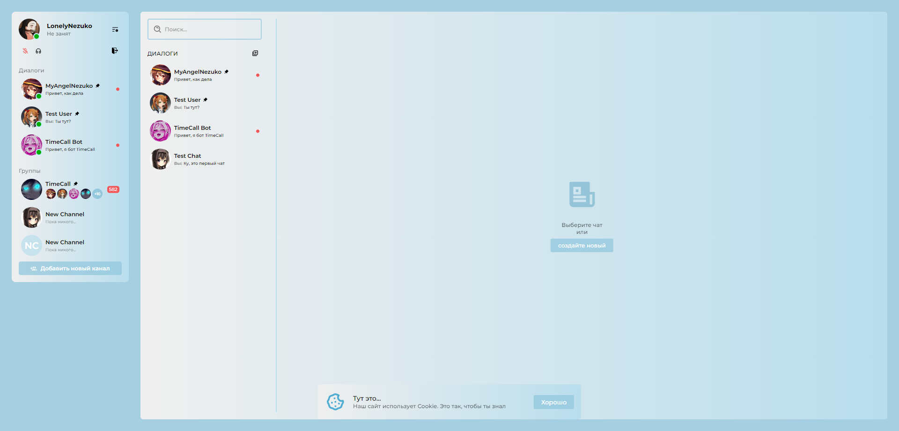
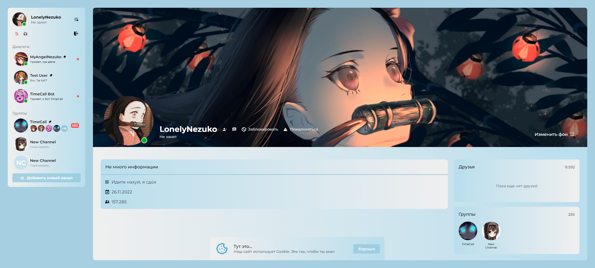
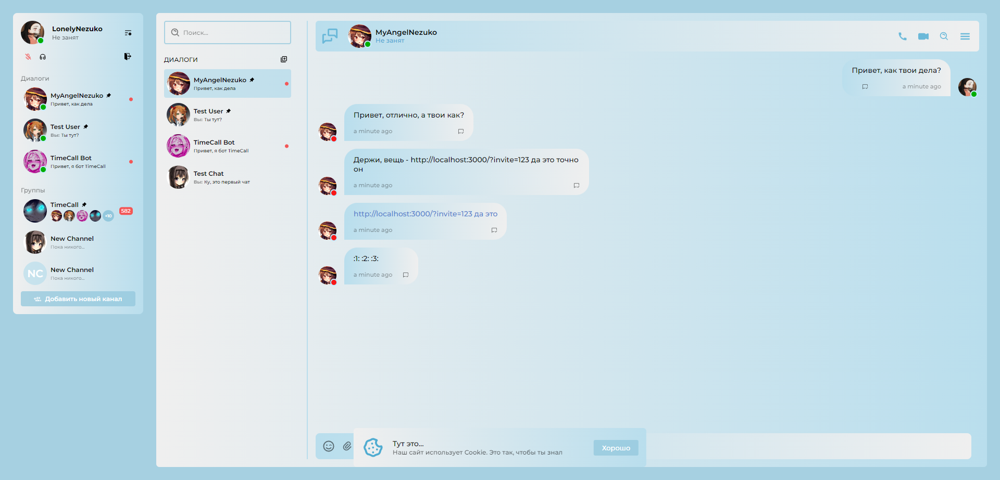
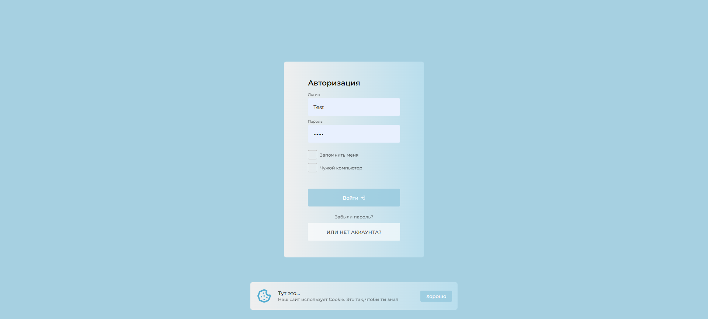
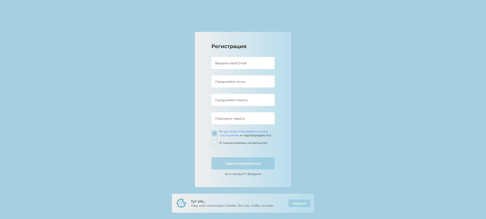

# FunDot
Не большой проект для себя (что-то на подобии Discord)


<details>
<summary>Изображения</summary>
    





</details>

<details>
<summary>Пример кода</summary>
    
```javascript
import React from 'react'
import $ from 'jquery'
import { Link } from 'react-router-dom'

import Avatar from '../../components/avatar/Avatar'

import { IoMdPersonAdd } from 'react-icons/io'
import { MdPersonRemoveAlt1 } from 'react-icons/md'

import { MdMessage } from 'react-icons/md'
import { ImBlocked } from 'react-icons/im'
import { MdReportProblem } from 'react-icons/md'
import { MdWallpaper } from 'react-icons/md'

import { TiInfoLargeOutline } from 'react-icons/ti'
import { RiGroupLine } from 'react-icons/ri'
import { BsFileEarmarkPost } from 'react-icons/bs'
import { TbFriends } from 'react-icons/tb'

import { TbListDetails } from 'react-icons/tb'
import { FaRegCalendarCheck } from 'react-icons/fa'
import { FaUserFriends } from 'react-icons/fa'

import './account.css'

export default function AccountPage()
{
    return (
        <section className="pageAccount">
            <div className="pageAccount-wrap">
                <div className="pageAccount-banner-mute">
                    <h1 className="pageAccount-banner-mute-h1">No Image</h1>
                    <div className="pageAccount-banner" style={{"background-image": "url(https://get.wallhere.com/photo/Kamado-Nezuko-Demon-Slayer-lantern-Kimetsu-no-Yaiba-1733063.jpg)"}}>
                        <div className="pageAccount-banner-wrap">
                            <div className="pageAccount-banner-wrap-elem">
                                <Avatar img="https://i.pinimg.com/736x/40/a9/4b/40a94b4c3473de7f425d95c5bbee3708.jpg" size="big" status="online" />
                                <h1 className="pageAccount-banner-name">
                                    <h2>
                                        LonelyNezuko
                                        <button className="btn-icon hint" data-hint="Удалить из друзей"><MdPersonRemoveAlt1 /></button>
                                        <button className="btn-icon hint" data-hint="Написать сообщение"><MdMessage /></button>
                                        <button className="btn-icon btn-icon-red"><ImBlocked /> <span style={{"margin-right": "0", "margin-left": "7px"}}>Заблокировать</span></button>
                                        <button className="btn-icon btn-icon-red"><MdReportProblem /> <span style={{"margin-right": "0", "margin-left": "7px"}}>Пожаловаться</span></button>
                                    </h2>
                                    <span>Не занят</span>
                                </h1>
                            </div>
                            <div className="pageAccount-banner-wrap-elem">
                                <button className="btn-icon">
                                    <span>Изменить фон</span>
                                    <MdWallpaper />
                                </button>
                            </div>
                        </div>
                    </div>
                </div>
                <div className="pageAccount-body">
                    {/*<div className="pageAccount-body-nav">
                        <button className="btn btn-select">
                            <TiInfoLargeOutline />
                            Информация
                        </button>
                        <button className="btn">
                            <RiGroupLine />
                            Группы <span>285</span>
                        </button>
                        <button className="btn">
                            <BsFileEarmarkPost />
                            Посты <span>15</span>
                        </button>
                        <button className="btn">
                            <TbFriends />
                            Друзья <span>8592</span>
                        </button>
                    </div>*/}
                    <div className="pageAccount-body-wrap" id="pageAccountBodyInfo">
                        <div className="pageAccount-body-posts">
                            <div className="pageAccount-body-posts-regInfo">
                                <h1>Не много информации</h1>
                                <section>
                                    <button className="btn-icon btn-icon-transparent btn-non-cursor">
                                        <TbListDetails />
                                        <span style={{"margin-right": "0", "margin-left": "7px"}}>Идите нахуй, я сдох</span>
                                    </button>
                                    <button className="btn-icon btn-icon-transparent hint btn-non-cursor" data-hint="Дата регистрации">
                                        <FaRegCalendarCheck />
                                        <span style={{"margin-right": "0", "margin-left": "7px"}}>26.11.2022</span>
                                    </button>
                                    <button className="btn-icon btn-icon-transparent hint btn-non-cursor" data-hint="Подписчики">
                                        <FaUserFriends />
                                        <span style={{"margin-right": "0", "margin-left": "7px"}}>157.285</span>
                                    </button>
                                </section>
                            </div>
                        </div>
                        <div className="pageAccount-body-subs">
                            <div className="pageAccount-body-info-subs">
                                <a className="pageAccount-body-info-subs-title" href="/account#friends">
                                    Друзья
                                    <span>8.592</span>
                                </a>
                                <div className="pageAccount-body-info-subs-wrap">
                                    {/*<a href="/user?id=23" className="avatar avatar-medium avatar-status avatar-online">
                                        <div className="avatar-wrap">
                                            
                                        </div>
                                        <h6>LonelyNezuko</h6>
                                    </a>
                                    <a href="/user?id=23" className="avatar avatar-medium avatar-status avatar-online">
                                        <div className="avatar-wrap">
                                            
                                        </div>
                                        <h6>LonelyNezuko</h6>
                                    </a>*/}
                                    <h3>Пока еще нет друзей</h3>
                                </div>
                            </div>
                            <div className="pageAccount-body-info-subs">
                                <a className="pageAccount-body-info-subs-title" href="/account#friends">
                                    Группы
                                    <span>285</span>
                                </a>
                                <div className="pageAccount-body-info-subs-wrap">
                                    <a href="/user?id=23">
                                        <Avatar img="https://pixelbox.ru/wp-content/uploads/2021/03/anime-avatar-discord-46.jpg" size="medium" name="TimeCall" />
                                    </a>
                                    <a href="/user?id=23">
                                        <Avatar img="https://pixelbox.ru/wp-content/uploads/2021/06/ava-steam-anime-tyan-94.jpg" size="medium" name="New Channel" />
                                    </a>
                                </div>
                            </div>
                        </div>
                    </div>
                </div>
            </div>
        </section>
    )
}
```
</details>